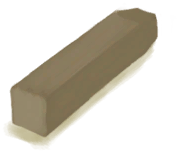

# 捕风者  
> 有助于降低小屋内的温度。  
  
<table class="table table-bordered" data-toggle="table"  data-show-header="false"><thead style="display:none"><tr ><th  style="width:50%;text-align:left;vertical-align:top;"  >title</th><th  style="width:50%;text-align:left;vertical-align:top;"  ></th></tr></thead><tr ><td  style="width:50%;text-align:left;vertical-align:top;"  >** 解锁条件: ** [

[木工(技能)](Skill_Woodworking.md)](Skill_Woodworking.md): 70-150  ** 解锁需求: ** [泥屋(环境)](Env_MudHut.md)</td><td  style="width:50%;text-align:left;vertical-align:top;"  >

<a href="Imp_Windcatcher.md" style="color:black">捕风者</a>

</td></tr></tbody></table>  
  
## 制作  
<table class="table table-bordered" data-toggle="table"  ><thead style=""><tr ><th  style="text-align:left;vertical-align:top;"  >步骤</th><th  style="text-align:left;vertical-align:top;"  >耗时</th><th  style="text-align:left;vertical-align:top;"  >需求</th><th  style="text-align:left;vertical-align:top;"  data-sortable="true"  >状态</th><th  style="text-align:left;vertical-align:top;"  data-sortable="true"  >成品</th></tr></thead><tr ><td  style="text-align:left;vertical-align:top;"  >1. [

[泥砖](MudBrick.md)](MudBrick.md) x 6 + [

[小树枝](Sticks.md)](Sticks.md) x 4 + [“锋利的斧子(组)”](GpTag_AxeAdv.md) x 1 2. [

[木板](Plank.md)](Plank.md) x 2 + [

[木钉](Treenail.md)](Treenail.md) x 6 + [“锤击工具(组)”](GpTag_Hammer.md) x 1</td><td  style="text-align:left;vertical-align:top;"  >1小时30分/每步骤</td><td  style="text-align:left;vertical-align:top;"  >** 需要状态: ** [

[光亮](Light.md)](Light.md): 10-100</td><td  style="text-align:left;vertical-align:top;"  ></td><td  style="text-align:left;vertical-align:top;"  ></td></tr></tbody></table>  
  

