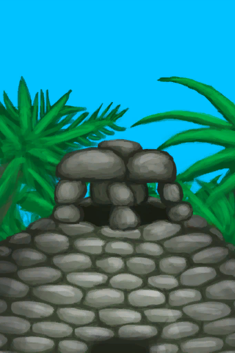

# 通风塔  
> 有助于降低室内温度。  
  
<table class="table table-bordered" data-toggle="table"  data-show-header="false"><thead style="display:none"><tr ><th  style="width:50%;text-align:left;vertical-align:top;"  >title</th><th  style="width:50%;text-align:left;vertical-align:top;"  ></th></tr></thead><tr ><td  style="width:50%;text-align:left;vertical-align:top;"  >** 效果: ** [

[体感温度](TemperaturePerceived.md)](TemperaturePerceived.md)<b>-3</b>  ** 解锁需求: ** [石屋(环境)](Env_StoneHut.md)</td><td  style="width:50%;text-align:left;vertical-align:top;"  >

<a href="Imp_WindcatcherStoneHut.md" style="color:black">通风塔</a>

</td></tr></tbody></table>  
  
## 制作  

<table><tr><td style="width:100px;"><b>材料总计：</b></td><td>[“锤击工具(组)”](GpTag_Hammer.md) x 1 , [

[大石块](StoneHeavy.md)](StoneHeavy.md) x 14 , [

[砂浆](Mortar.md)](Mortar.md) x 16 , [

[石头](Stone.md)](Stone.md) x 12</td></tr><tr><td><b>耗时：</b></td><td>1小时/每步骤 , 共计：4小时</td></tr><tr><td><b>需求：</b></td><td>[

[光亮](Light.md)](Light.md): <b>10-100</b></td></tr><tr><td colspan=2><b>步骤：</b></td></tr><tr><td style="text-align:right"><b>1.</b></td><td>[“锤击工具(组)”](GpTag_Hammer.md) x 1</td></tr><tr><td style="text-align:right"><b>2.</b></td><td>[

[大石块](StoneHeavy.md)](StoneHeavy.md) x 8 + [

[砂浆](Mortar.md)](Mortar.md) x 6</td></tr><tr><td style="text-align:right"><b>3.</b></td><td>[

[大石块](StoneHeavy.md)](StoneHeavy.md) x 4 + [

[石头](Stone.md)](Stone.md) x 8 + [

[砂浆](Mortar.md)](Mortar.md) x 6</td></tr><tr><td style="text-align:right"><b>4.</b></td><td>[

[大石块](StoneHeavy.md)](StoneHeavy.md) x 2 + [

[石头](Stone.md)](Stone.md) x 4 + [

[砂浆](Mortar.md)](Mortar.md) x 4</td></tr><tr style="background-color:#fff;font-size:1.2em;"><td></td><td style="text-align:right"><b>成品：</b></td></tr></table>
  
  

