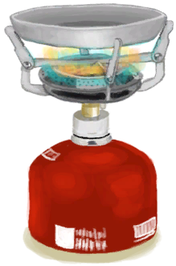
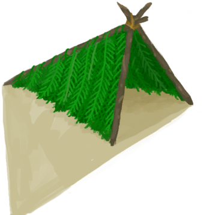

# 保温  
>   
  
#### ** 基础值: ** 0   
#### ** 变化范围: ** 0 ~ 0  
#### ** 基础变化率: ** 无   
## 阶段  
<table class="table table-bordered" data-toggle="table" ><thead><tr ><th  style="text-align:left;vertical-align:top;"  >范围</th><th  style="text-align:left;vertical-align:top;"  >名称</th><th  style="text-align:left;vertical-align:top;"  data-sortable="true"  >描述</th><th  style="text-align:left;vertical-align:top;"  >影响状态</th><th  style="text-align:left;vertical-align:top;"  data-sortable="true"  >影响动作</th></tr></thead><tr ><td  style="text-align:left;vertical-align:top;"  >5 ～ 10</td><td  style="text-align:left;vertical-align:top;"  >

1级</td><td  style="text-align:left;vertical-align:top;"  ></td><td  style="text-align:left;vertical-align:top;"  >[

[失温](Hypothermia.md)](Hypothermia.md)加成-15</td><td  style="text-align:left;vertical-align:top;"  ></td></tr><tr ><td  style="text-align:left;vertical-align:top;"  >11 ～ 20</td><td  style="text-align:left;vertical-align:top;"  >

2级</td><td  style="text-align:left;vertical-align:top;"  ></td><td  style="text-align:left;vertical-align:top;"  >[

[失温](Hypothermia.md)](Hypothermia.md)加成-26</td><td  style="text-align:left;vertical-align:top;"  ></td></tr><tr ><td  style="text-align:left;vertical-align:top;"  >21 ～ 30</td><td  style="text-align:left;vertical-align:top;"  >

3级</td><td  style="text-align:left;vertical-align:top;"  ></td><td  style="text-align:left;vertical-align:top;"  >[

[失温](Hypothermia.md)](Hypothermia.md)加成-28</td><td  style="text-align:left;vertical-align:top;"  ></td></tr><tr ><td  style="text-align:left;vertical-align:top;"  >31 ～ 40</td><td  style="text-align:left;vertical-align:top;"  >

4级</td><td  style="text-align:left;vertical-align:top;"  ></td><td  style="text-align:left;vertical-align:top;"  >[

[失温](Hypothermia.md)](Hypothermia.md)加成-32</td><td  style="text-align:left;vertical-align:top;"  ></td></tr><tr ><td  style="text-align:left;vertical-align:top;"  >41 ～ 50</td><td  style="text-align:left;vertical-align:top;"  >

5级</td><td  style="text-align:left;vertical-align:top;"  ></td><td  style="text-align:left;vertical-align:top;"  >[

[失温](Hypothermia.md)](Hypothermia.md)加成-40</td><td  style="text-align:left;vertical-align:top;"  ></td></tr></tbody></table>  
  
## 可被以下操作改变  
<table class="table table-bordered" data-toggle="table" ><thead><tr ><th  style="text-align:left;vertical-align:top;"  >来源</th><th  style="text-align:left;vertical-align:top;"  >操作</th><th  style="text-align:left;vertical-align:top;"  data-sortable="true"  >值</th></tr></thead><tr ><td  style="text-align:left;vertical-align:top;"  >[

[营火](Campfire.md)](Campfire.md)</td><td  style="text-align:left;vertical-align:top;"  >被动</td><td  style="text-align:left;vertical-align:top;"  >20</td></tr><tr ><td  style="text-align:left;vertical-align:top;"  >[

[粘土火盆](ClayFirePit.md)](ClayFirePit.md)</td><td  style="text-align:left;vertical-align:top;"  >被动</td><td  style="text-align:left;vertical-align:top;"  >20</td></tr><tr ><td  style="text-align:left;vertical-align:top;"  >[

[火堆](Fire.md)](Fire.md)</td><td  style="text-align:left;vertical-align:top;"  >被动</td><td  style="text-align:left;vertical-align:top;"  >20</td></tr><tr ><td  style="text-align:left;vertical-align:top;"  >[

[烟熏炉](Smoker.md)](Smoker.md)</td><td  style="text-align:left;vertical-align:top;"  >被动</td><td  style="text-align:left;vertical-align:top;"  >20</td></tr><tr ><td  style="text-align:left;vertical-align:top;"  >[

[烟熏炉(塑料布)(点燃)](SmokerPlastic.md)](SmokerPlastic.md)</td><td  style="text-align:left;vertical-align:top;"  >被动</td><td  style="text-align:left;vertical-align:top;"  >20</td></tr><tr ><td  style="text-align:left;vertical-align:top;"  >[

[蒸馏器(开)](AlembicOn.md)](AlembicOn.md)</td><td  style="text-align:left;vertical-align:top;"  >被动</td><td  style="text-align:left;vertical-align:top;"  >15</td></tr><tr ><td  style="text-align:left;vertical-align:top;"  >[

[火炉](Stove.md)](Stove.md)</td><td  style="text-align:left;vertical-align:top;"  >被动</td><td  style="text-align:left;vertical-align:top;"  >15</td></tr><tr ><td  style="text-align:left;vertical-align:top;"  >

[鱼人皮肤](Pk_3_PermeableSkin.md)</td><td  style="text-align:left;vertical-align:top;"  >特质影响</td><td  style="text-align:left;vertical-align:top;"  >15</td></tr><tr ><td  style="text-align:left;vertical-align:top;"  >[

[瓦斯炉(开)](GasCookerOn.md)](GasCookerOn.md)</td><td  style="text-align:left;vertical-align:top;"  >被动</td><td  style="text-align:left;vertical-align:top;"  >10</td></tr><tr ><td  style="text-align:left;vertical-align:top;"  >[

[窝棚](Shelter.md)](Shelter.md)</td><td  style="text-align:left;vertical-align:top;"  >被动</td><td  style="text-align:left;vertical-align:top;"  >5</td></tr><tr ><td  style="text-align:left;vertical-align:top;"  >[

[有遮蔽的叶床](ShelteredLeafBed.md)](ShelteredLeafBed.md)</td><td  style="text-align:left;vertical-align:top;"  >被动</td><td  style="text-align:left;vertical-align:top;"  >5</td></tr><tr ><td  style="text-align:left;vertical-align:top;"  >[

[帐篷](TentDeployed.md)](TentDeployed.md)</td><td  style="text-align:left;vertical-align:top;"  >被动</td><td  style="text-align:left;vertical-align:top;"  >5</td></tr><tr ><td  style="text-align:left;vertical-align:top;"  >[

[熔炉](Forge.md)](Forge.md)</td><td  style="text-align:left;vertical-align:top;"  >被动</td><td  style="text-align:left;vertical-align:top;"  >5</td></tr><tr ><td  style="text-align:left;vertical-align:top;"  >[

[窑炉](Kiln.md)](Kiln.md)</td><td  style="text-align:left;vertical-align:top;"  >被动</td><td  style="text-align:left;vertical-align:top;"  >5</td></tr><tr ><td  style="text-align:left;vertical-align:top;"  >[

[高级窑炉](KilnAdvanced.md)](KilnAdvanced.md)</td><td  style="text-align:left;vertical-align:top;"  >被动</td><td  style="text-align:left;vertical-align:top;"  >5</td></tr><tr ><td  style="text-align:left;vertical-align:top;"  >[

[木筏庇护所](RaftShelter.md)](RaftShelter.md)</td><td  style="text-align:left;vertical-align:top;"  >被动</td><td  style="text-align:left;vertical-align:top;"  >5</td></tr><tr ><td  style="text-align:left;vertical-align:top;"  >[

[防毒面具](GasMaskRustic.md)](GasMaskRustic.md)</td><td  style="text-align:left;vertical-align:top;"  >被动</td><td  style="text-align:left;vertical-align:top;"  >2</td></tr><tr ><td  style="text-align:left;vertical-align:top;"  >[

[临时防毒面具](MaskMakeshift.md)](MaskMakeshift.md)</td><td  style="text-align:left;vertical-align:top;"  >被动</td><td  style="text-align:left;vertical-align:top;"  >2</td></tr></tbody></table>  
  

