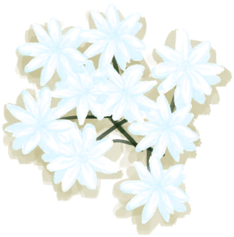

# 茉莉花  
> 香气迷人，可以装饰房间，也能沏一杯安神的茶。  
  
<table class="table table-bordered" data-toggle="table"  data-show-header="false"><thead style="display:none"><tr ><th  style="width:50%;text-align:left;vertical-align:top;"  >title</th><th  style="width:50%;text-align:left;vertical-align:top;"  ></th></tr></thead><tr ><td  style="width:50%;text-align:left;vertical-align:top;"  >**标签：**	[“花”](tag_Flower.md)  **可用次数：**4  ** 效果: ** [

[不适](Discomfort.md)](Discomfort.md)<b>-100</b></td><td  style="width:50%;text-align:left;vertical-align:top;"  >

<a href="JasminePlant.md" style="color:black">茉莉花</a>

</td></tr></tbody></table>  
  
## 获取来源  

转化

[茉莉花田](CropPlotJasmine.md)

探索

[丛林深处](DeepJungle.md)

  
  
## 动作  

<table><tr><td rowspan="2" style="width:200px;text-align:center;font-size:1.3em;font-weight:bold">

采集花朵

</td><td></td></tr><tr><td><b>自身：</b>使用次数  <b>-1(-25%)</b></td></tr><tr><td colspan="2"><b>需求：</b>[

[光亮](Light.md)](Light.md): <b>10-100</b></td></tr><tr><td colspan="2">[

[茉莉花](JasmineFlowers.md)](JasmineFlowers.md)(<b>+1</b>)</td></tr></table>
  
  
  
## 属性   

<table style="margin-bottom:0px;"><tr><td style="width:30%;text-align:left; background-color:#FEFEFE;font-size:1.3em;font-weight:bold;">使用次数</td><td style="font-size:1em;background-color:#FEFEFE">初始：4 , 最大：4 -</td></tr><tr style="background-color:#FFFFFF"><td colspan=2>** 到达0时： ** 自身: →消失</td></tr></table>
  

