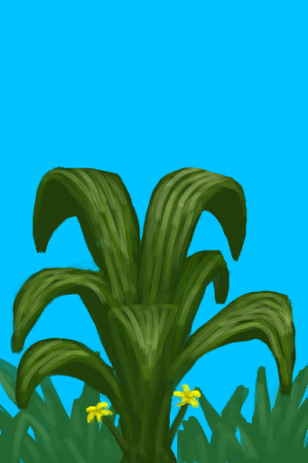

# 丛林  
> 我得寻找资源、食物和地标。  
  

<a href="Jungle.md" style="color:black">丛林</a>

<a href="Bay.md" style="color:black">海湾</a>

<a href="GrasslandsW.md" style="color:black">西部草原</a>

<a href="Outskirts.md" style="color:black">丛林边缘</a>

<a href="Wetlands.md" style="color:black">湿地丛林</a>

  
  
<table class="table table-bordered" data-toggle="table"  data-show-header="false"><thead style="display:none"><tr ><th  style="width:50%;text-align:left;vertical-align:top;"  >title</th><th  style="width:50%;text-align:left;vertical-align:top;"  ></th></tr></thead><tr ><td  style="width:50%;text-align:left;vertical-align:top;"  >** 区域唯一 **  **环境：**[丛林(环境)](Env_Jungle.md)  **标签：**	[“可布置陷阱的地点”](tag_SnareCompatible.md)  ** 环境效果: ** [

[雨水防护](RainProtection.md)](RainProtection.md)+2 [

[绝热](InsulationHeat.md)](InsulationHeat.md)+2 [

[阳光防护](SunProtection.md)](SunProtection.md)+2 [

[蚊虫数量](BugPopulation.md)](BugPopulation.md)+3 [

[猎手接近](HuntersProximity.md)](HuntersProximity.md)-0.5  ** 可改造项目: ** [小径](Imp_Path.md) , [灌溉系统](Imp_Irrigation.md) , [陷阱栅栏](Imp_TrappingFences.md)</td><td  style="width:50%;text-align:left;vertical-align:top;"  >丛林位于岛屿中心。它连接着岛屿的西部和南部海岸，同时连接东部的草原。 丛林植被茂盛，在这里你可以找到多种有用的植物，例如<b>大叶仙茅、卡瓦胡椒、香蕉、参薯还有马勃菌</b>  如果你考虑在此长期逗留并且怕被虫咬，请做好蚊虫防护。</td></tr></tbody></table>  
  
## 探索  
<table class="table table-bordered" data-toggle="table"  ><thead style=""><tr ><th  style="text-align:left;vertical-align:top;"  >进度</th><th  style="text-align:left;vertical-align:top;"  >目的地</th></tr></thead><tr ><td  style="text-align:left;vertical-align:top;"  >25%</td><td  style="text-align:left;vertical-align:top;"  >[前往湿地(丛林)](Path_JungleToWetlands.md)</td></tr><tr ><td  style="text-align:left;vertical-align:top;"  >50%</td><td  style="text-align:left;vertical-align:top;"  >[前往海湾(丛林)](Path_JungleToBay.md)</td></tr><tr ><td  style="text-align:left;vertical-align:top;"  >75%</td><td  style="text-align:left;vertical-align:top;"  >[前往西部草原(丛林)](Path_JungleToGrasslandsW.md)</td></tr><tr ><td  style="text-align:left;vertical-align:top;"  >100%</td><td  style="text-align:left;vertical-align:top;"  >[前往丛林边缘(丛林)](Path_JungleToOutskirts.md)</td></tr></tbody></table>  
  
## 动作  

<table><tr><td rowspan="2" style="width:200px;text-align:center;font-size:1.5em;font-weight:bold">

探索

15分

</td><td>[“腿部动作(组)”](LegAction.md)</td></tr><tr><td></td></tr><tr><td colspan="2"><b>需求：</b>[

[光亮](Light.md)](Light.md): 10-100</td></tr><tr><td colspan="2"><b>状态变化：</b>[

[足部损伤](FootDamage.md)](FootDamage.md)+20, [

[耐力](Stamina.md)](Stamina.md)-4, [

[压力](Stress.md)](Stress.md)-10, [

[污垢](Filth.md)](Filth.md)+1, [探索丛林](Exploration_Jungle.md)+1, [真人秀 丛林 - 探索](TV_JungleExplore.md)+1</td></tr><tr><td colspan="2">

<table style="margin-bottom:3px;"><tr><td rowspan=2 style="text-align:center" width="80px">
基础权重

600
</td><td style="font-size:0.6em;line-height:0.6em;font-weight:bold">Dry Leaves</td></tr><tr><td>[

[枯叶](LeavesDry.md)](LeavesDry.md)(+1～+2)</td></tr></table>

<table style="margin-bottom:3px;"><tr><td rowspan=2 style="text-align:center" width="80px">
基础权重

600
</td><td style="font-size:0.6em;line-height:0.6em;font-weight:bold">Palm Fronds</td></tr><tr><td>[

[棕榈叶](PalmFronds.md)](PalmFronds.md)(+2～+4)</td></tr></table>

<table style="margin-bottom:3px;"><tr><td rowspan=2 style="text-align:center" width="80px">
基础权重

800
</td><td style="font-size:0.6em;line-height:0.6em;font-weight:bold">Sticks</td></tr><tr><td>[

[小树枝](Sticks.md)](Sticks.md)(+1～+2)</td></tr></table>

<table style="margin-bottom:3px;"><tr><td rowspan=2 style="text-align:center" width="80px">
基础权重

600
</td><td style="font-size:0.6em;line-height:0.6em;font-weight:bold">Long Sticks</td></tr><tr><td>[

[长木棍](StickLong.md)](StickLong.md)(+1)</td></tr></table>

<table style="margin-bottom:3px;"><tr><td rowspan=2 style="text-align:center" width="80px">
基础权重

300
</td><td style="font-size:0.6em;line-height:0.6em;font-weight:bold">Palm Bush</td></tr><tr><td>[

[棕榈丛](PalmBush.md)](PalmBush.md)(+1)</td></tr></table>

<table style="margin-bottom:3px;"><tr><td rowspan=2 style="text-align:center" width="80px">
基础权重

800
</td><td style="font-size:0.6em;line-height:0.6em;font-weight:bold">Wood</td></tr><tr><td>[

[木材](Wood.md)](Wood.md)(+1)</td></tr></table>

<table style="margin-bottom:3px;"><tr><td rowspan=2 style="text-align:center" width="80px">
基础权重

1000000
</td><td style="font-size:0.6em;line-height:0.6em;font-weight:bold">Wood First❗限2次</td></tr><tr><td>[

[木材](Wood.md)](Wood.md)(+1)</td></tr></table>

<table style="margin-bottom:3px;"><tr><td rowspan=2 style="text-align:center" width="80px">
基础权重

800
</td><td style="font-size:0.6em;line-height:0.6em;font-weight:bold">Stone❗限3次</td></tr><tr><td>[

[石头](Stone.md)](Stone.md)(+1)</td></tr></table>

<table style="margin-bottom:3px;"><tr><td rowspan=2 style="text-align:center" width="80px">
基础权重

0
</td><td style="font-size:0.6em;line-height:0.6em;font-weight:bold">Supply Crate</td></tr><tr><td>[

[补给胶囊](TV_SupplyCapsule.md)](TV_SupplyCapsule.md)(+1)</td></tr><tr><td colspan=2><li>[

[真人秀 丛林](TV_Jungle.md)](TV_Jungle.md)为1时权重+300</li><li>[真人秀 丛林 - 探索](TV_JungleExplore.md)为0～9时权重-999</li></td></tr></table>

<table style="margin-bottom:3px;"><tr><td rowspan=2 style="text-align:center" width="80px">
基础权重

300
</td><td style="font-size:0.6em;line-height:0.6em;font-weight:bold">Heavy Stone❗限2次</td></tr><tr><td>[

[大石块](StoneHeavy.md)](StoneHeavy.md)(+1)</td></tr></table>

<table style="margin-bottom:3px;"><tr><td rowspan=2 style="text-align:center" width="80px">
基础权重

200000
</td><td style="font-size:0.6em;line-height:0.6em;font-weight:bold">Small Tree</td></tr><tr><td>[

[小树](SmallTree.md)](SmallTree.md)(+1)</td></tr></table>

<table style="margin-bottom:3px;"><tr><td rowspan=2 style="text-align:center" width="80px">
基础权重

200000
</td><td style="font-size:0.6em;line-height:0.6em;font-weight:bold">Small Palm</td></tr><tr><td>[

[小棕榈树](SmallPalm.md)](SmallPalm.md)(+1)</td></tr></table>

<table style="margin-bottom:3px;"><tr><td rowspan=2 style="text-align:center" width="80px">
基础权重

600
</td><td style="font-size:0.6em;line-height:0.6em;font-weight:bold">Snake Grass</td></tr><tr><td>[

[蛇草丛](SnakegrassPatch.md)](SnakegrassPatch.md)(+1)</td></tr><tr><td colspan=2><li>[

[薬草学(技能)](Skill_Herbology.md)](Skill_Herbology.md)为0～150时权重+0～+200</li></td></tr></table>

<table style="margin-bottom:3px;"><tr><td rowspan=2 style="text-align:center" width="80px">
基础权重

2000
</td><td style="font-size:0.6em;line-height:0.6em;font-weight:bold">Large Tree</td></tr><tr><td>[

[大树](LargeTree.md)](LargeTree.md)(+1)</td></tr></table>

<table style="margin-bottom:3px;"><tr><td rowspan=2 style="text-align:center" width="80px">
基础权重

0
</td><td style="font-size:0.6em;line-height:0.6em;font-weight:bold">Banana Tree</td></tr><tr><td>[

[香蕉树](BananaTree.md)](BananaTree.md)(+1)[丛林香蕉树种群数量](Bananas_JunglePop.md)-1000</td></tr><tr><td colspan=2><li>[

[薬草学(技能)](Skill_Herbology.md)](Skill_Herbology.md)为0～150时权重-400～+0</li><li>[

[视力](Myopia.md)](Myopia.md)为1～3时权重-100～-300</li><li>[丛林香蕉树种群数量](Bananas_JunglePop.md)为1000～6000时权重+100～+500</li></td></tr></table>

<table style="margin-bottom:3px;"><tr><td rowspan=2 style="text-align:center" width="80px">
基础权重

0
</td><td style="font-size:0.6em;line-height:0.6em;font-weight:bold">Yam</td></tr><tr><td>[

[野参薯](YamPlant.md)](YamPlant.md)(+1)[丛林参薯种群数量](Yam_JunglePop.md)-1000</td></tr><tr><td colspan=2><li>[

[薬草学(技能)](Skill_Herbology.md)](Skill_Herbology.md)为0～150时权重-300～+0</li><li>[

[视力](Myopia.md)](Myopia.md)为1～3时权重-100～-300</li><li>[丛林参薯种群数量](Yam_JunglePop.md)为1000～6000时权重+100～+400</li></td></tr></table>

<table style="margin-bottom:3px;"><tr><td rowspan=2 style="text-align:center" width="80px">
基础权重

450
</td><td style="font-size:0.6em;line-height:0.6em;font-weight:bold">Puffballs</td></tr><tr><td>[

[马勃菌](PuffballsPlant.md)](PuffballsPlant.md)(+1)</td></tr><tr><td colspan=2><li>[

[薬草学(技能)](Skill_Herbology.md)](Skill_Herbology.md)为0～150时权重-300～+0</li><li>[

[视力](Myopia.md)](Myopia.md)为1～3时权重-100～-300</li></td></tr></table>

<table style="margin-bottom:3px;"><tr><td rowspan=2 style="text-align:center" width="80px">
基础权重

400
</td><td style="font-size:0.6em;line-height:0.6em;font-weight:bold">Cinchona Tree</td></tr><tr><td>[

[金鸡纳树](CinchonaTree.md)](CinchonaTree.md)(+1)</td></tr><tr><td colspan=2><li>[

[薬草学(技能)](Skill_Herbology.md)](Skill_Herbology.md)为0～150时权重-300～+0</li><li>[

[视力](Myopia.md)](Myopia.md)为1～3时权重-100～-300</li></td></tr></table>

<table style="margin-bottom:3px;"><tr><td rowspan=2 style="text-align:center" width="80px">
基础权重

0
</td><td style="font-size:0.6em;line-height:0.6em;font-weight:bold">Kava</td></tr><tr><td>[

[卡瓦胡椒株](KavaPlant.md)](KavaPlant.md)(+1)[丛林卡瓦胡椒种群数量](Kava_JunglePop.md)-1000</td></tr><tr><td colspan=2><li>[

[薬草学(技能)](Skill_Herbology.md)](Skill_Herbology.md)为0～150时权重-300～+0</li><li>[

[视力](Myopia.md)](Myopia.md)为1～3时权重-100～-300</li><li>[丛林卡瓦胡椒种群数量](Kava_JunglePop.md)为1000～15000时权重+100～+500</li></td></tr></table>

<table style="margin-bottom:3px;"><tr><td rowspan=2 style="text-align:center" width="80px">
基础权重

6000
</td><td style="font-size:0.6em;line-height:0.6em;font-weight:bold">Kava First❗限1次</td></tr><tr><td>[

[卡瓦胡椒株](KavaPlant.md)](KavaPlant.md)(+1)[丛林卡瓦胡椒种群数量](Kava_JunglePop.md)-1000</td></tr></table>

<table style="margin-bottom:3px;"><tr><td rowspan=2 style="text-align:center" width="80px">
基础权重

0
</td><td style="font-size:0.6em;line-height:0.6em;font-weight:bold">Molineria</td></tr><tr><td>[

[大叶仙茅](WeevilLily.md)](WeevilLily.md)(+1)[丛林大叶仙茅种群数量](WeevilLily_JunglePop.md)-1000</td></tr><tr><td colspan=2><li>[

[薬草学(技能)](Skill_Herbology.md)](Skill_Herbology.md)为0～150时权重-300～+0</li><li>[

[视力](Myopia.md)](Myopia.md)为1～3时权重-100～-300</li><li>[丛林大叶仙茅种群数量](WeevilLily_JunglePop.md)为1000～9000时权重+100～+600</li></td></tr></table>

<table style="margin-bottom:3px;"><tr><td rowspan=2 style="text-align:center" width="80px">
基础权重

2500
</td><td style="font-size:0.6em;line-height:0.6em;font-weight:bold">Molineria First❗限1次</td></tr><tr><td>[

[大叶仙茅](WeevilLily.md)](WeevilLily.md)(+1)[丛林大叶仙茅种群数量](WeevilLily_JunglePop.md)-1000</td></tr></table>

<table style="margin-bottom:3px;"><tr><td rowspan=2 style="text-align:center" width="80px">
基础权重

0
</td><td style="font-size:0.6em;line-height:0.6em;font-weight:bold">Partridge Spotted</td></tr><tr><td>[

[一只灰山鹑！(事件)](Event_PartridgeFight.md)](Event_PartridgeFight.md)(+1)</td></tr><tr><td colspan=2><li>[灰山鹑种群数量](Pop_Partridge.md)为1000～30000时权重限定为+100～+200</li><li>[

[视力](Myopia.md)](Myopia.md)为1～3时权重限定为-100～-200</li></td></tr></table>

<table style="margin-bottom:3px;"><tr><td rowspan=2 style="text-align:center" width="80px">
基础权重

0
</td><td style="font-size:0.6em;line-height:0.6em;font-weight:bold">Partridge Nest</td></tr><tr><td>[

[一个灰山鹑巢！(事件)](Event_PartridgeNest.md)](Event_PartridgeNest.md)(+1)</td></tr><tr><td colspan=2><li>[灰山鹑种群数量](Pop_Partridge.md)为2000～30000时权重限定为+10～+100</li><li>[

[视力](Myopia.md)](Myopia.md)为1～3时权重限定为-100～-200</li></td></tr></table>

<table style="margin-bottom:3px;"><tr><td rowspan=2 style="text-align:center" width="80px">
基础权重

0
</td><td style="font-size:0.6em;line-height:0.6em;font-weight:bold">Boar Encounter</td></tr><tr><td>[

[我发现了一头野猪！(事件)](Event_BoarFight.md)](Event_BoarFight.md)(+1)</td></tr><tr><td colspan=2><li>[野猪种群数量](Pop_Boar.md)为1000～12000时权重+50～+200</li><li>[

[视力](Myopia.md)](Myopia.md)为1～3时权重-50～-200</li><li>[“战斗事件”](tag_FightEvent.md)存在于*手中/面板*，权重-999999(可叠加)</li></td></tr></table>

<table style="margin-bottom:3px;"><tr><td rowspan=2 style="text-align:center" width="80px">
基础权重

0
</td><td style="font-size:0.6em;line-height:0.6em;font-weight:bold">Macaque Spotted</td></tr><tr><td>[

[一只猕猴！(事件)](Event_MacaqueFight.md)](Event_MacaqueFight.md)(+1)</td></tr><tr><td colspan=2><li>[猕猴种群数量](Pop_Macaque.md)为1000～25000时权重限定为+25～+150</li><li>[

[视力](Myopia.md)](Myopia.md)为1～3时权重限定为-100～-125</li></td></tr></table>

<table style="margin-bottom:3px;"><tr><td rowspan=2 style="text-align:center" width="80px">
基础权重

0
</td><td style="font-size:0.6em;line-height:0.6em;font-weight:bold">Drone Encounter</td></tr><tr><td>[

[攻击无人机！(事件)](Event_DroneFight.md)](Event_DroneFight.md)(+1)</td></tr><tr><td colspan=2><li>[杀手无人机种群数量](Pop_Drone.md)为1000～4000时权重+25～+50</li><li>[

[视力](Myopia.md)](Myopia.md)为1～3时权重+0</li><li>[“战斗事件”](tag_FightEvent.md)存在于*手中/面板*，权重-999999(可叠加)</li></td></tr></table>

<table style="margin-bottom:3px;"><tr><td rowspan=2 style="text-align:center" width="80px">
基础权重

100
</td><td style="font-size:0.6em;line-height:0.6em;font-weight:bold">Spider</td></tr><tr><td>[

[一只蜘蛛！(事件)](Event_Spider.md)](Event_Spider.md)(+1)</td></tr><tr><td colspan=2><li>[

[视力](Myopia.md)](Myopia.md)为1～3时权重+25～+100</li></td></tr></table>

<table style="margin-bottom:3px;"><tr><td rowspan=2 style="text-align:center" width="80px">
基础权重

50
</td><td style="font-size:0.6em;line-height:0.6em;font-weight:bold">Fallen Tree</td></tr><tr><td>[

[倒下的大树](LargeTreeFelled.md)](LargeTreeFelled.md)(+1)</td></tr></table>

</td></tr></table>
  
  
  
## 可拖入  

<table style="margin-bottom:0px;"><tr><td style="width:40%;text-align:left; background-color:#FEFEFE"><b>拖入：</b>[“高级斧”](tag_AxeAdv.md)</td><td style="width:40%;font-size:1em;font-weight:bold;background-color:#FEFEFE">砍伐木材 (30分) [“手部动作(组)”](HandAction.md)</td></tr><tr style="background-color:#FFFFFF"><td style=""><b>使用物：</b>可用次数  -1</td><td style=""><b>自身：</b></td></tr><tr><td colspan="2"><b>状态变化：</b>[

[耐力](Stamina.md)](Stamina.md)-4, [

[手掌损伤](HandDamage.md)](HandDamage.md)+25, [

[木工(技能)](Skill_Woodworking.md)](Skill_Woodworking.md)+0.5</td></tr><tr><td colspan="2"><b>需求：</b>[

[光亮](Light.md)](Light.md): 10-100, [

[耐力](Stamina.md)](Stamina.md): 11-32</td></tr><tr><td colspan="2">[

[木材](Wood.md)](Wood.md)(+2), [

[小树枝](Sticks.md)](Sticks.md)(+4)</td></tr></table>
  

<table style="margin-bottom:0px;"><tr><td style="width:40%;text-align:left; background-color:#FEFEFE"><b>拖入：</b>[“斧”](tag_Axe.md)</td><td style="width:40%;font-size:1em;font-weight:bold;background-color:#FEFEFE">砍伐木材 (30分) [“手部动作(组)”](HandAction.md)</td></tr><tr style="background-color:#FFFFFF"><td style=""><b>使用物：</b>可用次数  -1</td><td style=""><b>自身：</b></td></tr><tr><td colspan="2"><b>状态变化：</b>[

[耐力](Stamina.md)](Stamina.md)-4, [

[手掌损伤](HandDamage.md)](HandDamage.md)+25, [

[木工(技能)](Skill_Woodworking.md)](Skill_Woodworking.md)+0.5</td></tr><tr><td colspan="2"><b>需求：</b>[

[光亮](Light.md)](Light.md): 10-100, [

[耐力](Stamina.md)](Stamina.md): 11-32</td></tr><tr><td colspan="2">[

[木材](Wood.md)](Wood.md)(+1), [

[小树枝](Sticks.md)](Sticks.md)(+2)</td></tr></table>
  
  

