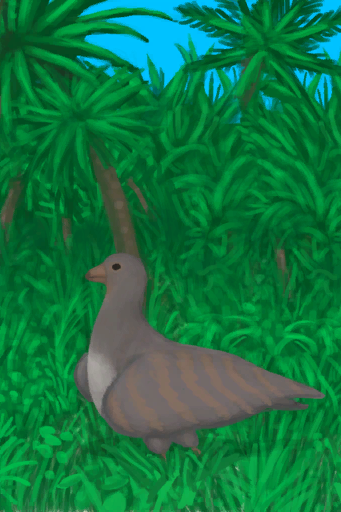

# 丛林高地  
> 我得寻找资源、食物和地标。  
  

<a href="JungleHighlands.md" style="color:black">丛林高地</a>

<a href="CaveBats.md" style="color:black">蝙蝠洞</a>

<a href="MacaqueDen.md" style="color:black">猕猴窝</a>

<a href="DeepJungle.md" style="color:black">丛林深处</a>

<a href="Cove.md" style="color:black">隐秘港湾</a>

<a href="HighlandsWestern.md" style="color:black">西部高地</a>

  
  
<table class="table table-bordered" data-toggle="table"  data-show-header="false"><thead style="display:none"><tr ><th  style="width:50%;text-align:left;vertical-align:top;"  >title</th><th  style="width:50%;text-align:left;vertical-align:top;"  ></th></tr></thead><tr ><td  style="width:50%;text-align:left;vertical-align:top;"  >** 区域唯一 **  **环境：**[丛林高地(环境)](Env_JungleHighlands.md)  **标签：**	[“可布置陷阱的地点”](tag_SnareCompatible.md)  ** 环境效果: ** [

[雨水防护](RainProtection.md)](RainProtection.md)+2 [

[绝热](InsulationHeat.md)](InsulationHeat.md)+2 [

[阳光防护](SunProtection.md)](SunProtection.md)+2 [

[蚊虫数量](BugPopulation.md)](BugPopulation.md)+3  ** 可改造项目: ** [小径](Imp_Path.md) , [灌溉系统](Imp_Irrigation.md) , [陷阱栅栏](Imp_TrappingFences.md)</td><td  style="width:50%;text-align:left;vertical-align:top;"  >丛林高地位于岛屿深处。该地区拥有众多洞穴，以及数量最多的猕猴。 这里还可以找到许多独特而有用的植物，包括<b>咖啡树、芒果树和金鸡纳树</b>。 </td></tr></tbody></table>  
  
## 探索  
<table class="table table-bordered" data-toggle="table"  ><thead style=""><tr ><th  style="text-align:left;vertical-align:top;"  >进度</th><th  style="text-align:left;vertical-align:top;"  >目的地</th></tr></thead><tr ><td  style="text-align:left;vertical-align:top;"  >20%</td><td  style="text-align:left;vertical-align:top;"  >[前往丛林深处(丛林高地)](Path_JungleHighlandsToDeepJungle.md)</td></tr><tr ><td  style="text-align:left;vertical-align:top;"  >35%</td><td  style="text-align:left;vertical-align:top;"  >[猕猴窝(丛林高地)](MacaqueDenEntrance.md)</td></tr><tr ><td  style="text-align:left;vertical-align:top;"  >50%</td><td  style="text-align:left;vertical-align:top;"  >[前往西部高地(丛林高地)](Path_JungleHighlandsToHighlandsW.md)</td></tr><tr ><td  style="text-align:left;vertical-align:top;"  >65%</td><td  style="text-align:left;vertical-align:top;"  >[蝙蝠洞(丛林高地)](CaveBatsEntrance.md)</td></tr><tr ><td  style="text-align:left;vertical-align:top;"  >80%</td><td  style="text-align:left;vertical-align:top;"  >[前往隐秘港湾(丛林高地)](Path_JungleHighlandsToCove.md)</td></tr><tr ><td  style="text-align:left;vertical-align:top;"  >100%</td><td  style="text-align:left;vertical-align:top;"  >[地区探索完毕(事件)(丛林高地)](Event_JungleHighlandsExplored.md)</td></tr></tbody></table>  
  
## 动作  
<table class="table table-bordered" data-toggle="table"  ><thead style=""><tr ><th  style="text-align:left;vertical-align:top;"  >动作</th><th  style="text-align:left;vertical-align:top;"  >耗时</th><th  style="text-align:left;vertical-align:top;"  >条件</th><th  style="text-align:left;vertical-align:top;"  >变化</th><th  style="text-align:left;vertical-align:top;"  >状态</th></tr></thead><tr ><td  style="text-align:left;vertical-align:top;"  >探索 [“腿部动作(组)”](LegAction.md)</td><td  style="text-align:left;vertical-align:top;"  >15分</td><td  style="text-align:left;vertical-align:top;"  >[

[光亮](Light.md)](Light.md): 10-100</td><td  style="text-align:left;vertical-align:top;"  >** 获得： ** ** [Dry Leaves]  **   [

[枯叶](LeavesDry.md)](LeavesDry.md)(+1～+2) 基础权重：600 ** [Palm Fronds]  **   [

[棕榈叶](PalmFronds.md)](PalmFronds.md)(+2～+4) 基础权重：400 ** [Sticks]  **   [

[小树枝](Sticks.md)](Sticks.md)(+1～+2) 基础权重：800 ** [Long Sticks]  **   [

[长木棍](StickLong.md)](StickLong.md)(+1) 基础权重：600 ** [Palm Bush]  **   [

[棕榈丛](PalmBush.md)](PalmBush.md)(+1) 基础权重：200 ** [Wood]  **   [

[木材](Wood.md)](Wood.md)(+1) 基础权重：800 ** [Wood First]  **❗限1次   [

[木材](Wood.md)](Wood.md)(+1) 基础权重：1000000 ** [Stone]  **❗限6次   [

[石头](Stone.md)](Stone.md)(+1) 基础权重：800 ** [Flint]  **❗限3次   [

[燧石](Flint.md)](Flint.md)(+1) 基础权重：400 ** [Flint Slab]  **❗限1次   [

[燧石板](FlintSlab.md)](FlintSlab.md)(+1) 基础权重：200 ** [Supply Crate]  **   [

[补给胶囊](TV_SupplyCapsule.md)](TV_SupplyCapsule.md)(+1) 基础权重：0<li>[

[真人秀 丛林](TV_Jungle.md)](TV_Jungle.md)为1时权重+300</li><li>[真人秀 丛林 - 探索](TV_JungleExplore.md)为0～9时权重-999</li> ** [Heavy Stone]  **   [

[大石块](StoneHeavy.md)](StoneHeavy.md)(+1) 基础权重：300 ** [Small Tree]  **   [

[小树](SmallTree.md)](SmallTree.md)(+1) 基础权重：200000 ** [Small Palm]  **   [

[小棕榈树](SmallPalm.md)](SmallPalm.md)(+1) 基础权重：200000 ** [Snake Grass]  **   [

[蛇草丛](SnakegrassPatch.md)](SnakegrassPatch.md)(+1) 基础权重：500<li>[

[薬草学(技能)](Skill_Herbology.md)](Skill_Herbology.md)为0～150时权重+0～+200</li> ** [Large Tree]  **   [

[大树](LargeTree.md)](LargeTree.md)(+1) 基础权重：2000 ** [Coffee]  **   [

[咖啡丛](CoffeePlant.md)](CoffeePlant.md)(+1) [丛林高地咖啡种群数量](Coffee_JungleHighlandsPop.md)-1000 基础权重：0<li>[

[薬草学(技能)](Skill_Herbology.md)](Skill_Herbology.md)为0～150时权重-300～+0</li><li>[

[视力](Myopia.md)](Myopia.md)为1～3时权重-100～-300</li><li>[丛林高地咖啡种群数量](Coffee_JungleHighlandsPop.md)为1000～15000时权重+100～+500</li> ** [Mango Tree]  **   [

[芒果树](MangoTree.md)](MangoTree.md)(+1) [丛林高地芒果种群数量](Mango_JungleHighlandsPop.md)-1000 基础权重：0<li>[

[薬草学(技能)](Skill_Herbology.md)](Skill_Herbology.md)为0～150时权重-300～+0</li><li>[

[视力](Myopia.md)](Myopia.md)为1～3时权重-100～-300</li><li>[丛林高地芒果种群数量](Mango_JungleHighlandsPop.md)为1000～6000时权重+100～+400</li> ** [Cinchona Tree]  **   [

[金鸡纳树](CinchonaTree.md)](CinchonaTree.md)(+1) 基础权重：600<li>[

[薬草学(技能)](Skill_Herbology.md)](Skill_Herbology.md)为0～150时权重-300～+0</li><li>[

[视力](Myopia.md)](Myopia.md)为1～3时权重-100～-300</li> ** [China Rose]  **   [

[月季丛](ChinaRosePlant.md)](ChinaRosePlant.md)(+1) [丛林高地月季种群数量](ChinaRose_JungleHighlandsPop.md)-1000 基础权重：0<li>[

[薬草学(技能)](Skill_Herbology.md)](Skill_Herbology.md)为0～150时权重-300～+0</li><li>[

[视力](Myopia.md)](Myopia.md)为1～3时权重-100～-300</li><li>[丛林高地月季种群数量](ChinaRose_JungleHighlandsPop.md)为1000～15000时权重+100～+400</li> ** [Partridge Spotted]  **   [

[一只灰山鹑！(事件)](Event_PartridgeFight.md)](Event_PartridgeFight.md)(+1) 基础权重：0<li>[灰山鹑种群数量](Pop_Partridge.md)为1000～30000时权重限定为+100～+200</li><li>[

[视力](Myopia.md)](Myopia.md)为1～3时权重限定为-100～-200</li> ** [Partridge Nest]  **   [

[一个灰山鹑巢！(事件)](Event_PartridgeNest.md)](Event_PartridgeNest.md)(+1) 基础权重：0<li>[灰山鹑种群数量](Pop_Partridge.md)为2000～30000时权重限定为+10～+100</li><li>[

[视力](Myopia.md)](Myopia.md)为1～3时权重限定为-100～-200</li> ** [Boar Encounter]  **   [

[我发现了一头野猪！(事件)](Event_BoarFight.md)](Event_BoarFight.md)(+1) 基础权重：0<li>[野猪种群数量](Pop_Boar.md)为1000～12000时权重+50～+200</li><li>[

[视力](Myopia.md)](Myopia.md)为1～3时权重-50～-200</li><li>[“战斗事件”](tag_FightEvent.md)存在于*手中/面板*，权重-999999(可叠加)</li> ** [Macaque Spotted]  **   [

[一只猕猴！(事件)](Event_MacaqueFight.md)](Event_MacaqueFight.md)(+1) 基础权重：0<li>[猕猴种群数量](Pop_Macaque.md)为1000～25000时权重限定为+50～+300</li><li>[

[视力](Myopia.md)](Myopia.md)为1～3时权重限定为-100～-150</li> ** [Drone Encounter]  **   [

[攻击无人机！(事件)](Event_DroneFight.md)](Event_DroneFight.md)(+1) 基础权重：0<li>[杀手无人机种群数量](Pop_Drone.md)为1000～4000时权重+25～+50</li><li>[

[视力](Myopia.md)](Myopia.md)为1～3时权重+0</li><li>[“战斗事件”](tag_FightEvent.md)存在于*手中/面板*，权重-999999(可叠加)</li> ** [Fallen Tree]  **   [

[倒下的大树](LargeTreeFelled.md)](LargeTreeFelled.md)(+1) 基础权重：50</td><td  style="text-align:left;vertical-align:top;"  >[

[足部损伤](FootDamage.md)](FootDamage.md)+20 [

[耐力](Stamina.md)](Stamina.md)-4 [

[压力](Stress.md)](Stress.md)-10 [

[污垢](Filth.md)](Filth.md)+1 [探索丛林](Exploration_Jungle.md)+1 [真人秀 丛林 - 探索](TV_JungleExplore.md)+1</td></tr></tbody></table>  
  
## 可拖入  
<table class="table table-bordered" data-toggle="table"  ><thead style=""><tr ><th  style="text-align:left;vertical-align:top;"  >使用</th><th  style="text-align:left;vertical-align:top;"  >动作</th><th  style="text-align:left;vertical-align:top;"  >耗时</th><th  style="text-align:left;vertical-align:top;"  >条件</th><th  style="text-align:left;vertical-align:top;"  >变化</th><th  style="text-align:left;vertical-align:top;"  >玩家状态</th></tr></thead><tr ><td  style="text-align:left;vertical-align:top;"  >[“高级斧”](tag_AxeAdv.md)</td><td  style="text-align:left;vertical-align:top;"  >砍伐木材 [“手部动作(组)”](HandAction.md)</td><td  style="text-align:left;vertical-align:top;"  >30分</td><td  style="text-align:left;vertical-align:top;"  >[

[光亮](Light.md)](Light.md): 10-100 [

[耐力](Stamina.md)](Stamina.md): 11-32</td><td  style="text-align:left;vertical-align:top;"  > ** 使用物: ** 可用次数  -1  ** 获得: ** ** [Cut Wood]  **   [

[木材](Wood.md)](Wood.md)(+2)   [

[小树枝](Sticks.md)](Sticks.md)(+4) 基础权重：1</td><td  style="text-align:left;vertical-align:top;"  >[

[耐力](Stamina.md)](Stamina.md)-4 [

[手掌损伤](HandDamage.md)](HandDamage.md)+25 [

[木工(技能)](Skill_Woodworking.md)](Skill_Woodworking.md)+0.5</td></tr><tr ><td  style="text-align:left;vertical-align:top;"  >[“斧”](tag_Axe.md)</td><td  style="text-align:left;vertical-align:top;"  >砍伐木材 [“手部动作(组)”](HandAction.md)</td><td  style="text-align:left;vertical-align:top;"  >30分</td><td  style="text-align:left;vertical-align:top;"  >[

[光亮](Light.md)](Light.md): 10-100 [

[耐力](Stamina.md)](Stamina.md): 11-32</td><td  style="text-align:left;vertical-align:top;"  > ** 使用物: ** 可用次数  -1  ** 获得: ** ** [Cut Wood]  **   [

[木材](Wood.md)](Wood.md)(+1)   [

[小树枝](Sticks.md)](Sticks.md)(+2) 基础权重：1</td><td  style="text-align:left;vertical-align:top;"  >[

[耐力](Stamina.md)](Stamina.md)-4 [

[手掌损伤](HandDamage.md)](HandDamage.md)+25 [

[木工(技能)](Skill_Woodworking.md)](Skill_Woodworking.md)+0.5</td></tr></tbody></table>  
  

