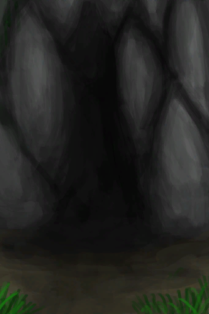

# 丛林高地  
> 我得寻找资源、食物和地标。  
  

<a href="JungleHighlands.md" style="color:black">丛林高地</a>

<a href="CaveBats.md" style="color:black">蝙蝠洞</a>

<a href="MacaqueDen.md" style="color:black">猕猴窝</a>

<a href="DeepJungle.md" style="color:black">丛林深处</a>

<a href="Cove.md" style="color:black">隐秘港湾</a>

<a href="HighlandsWestern.md" style="color:black">西部高地</a>

  
  
<table class="table table-bordered" data-toggle="table"  data-show-header="false"><thead style="display:none"><tr ><th  style="width:50%;text-align:left;vertical-align:top;"  >title</th><th  style="width:50%;text-align:left;vertical-align:top;"  ></th></tr></thead><tr ><td  style="width:50%;text-align:left;vertical-align:top;"  >** 区域唯一 **  **环境：**[丛林高地(环境)](Env_JungleHighlands.md)  **标签：**	[“可布置陷阱的地点”](tag_SnareCompatible.md)  ** 环境效果: ** [

[雨水防护](RainProtection.md)](RainProtection.md)<b>+2</b> [

[绝热](InsulationHeat.md)](InsulationHeat.md)<b>+2</b> [

[阳光防护](SunProtection.md)](SunProtection.md)<b>+2</b> [

[蚊虫数量](BugPopulation.md)](BugPopulation.md)<b>+3</b>  ** 可改造项目: ** [小径](Imp_Path.md) , [灌溉系统](Imp_Irrigation.md) , [陷阱栅栏](Imp_TrappingFences.md)</td><td  style="width:50%;text-align:left;vertical-align:top;"  >丛林高地位于岛屿深处。该地区拥有众多洞穴，以及数量最多的猕猴。 这里还可以找到许多独特而有用的植物，包括<b>咖啡树、芒果树和金鸡纳树</b>。 </td></tr></tbody></table>  
  
## 探索  
<table class="table table-bordered" data-toggle="table"  ><thead style=""><tr ><th  style="text-align:left;vertical-align:top;"  >进度</th><th  style="text-align:left;vertical-align:top;"  >目的地</th></tr></thead><tr ><td  style="text-align:left;vertical-align:top;"  >20%</td><td  style="text-align:left;vertical-align:top;"  >[前往丛林深处(丛林高地)](Path_JungleHighlandsToDeepJungle.md)</td></tr><tr ><td  style="text-align:left;vertical-align:top;"  >35%</td><td  style="text-align:left;vertical-align:top;"  >[猕猴窝(丛林高地)](MacaqueDenEntrance.md)</td></tr><tr ><td  style="text-align:left;vertical-align:top;"  >50%</td><td  style="text-align:left;vertical-align:top;"  >[前往西部高地(丛林高地)](Path_JungleHighlandsToHighlandsW.md)</td></tr><tr ><td  style="text-align:left;vertical-align:top;"  >65%</td><td  style="text-align:left;vertical-align:top;"  >[蝙蝠洞(丛林高地)](CaveBatsEntrance.md)</td></tr><tr ><td  style="text-align:left;vertical-align:top;"  >80%</td><td  style="text-align:left;vertical-align:top;"  >[前往隐秘港湾(丛林高地)](Path_JungleHighlandsToCove.md)</td></tr><tr ><td  style="text-align:left;vertical-align:top;"  >100%</td><td  style="text-align:left;vertical-align:top;"  >[地区探索完毕(事件)(丛林高地)](Event_JungleHighlandsExplored.md)</td></tr></tbody></table>  
  
## 动作  

<table><tr><td rowspan="2" style="width:200px;text-align:center;font-size:1.3em;font-weight:bold">

探索

15分

</td><td>[“腿部动作(组)”](LegAction.md)</td></tr><tr><td></td></tr><tr><td colspan="2"><b>需求：</b>[

[光亮](Light.md)](Light.md): <b>10-100</b></td></tr><tr><td colspan="2"><b>状态变化：</b>[

[足部损伤](FootDamage.md)](FootDamage.md)<b>+20</b>, [

[耐力](Stamina.md)](Stamina.md)<b>-4</b>, [

[压力](Stress.md)](Stress.md)<b>-10</b>, [

[污垢](Filth.md)](Filth.md)<b>+1</b>, [探索丛林](Exploration_Jungle.md)<b>+1</b>, [真人秀 丛林 - 探索](TV_JungleExplore.md)<b>+1</b></td></tr><tr><td colspan="2">

<table style="margin-bottom:3px;"><tr><td rowspan=2 style="text-align:center" width="80px">
基础权重

600
</td><td style="font-size:0.6em;line-height:0.6em;font-weight:bold">Dry Leaves</td></tr><tr><td>[

[枯叶](LeavesDry.md)](LeavesDry.md)(<b>+1～+2</b>)</td></tr></table>

<table style="margin-bottom:3px;"><tr><td rowspan=2 style="text-align:center" width="80px">
基础权重

400
</td><td style="font-size:0.6em;line-height:0.6em;font-weight:bold">Palm Fronds</td></tr><tr><td>[

[棕榈叶](PalmFronds.md)](PalmFronds.md)(<b>+2～+4</b>)</td></tr></table>

<table style="margin-bottom:3px;"><tr><td rowspan=2 style="text-align:center" width="80px">
基础权重

800
</td><td style="font-size:0.6em;line-height:0.6em;font-weight:bold">Sticks</td></tr><tr><td>[

[小树枝](Sticks.md)](Sticks.md)(<b>+1～+2</b>)</td></tr></table>

<table style="margin-bottom:3px;"><tr><td rowspan=2 style="text-align:center" width="80px">
基础权重

600
</td><td style="font-size:0.6em;line-height:0.6em;font-weight:bold">Long Sticks</td></tr><tr><td>[

[长木棍](StickLong.md)](StickLong.md)(<b>+1</b>)</td></tr></table>

<table style="margin-bottom:3px;"><tr><td rowspan=2 style="text-align:center" width="80px">
基础权重

200
</td><td style="font-size:0.6em;line-height:0.6em;font-weight:bold">Palm Bush</td></tr><tr><td>[

[棕榈丛](PalmBush.md)](PalmBush.md)(<b>+1</b>)</td></tr></table>

<table style="margin-bottom:3px;"><tr><td rowspan=2 style="text-align:center" width="80px">
基础权重

800
</td><td style="font-size:0.6em;line-height:0.6em;font-weight:bold">Wood</td></tr><tr><td>[

[木材](Wood.md)](Wood.md)(<b>+1</b>)</td></tr></table>

<table style="margin-bottom:3px;"><tr><td rowspan=2 style="text-align:center" width="80px">
基础权重

1000000
</td><td style="font-size:0.6em;line-height:0.6em;font-weight:bold">Wood First❗限1次</td></tr><tr><td>[

[木材](Wood.md)](Wood.md)(<b>+1</b>)</td></tr></table>

<table style="margin-bottom:3px;"><tr><td rowspan=2 style="text-align:center" width="80px">
基础权重

800
</td><td style="font-size:0.6em;line-height:0.6em;font-weight:bold">Stone❗限6次</td></tr><tr><td>[

[石头](Stone.md)](Stone.md)(<b>+1</b>)</td></tr></table>

<table style="margin-bottom:3px;"><tr><td rowspan=2 style="text-align:center" width="80px">
基础权重

400
</td><td style="font-size:0.6em;line-height:0.6em;font-weight:bold">Flint❗限3次</td></tr><tr><td>[

[燧石](Flint.md)](Flint.md)(<b>+1</b>)</td></tr></table>

<table style="margin-bottom:3px;"><tr><td rowspan=2 style="text-align:center" width="80px">
基础权重

200
</td><td style="font-size:0.6em;line-height:0.6em;font-weight:bold">Flint Slab❗限1次</td></tr><tr><td>[

[燧石板](FlintSlab.md)](FlintSlab.md)(<b>+1</b>)</td></tr></table>

<table style="margin-bottom:3px;"><tr><td rowspan=2 style="text-align:center" width="80px">
基础权重

0
</td><td style="font-size:0.6em;line-height:0.6em;font-weight:bold">Supply Crate</td></tr><tr><td>[

[补给胶囊](TV_SupplyCapsule.md)](TV_SupplyCapsule.md)(<b>+1</b>)</td></tr><tr><td colspan=2><li>[

[真人秀 丛林](TV_Jungle.md)](TV_Jungle.md)为<b>1</b>时权重<b>+300</b></li><li>[真人秀 丛林 - 探索](TV_JungleExplore.md)为<b>0～9</b>时权重<b>-999</b></li></td></tr></table>

<table style="margin-bottom:3px;"><tr><td rowspan=2 style="text-align:center" width="80px">
基础权重

300
</td><td style="font-size:0.6em;line-height:0.6em;font-weight:bold">Heavy Stone</td></tr><tr><td>[

[大石块](StoneHeavy.md)](StoneHeavy.md)(<b>+1</b>)</td></tr></table>

<table style="margin-bottom:3px;"><tr><td rowspan=2 style="text-align:center" width="80px">
基础权重

200000
</td><td style="font-size:0.6em;line-height:0.6em;font-weight:bold">Small Tree</td></tr><tr><td>[

[小树](SmallTree.md)](SmallTree.md)(<b>+1</b>)</td></tr></table>

<table style="margin-bottom:3px;"><tr><td rowspan=2 style="text-align:center" width="80px">
基础权重

200000
</td><td style="font-size:0.6em;line-height:0.6em;font-weight:bold">Small Palm</td></tr><tr><td>[

[小棕榈树](SmallPalm.md)](SmallPalm.md)(<b>+1</b>)</td></tr></table>

<table style="margin-bottom:3px;"><tr><td rowspan=2 style="text-align:center" width="80px">
基础权重

500
</td><td style="font-size:0.6em;line-height:0.6em;font-weight:bold">Snake Grass</td></tr><tr><td>[

[蛇草丛](SnakegrassPatch.md)](SnakegrassPatch.md)(<b>+1</b>)</td></tr><tr><td colspan=2><li>[

[薬草学(技能)](Skill_Herbology.md)](Skill_Herbology.md)为<b>0～150</b>时权重<b>+0～+200</b></li></td></tr></table>

<table style="margin-bottom:3px;"><tr><td rowspan=2 style="text-align:center" width="80px">
基础权重

2000
</td><td style="font-size:0.6em;line-height:0.6em;font-weight:bold">Large Tree</td></tr><tr><td>[

[大树](LargeTree.md)](LargeTree.md)(<b>+1</b>)</td></tr></table>

<table style="margin-bottom:3px;"><tr><td rowspan=2 style="text-align:center" width="80px">
基础权重

0
</td><td style="font-size:0.6em;line-height:0.6em;font-weight:bold">Coffee</td></tr><tr><td>[

[咖啡丛](CoffeePlant.md)](CoffeePlant.md)(<b>+1</b>)[丛林高地咖啡种群数量](Coffee_JungleHighlandsPop.md)<b>-1000</b></td></tr><tr><td colspan=2><li>[

[薬草学(技能)](Skill_Herbology.md)](Skill_Herbology.md)为<b>0～150</b>时权重<b>-300～+0</b></li><li>[

[视力](Myopia.md)](Myopia.md)为<b>1～3</b>时权重<b>-100～-300</b></li><li>[丛林高地咖啡种群数量](Coffee_JungleHighlandsPop.md)为<b>1000～15000</b>时权重<b>+100～+500</b></li></td></tr></table>

<table style="margin-bottom:3px;"><tr><td rowspan=2 style="text-align:center" width="80px">
基础权重

0
</td><td style="font-size:0.6em;line-height:0.6em;font-weight:bold">Mango Tree</td></tr><tr><td>[

[芒果树](MangoTree.md)](MangoTree.md)(<b>+1</b>)[丛林高地芒果种群数量](Mango_JungleHighlandsPop.md)<b>-1000</b></td></tr><tr><td colspan=2><li>[

[薬草学(技能)](Skill_Herbology.md)](Skill_Herbology.md)为<b>0～150</b>时权重<b>-300～+0</b></li><li>[

[视力](Myopia.md)](Myopia.md)为<b>1～3</b>时权重<b>-100～-300</b></li><li>[丛林高地芒果种群数量](Mango_JungleHighlandsPop.md)为<b>1000～6000</b>时权重<b>+100～+400</b></li></td></tr></table>

<table style="margin-bottom:3px;"><tr><td rowspan=2 style="text-align:center" width="80px">
基础权重

600
</td><td style="font-size:0.6em;line-height:0.6em;font-weight:bold">Cinchona Tree</td></tr><tr><td>[

[金鸡纳树](CinchonaTree.md)](CinchonaTree.md)(<b>+1</b>)</td></tr><tr><td colspan=2><li>[

[薬草学(技能)](Skill_Herbology.md)](Skill_Herbology.md)为<b>0～150</b>时权重<b>-300～+0</b></li><li>[

[视力](Myopia.md)](Myopia.md)为<b>1～3</b>时权重<b>-100～-300</b></li></td></tr></table>

<table style="margin-bottom:3px;"><tr><td rowspan=2 style="text-align:center" width="80px">
基础权重

0
</td><td style="font-size:0.6em;line-height:0.6em;font-weight:bold">China Rose</td></tr><tr><td>[

[月季丛](ChinaRosePlant.md)](ChinaRosePlant.md)(<b>+1</b>)[丛林高地月季种群数量](ChinaRose_JungleHighlandsPop.md)<b>-1000</b></td></tr><tr><td colspan=2><li>[

[薬草学(技能)](Skill_Herbology.md)](Skill_Herbology.md)为<b>0～150</b>时权重<b>-300～+0</b></li><li>[

[视力](Myopia.md)](Myopia.md)为<b>1～3</b>时权重<b>-100～-300</b></li><li>[丛林高地月季种群数量](ChinaRose_JungleHighlandsPop.md)为<b>1000～15000</b>时权重<b>+100～+400</b></li></td></tr></table>

<table style="margin-bottom:3px;"><tr><td rowspan=2 style="text-align:center" width="80px">
基础权重

0
</td><td style="font-size:0.6em;line-height:0.6em;font-weight:bold">Partridge Spotted</td></tr><tr><td>[

[一只灰山鹑！(事件)](Event_PartridgeFight.md)](Event_PartridgeFight.md)(<b>+1</b>)</td></tr><tr><td colspan=2><li>[灰山鹑种群数量](Pop_Partridge.md)为<b>1000～30000</b>时权重限定为<b>+100～+200</b></li><li>[

[视力](Myopia.md)](Myopia.md)为<b>1～3</b>时权重限定为<b>-100～-200</b></li></td></tr></table>

<table style="margin-bottom:3px;"><tr><td rowspan=2 style="text-align:center" width="80px">
基础权重

0
</td><td style="font-size:0.6em;line-height:0.6em;font-weight:bold">Partridge Nest</td></tr><tr><td>[

[一个灰山鹑巢！(事件)](Event_PartridgeNest.md)](Event_PartridgeNest.md)(<b>+1</b>)</td></tr><tr><td colspan=2><li>[灰山鹑种群数量](Pop_Partridge.md)为<b>2000～30000</b>时权重限定为<b>+10～+100</b></li><li>[

[视力](Myopia.md)](Myopia.md)为<b>1～3</b>时权重限定为<b>-100～-200</b></li></td></tr></table>

<table style="margin-bottom:3px;"><tr><td rowspan=2 style="text-align:center" width="80px">
基础权重

0
</td><td style="font-size:0.6em;line-height:0.6em;font-weight:bold">Boar Encounter</td></tr><tr><td>[

[我发现了一头野猪！(事件)](Event_BoarFight.md)](Event_BoarFight.md)(<b>+1</b>)</td></tr><tr><td colspan=2><li>[野猪种群数量](Pop_Boar.md)为<b>1000～12000</b>时权重<b>+50～+200</b></li><li>[

[视力](Myopia.md)](Myopia.md)为<b>1～3</b>时权重<b>-50～-200</b></li><li>[“战斗事件”](tag_FightEvent.md)存在于*手中/面板*，权重<b>-999999</b>(可叠加),</li></td></tr></table>

<table style="margin-bottom:3px;"><tr><td rowspan=2 style="text-align:center" width="80px">
基础权重

0
</td><td style="font-size:0.6em;line-height:0.6em;font-weight:bold">Macaque Spotted</td></tr><tr><td>[

[一只猕猴！(事件)](Event_MacaqueFight.md)](Event_MacaqueFight.md)(<b>+1</b>)</td></tr><tr><td colspan=2><li>[猕猴种群数量](Pop_Macaque.md)为<b>1000～25000</b>时权重限定为<b>+50～+300</b></li><li>[

[视力](Myopia.md)](Myopia.md)为<b>1～3</b>时权重限定为<b>-100～-150</b></li></td></tr></table>

<table style="margin-bottom:3px;"><tr><td rowspan=2 style="text-align:center" width="80px">
基础权重

0
</td><td style="font-size:0.6em;line-height:0.6em;font-weight:bold">Drone Encounter</td></tr><tr><td>[

[攻击无人机！(事件)](Event_DroneFight.md)](Event_DroneFight.md)(<b>+1</b>)</td></tr><tr><td colspan=2><li>[杀手无人机种群数量](Pop_Drone.md)为<b>1000～4000</b>时权重<b>+25～+50</b></li><li>[

[视力](Myopia.md)](Myopia.md)为<b>1～3</b>时权重<b>+0</b></li><li>[“战斗事件”](tag_FightEvent.md)存在于*手中/面板*，权重<b>-999999</b>(可叠加),</li></td></tr></table>

<table style="margin-bottom:3px;"><tr><td rowspan=2 style="text-align:center" width="80px">
基础权重

50
</td><td style="font-size:0.6em;line-height:0.6em;font-weight:bold">Fallen Tree</td></tr><tr><td>[

[倒下的大树](LargeTreeFelled.md)](LargeTreeFelled.md)(<b>+1</b>)</td></tr></table>
<button class="btn btn-secondary btn-sm" style="" data-toggle="modal" onclick="setCollectionDataBase64('eyJ0aXRsZSI6IuamgueOh+aooeaLnzog5o6i57SiICjkuJvmnpfpq5jlnLApIiwiY29sbGVjdGlvbnMiOlt7ImRyb3AiOiI8ZGl2IHN0eWxlPVwid2lkdGg6MjVweDtkaXNwbGF5OmlubGluZS1ibG9jazt0ZXh0LWFsaWduOmNlbnRlclwiPjxpbWcgZGVjb2Rpbmc9XCJhc3luY1wiIHNyYz1cIi4uL3dpa2kvU3ByaXRlL1RpbmRlci5wbmdcIiBocmVmPVwiYS5tZFwiIHN0eWxlPVwibWF4LXdpZHRoOjI1cHg7bWF4LWhlaWdodDoyNXB4O1wiPjwvZGl2Puaer+WPtiIsImJhc2UiOjYwMCwiY29uZGl0aW9uIjpbXX0seyJkcm9wIjoiPGRpdiBzdHlsZT1cIndpZHRoOjI1cHg7ZGlzcGxheTppbmxpbmUtYmxvY2s7dGV4dC1hbGlnbjpjZW50ZXJcIj48aW1nIGRlY29kaW5nPVwiYXN5bmNcIiBzcmM9XCIuLi93aWtpL1Nwcml0ZS9QYWxtVHJlZUxlYXZlcy5wbmdcIiBocmVmPVwiYS5tZFwiIHN0eWxlPVwibWF4LXdpZHRoOjI1cHg7bWF4LWhlaWdodDoyNXB4O1wiPjwvZGl2PuajleamiOWPtiIsImJhc2UiOjQwMCwiY29uZGl0aW9uIjpbXX0seyJkcm9wIjoiPGRpdiBzdHlsZT1cIndpZHRoOjI1cHg7ZGlzcGxheTppbmxpbmUtYmxvY2s7dGV4dC1hbGlnbjpjZW50ZXJcIj48aW1nIGRlY29kaW5nPVwiYXN5bmNcIiBzcmM9XCIuLi93aWtpL1Nwcml0ZS9LaW5kbGluZy5wbmdcIiBocmVmPVwiYS5tZFwiIHN0eWxlPVwibWF4LXdpZHRoOjI1cHg7bWF4LWhlaWdodDoyNXB4O1wiPjwvZGl2PuWwj+agkeaenSIsImJhc2UiOjgwMCwiY29uZGl0aW9uIjpbXX0seyJkcm9wIjoiPGRpdiBzdHlsZT1cIndpZHRoOjI1cHg7ZGlzcGxheTppbmxpbmUtYmxvY2s7dGV4dC1hbGlnbjpjZW50ZXJcIj48aW1nIGRlY29kaW5nPVwiYXN5bmNcIiBzcmM9XCIuLi93aWtpL1Nwcml0ZS9TdGlja0xvbmcucG5nXCIgaHJlZj1cImEubWRcIiBzdHlsZT1cIm1heC13aWR0aDoyNXB4O21heC1oZWlnaHQ6MjVweDtcIj48L2Rpdj7plb/mnKjmo40iLCJiYXNlIjo2MDAsImNvbmRpdGlvbiI6W119LHsiZHJvcCI6IjxkaXYgc3R5bGU9XCJ3aWR0aDoyNXB4O2Rpc3BsYXk6aW5saW5lLWJsb2NrO3RleHQtYWxpZ246Y2VudGVyXCI+PGltZyBkZWNvZGluZz1cImFzeW5jXCIgc3JjPVwiLi4vd2lraS9TcHJpdGUvUGFsbUJ1c2gucG5nXCIgaHJlZj1cImEubWRcIiBzdHlsZT1cIm1heC13aWR0aDoyNXB4O21heC1oZWlnaHQ6MjVweDtcIj48L2Rpdj7mo5XmpojkuJsiLCJiYXNlIjoyMDAsImNvbmRpdGlvbiI6W119LHsiZHJvcCI6IjxkaXYgc3R5bGU9XCJ3aWR0aDoyNXB4O2Rpc3BsYXk6aW5saW5lLWJsb2NrO3RleHQtYWxpZ246Y2VudGVyXCI+PGltZyBkZWNvZGluZz1cImFzeW5jXCIgc3JjPVwiLi4vd2lraS9TcHJpdGUvRmlyZXdvb2QucG5nXCIgaHJlZj1cImEubWRcIiBzdHlsZT1cIm1heC13aWR0aDoyNXB4O21heC1oZWlnaHQ6MjVweDtcIj48L2Rpdj7mnKjmnZAiLCJiYXNlIjo4MDAsImNvbmRpdGlvbiI6W119LHsiZHJvcCI6IjxkaXYgc3R5bGU9XCJ3aWR0aDoyNXB4O2Rpc3BsYXk6aW5saW5lLWJsb2NrO3RleHQtYWxpZ246Y2VudGVyXCI+PGltZyBkZWNvZGluZz1cImFzeW5jXCIgc3JjPVwiLi4vd2lraS9TcHJpdGUvU2FuZHN0b25lLnBuZ1wiIGhyZWY9XCJhLm1kXCIgc3R5bGU9XCJtYXgtd2lkdGg6MjVweDttYXgtaGVpZ2h0OjI1cHg7XCI+PC9kaXY+5aSn55+z5Z2XIiwiYmFzZSI6MzAwLCJjb25kaXRpb24iOltdfSx7ImRyb3AiOiI8ZGl2IHN0eWxlPVwid2lkdGg6MjVweDtkaXNwbGF5OmlubGluZS1ibG9jazt0ZXh0LWFsaWduOmNlbnRlclwiPjxpbWcgZGVjb2Rpbmc9XCJhc3luY1wiIHNyYz1cIi4uL3dpa2kvU3ByaXRlL1NuYWtlZ3Jhc3NQYXRjaC5wbmdcIiBocmVmPVwiYS5tZFwiIHN0eWxlPVwibWF4LXdpZHRoOjI1cHg7bWF4LWhlaWdodDoyNXB4O1wiPjwvZGl2Puibh+iNieS4myIsImJhc2UiOjUwMCwiY29uZGl0aW9uIjpbeyJrZXkiOiJTa2lsbF9IZXJib2xvZ3kiLCJ0aXRsZSI6IuiNr+iNieWtpijmioDog70pIiwidHlwZSI6InJhbmdlIiwibWF4IjpbMCwxNTBdLCJyYW5nZSI6WzAsMTUwXSwid2VpZ2h0IjpbMCwyMDBdLCJkZWZhdWx0VmFsdWUiOjAsIndoZW5PdXRPZlJhbmdlIjowfV19LHsiZHJvcCI6IjxkaXYgc3R5bGU9XCJ3aWR0aDoyNXB4O2Rpc3BsYXk6aW5saW5lLWJsb2NrO3RleHQtYWxpZ246Y2VudGVyXCI+PGltZyBkZWNvZGluZz1cImFzeW5jXCIgc3JjPVwiLi4vd2lraS9TcHJpdGUvQ29mZmVlUGxhbnQucG5nXCIgaHJlZj1cImEubWRcIiBzdHlsZT1cIm1heC13aWR0aDoyNXB4O21heC1oZWlnaHQ6MjVweDtcIj48L2Rpdj7lkpbllaHkuJsiLCJiYXNlIjowLCJjb25kaXRpb24iOlt7ImtleSI6IlNraWxsX0hlcmJvbG9neSIsInRpdGxlIjoi6I2v6I2J5a2mKOaKgOiDvSkiLCJ0eXBlIjoicmFuZ2UiLCJtYXgiOlswLDE1MF0sInJhbmdlIjpbMCwxNTBdLCJ3ZWlnaHQiOlstMzAwLDBdLCJkZWZhdWx0VmFsdWUiOjAsIndoZW5PdXRPZlJhbmdlIjowfSx7ImtleSI6Ik15b3BpYSIsInRpdGxlIjoi6KeG5YqbIiwidHlwZSI6InJhbmdlIiwibWF4IjpbMCwzXSwicmFuZ2UiOlsxLDNdLCJ3ZWlnaHQiOlstMTAwLC0zMDBdLCJkZWZhdWx0VmFsdWUiOjEsIndoZW5PdXRPZlJhbmdlIjowfSx7ImtleSI6IkNvZmZlZV9KdW5nbGVIaWdobGFuZHNQb3AiLCJ0aXRsZSI6IuS4m+ael+mrmOWcsOWSluWVoeenjee+pOaVsOmHjyIsInR5cGUiOiJyYW5nZSIsIm1heCI6WzAsMTUwMDBdLCJyYW5nZSI6WzEwMDAsMTUwMDBdLCJ3ZWlnaHQiOlsxMDAsNTAwXSwiZGVmYXVsdFZhbHVlIjoxMDAwLCJ3aGVuT3V0T2ZSYW5nZSI6MH1dfSx7ImRyb3AiOiI8ZGl2IHN0eWxlPVwid2lkdGg6MjVweDtkaXNwbGF5OmlubGluZS1ibG9jazt0ZXh0LWFsaWduOmNlbnRlclwiPjxpbWcgZGVjb2Rpbmc9XCJhc3luY1wiIHNyYz1cIi4uL3dpa2kvU3ByaXRlL01hbmdvVHJlZS5wbmdcIiBocmVmPVwiYS5tZFwiIHN0eWxlPVwibWF4LXdpZHRoOjI1cHg7bWF4LWhlaWdodDoyNXB4O1wiPjwvZGl2PuiKkuaenOagkSIsImJhc2UiOjAsImNvbmRpdGlvbiI6W3sia2V5IjoiU2tpbGxfSGVyYm9sb2d5IiwidGl0bGUiOiLoja/ojYnlraYo5oqA6IO9KSIsInR5cGUiOiJyYW5nZSIsIm1heCI6WzAsMTUwXSwicmFuZ2UiOlswLDE1MF0sIndlaWdodCI6Wy0zMDAsMF0sImRlZmF1bHRWYWx1ZSI6MCwid2hlbk91dE9mUmFuZ2UiOjB9LHsia2V5IjoiTXlvcGlhIiwidGl0bGUiOiLop4blipsiLCJ0eXBlIjoicmFuZ2UiLCJtYXgiOlswLDNdLCJyYW5nZSI6WzEsM10sIndlaWdodCI6Wy0xMDAsLTMwMF0sImRlZmF1bHRWYWx1ZSI6MSwid2hlbk91dE9mUmFuZ2UiOjB9LHsia2V5IjoiTWFuZ29fSnVuZ2xlSGlnaGxhbmRzUG9wIiwidGl0bGUiOiLkuJvmnpfpq5jlnLDoipLmnpznp43nvqTmlbDph48iLCJ0eXBlIjoicmFuZ2UiLCJtYXgiOlswLDYwMDBdLCJyYW5nZSI6WzEwMDAsNjAwMF0sIndlaWdodCI6WzEwMCw0MDBdLCJkZWZhdWx0VmFsdWUiOjEwMDAsIndoZW5PdXRPZlJhbmdlIjowfV19LHsiZHJvcCI6IjxkaXYgc3R5bGU9XCJ3aWR0aDoyNXB4O2Rpc3BsYXk6aW5saW5lLWJsb2NrO3RleHQtYWxpZ246Y2VudGVyXCI+PGltZyBkZWNvZGluZz1cImFzeW5jXCIgc3JjPVwiLi4vd2lraS9TcHJpdGUvQ2luY2hvbmFUcmVlLnBuZ1wiIGhyZWY9XCJhLm1kXCIgc3R5bGU9XCJtYXgtd2lkdGg6MjVweDttYXgtaGVpZ2h0OjI1cHg7XCI+PC9kaXY+6YeR6bih57qz5qCRIiwiYmFzZSI6NjAwLCJjb25kaXRpb24iOlt7ImtleSI6IlNraWxsX0hlcmJvbG9neSIsInRpdGxlIjoi6I2v6I2J5a2mKOaKgOiDvSkiLCJ0eXBlIjoicmFuZ2UiLCJtYXgiOlswLDE1MF0sInJhbmdlIjpbMCwxNTBdLCJ3ZWlnaHQiOlstMzAwLDBdLCJkZWZhdWx0VmFsdWUiOjAsIndoZW5PdXRPZlJhbmdlIjowfSx7ImtleSI6Ik15b3BpYSIsInRpdGxlIjoi6KeG5YqbIiwidHlwZSI6InJhbmdlIiwibWF4IjpbMCwzXSwicmFuZ2UiOlsxLDNdLCJ3ZWlnaHQiOlstMTAwLC0zMDBdLCJkZWZhdWx0VmFsdWUiOjEsIndoZW5PdXRPZlJhbmdlIjowfV19LHsiZHJvcCI6IjxkaXYgc3R5bGU9XCJ3aWR0aDoyNXB4O2Rpc3BsYXk6aW5saW5lLWJsb2NrO3RleHQtYWxpZ246Y2VudGVyXCI+PGltZyBkZWNvZGluZz1cImFzeW5jXCIgc3JjPVwiLi4vd2lraS9TcHJpdGUvQ2hpbmFSb3NlUGxhbnQucG5nXCIgaHJlZj1cImEubWRcIiBzdHlsZT1cIm1heC13aWR0aDoyNXB4O21heC1oZWlnaHQ6MjVweDtcIj48L2Rpdj7mnIjlraPkuJsiLCJiYXNlIjowLCJjb25kaXRpb24iOlt7ImtleSI6IlNraWxsX0hlcmJvbG9neSIsInRpdGxlIjoi6I2v6I2J5a2mKOaKgOiDvSkiLCJ0eXBlIjoicmFuZ2UiLCJtYXgiOlswLDE1MF0sInJhbmdlIjpbMCwxNTBdLCJ3ZWlnaHQiOlstMzAwLDBdLCJkZWZhdWx0VmFsdWUiOjAsIndoZW5PdXRPZlJhbmdlIjowfSx7ImtleSI6Ik15b3BpYSIsInRpdGxlIjoi6KeG5YqbIiwidHlwZSI6InJhbmdlIiwibWF4IjpbMCwzXSwicmFuZ2UiOlsxLDNdLCJ3ZWlnaHQiOlstMTAwLC0zMDBdLCJkZWZhdWx0VmFsdWUiOjEsIndoZW5PdXRPZlJhbmdlIjowfSx7ImtleSI6IkNoaW5hUm9zZV9KdW5nbGVIaWdobGFuZHNQb3AiLCJ0aXRsZSI6IuS4m+ael+mrmOWcsOaciOWto+enjee+pOaVsOmHjyIsInR5cGUiOiJyYW5nZSIsIm1heCI6WzAsMTUwMDBdLCJyYW5nZSI6WzEwMDAsMTUwMDBdLCJ3ZWlnaHQiOlsxMDAsNDAwXSwiZGVmYXVsdFZhbHVlIjoxMDAwLCJ3aGVuT3V0T2ZSYW5nZSI6MH1dfSx7ImRyb3AiOiI8ZGl2IHN0eWxlPVwid2lkdGg6MjVweDtkaXNwbGF5OmlubGluZS1ibG9jazt0ZXh0LWFsaWduOmNlbnRlclwiPjxpbWcgZGVjb2Rpbmc9XCJhc3luY1wiIHNyYz1cIi4uL3dpa2kvU3ByaXRlL1BhcnRyaWRnZUV2ZW50LnBuZ1wiIGhyZWY9XCJhLm1kXCIgc3R5bGU9XCJtYXgtd2lkdGg6MjVweDttYXgtaGVpZ2h0OjI1cHg7XCI+PC9kaXY+5LiA5Y+q54Gw5bGx6bmR77yBKOS6i+S7tikiLCJiYXNlIjowLCJjb25kaXRpb24iOlt7ImtleSI6IlBvcF9QYXJ0cmlkZ2UiLCJ0aXRsZSI6IueBsOWxsem5keenjee+pOaVsOmHjyIsInR5cGUiOiJyYW5nZSIsIm1heCI6WzAsNDAwMDBdLCJyYW5nZSI6WzEwMDAsMzAwMDBdLCJ3ZWlnaHQiOlsxMDAsMjAwXSwiZGVmYXVsdFZhbHVlIjoxMDAwLCJ3aGVuT3V0T2ZSYW5nZSI6MX0seyJrZXkiOiJNeW9waWEiLCJ0aXRsZSI6IuinhuWKmyIsInR5cGUiOiJyYW5nZSIsIm1heCI6WzAsM10sInJhbmdlIjpbMSwzXSwid2VpZ2h0IjpbLTEwMCwtMjAwXSwiZGVmYXVsdFZhbHVlIjoxLCJ3aGVuT3V0T2ZSYW5nZSI6MX1dfSx7ImRyb3AiOiI8ZGl2IHN0eWxlPVwid2lkdGg6MjVweDtkaXNwbGF5OmlubGluZS1ibG9jazt0ZXh0LWFsaWduOmNlbnRlclwiPjxpbWcgZGVjb2Rpbmc9XCJhc3luY1wiIHNyYz1cIi4uL3dpa2kvU3ByaXRlL05lc3QucG5nXCIgaHJlZj1cImEubWRcIiBzdHlsZT1cIm1heC13aWR0aDoyNXB4O21heC1oZWlnaHQ6MjVweDtcIj48L2Rpdj7kuIDkuKrngbDlsbHpuZHlt6LvvIEo5LqL5Lu2KSIsImJhc2UiOjAsImNvbmRpdGlvbiI6W3sia2V5IjoiUG9wX1BhcnRyaWRnZSIsInRpdGxlIjoi54Gw5bGx6bmR56eN576k5pWw6YePIiwidHlwZSI6InJhbmdlIiwibWF4IjpbMCw0MDAwMF0sInJhbmdlIjpbMjAwMCwzMDAwMF0sIndlaWdodCI6WzEwLDEwMF0sImRlZmF1bHRWYWx1ZSI6MjAwMCwid2hlbk91dE9mUmFuZ2UiOjF9LHsia2V5IjoiTXlvcGlhIiwidGl0bGUiOiLop4blipsiLCJ0eXBlIjoicmFuZ2UiLCJtYXgiOlswLDNdLCJyYW5nZSI6WzEsM10sIndlaWdodCI6Wy0xMDAsLTIwMF0sImRlZmF1bHRWYWx1ZSI6MSwid2hlbk91dE9mUmFuZ2UiOjF9XX0seyJkcm9wIjoiPGRpdiBzdHlsZT1cIndpZHRoOjI1cHg7ZGlzcGxheTppbmxpbmUtYmxvY2s7dGV4dC1hbGlnbjpjZW50ZXJcIj48aW1nIGRlY29kaW5nPVwiYXN5bmNcIiBzcmM9XCIuLi93aWtpL1Nwcml0ZS9Cb2FyRXZlbnQucG5nXCIgaHJlZj1cImEubWRcIiBzdHlsZT1cIm1heC13aWR0aDoyNXB4O21heC1oZWlnaHQ6MjVweDtcIj48L2Rpdj7miJHlj5HnjrDkuobkuIDlpLTph47njKrvvIEo5LqL5Lu2KSIsImJhc2UiOjAsImNvbmRpdGlvbiI6W3sia2V5IjoiUG9wX0JvYXIiLCJ0aXRsZSI6IumHjueMquenjee+pOaVsOmHjyIsInR5cGUiOiJyYW5nZSIsIm1heCI6WzAsMTIwMDBdLCJyYW5nZSI6WzEwMDAsMTIwMDBdLCJ3ZWlnaHQiOls1MCwyMDBdLCJkZWZhdWx0VmFsdWUiOjEwMDAsIndoZW5PdXRPZlJhbmdlIjowfSx7ImtleSI6Ik15b3BpYSIsInRpdGxlIjoi6KeG5YqbIiwidHlwZSI6InJhbmdlIiwibWF4IjpbMCwzXSwicmFuZ2UiOlsxLDNdLCJ3ZWlnaHQiOlstNTAsLTIwMF0sImRlZmF1bHRWYWx1ZSI6MSwid2hlbk91dE9mUmFuZ2UiOjB9LHsia2V5IjoidGFnX0ZpZ2h0RXZlbnRfYW1vdW50IiwidGl0bGUiOiLigJzmiJjmlpfkuovku7bigJ0iLCJ0eXBlIjoicmFuZ2UiLCJyYW5nZSI6WzAsMjBdLCJtYXgiOlswLDIwXSwid2VpZ2h0IjpbMCwtMTk5OTk5ODBdLCJkZWZhdWx0VmFsdWUiOjAsIndoZW5PdXRPZlJhbmdlIjowfV19LHsiZHJvcCI6IjxkaXYgc3R5bGU9XCJ3aWR0aDoyNXB4O2Rpc3BsYXk6aW5saW5lLWJsb2NrO3RleHQtYWxpZ246Y2VudGVyXCI+PGltZyBkZWNvZGluZz1cImFzeW5jXCIgc3JjPVwiLi4vd2lraS9TcHJpdGUvTWFjYXF1ZUV2ZW50LnBuZ1wiIGhyZWY9XCJhLm1kXCIgc3R5bGU9XCJtYXgtd2lkdGg6MjVweDttYXgtaGVpZ2h0OjI1cHg7XCI+PC9kaXY+5LiA5Y+q54yV54y077yBKOS6i+S7tikiLCJiYXNlIjowLCJjb25kaXRpb24iOlt7ImtleSI6IlBvcF9NYWNhcXVlIiwidGl0bGUiOiLnjJXnjLTnp43nvqTmlbDph48iLCJ0eXBlIjoicmFuZ2UiLCJtYXgiOlswLDI1MDAwXSwicmFuZ2UiOlsxMDAwLDI1MDAwXSwid2VpZ2h0IjpbNTAsMzAwXSwiZGVmYXVsdFZhbHVlIjoxMDAwLCJ3aGVuT3V0T2ZSYW5nZSI6MX0seyJrZXkiOiJNeW9waWEiLCJ0aXRsZSI6IuinhuWKmyIsInR5cGUiOiJyYW5nZSIsIm1heCI6WzAsM10sInJhbmdlIjpbMSwzXSwid2VpZ2h0IjpbLTEwMCwtMTUwXSwiZGVmYXVsdFZhbHVlIjoxLCJ3aGVuT3V0T2ZSYW5nZSI6MX1dfSx7ImRyb3AiOiI8ZGl2IHN0eWxlPVwid2lkdGg6MjVweDtkaXNwbGF5OmlubGluZS1ibG9jazt0ZXh0LWFsaWduOmNlbnRlclwiPjxpbWcgZGVjb2Rpbmc9XCJhc3luY1wiIHNyYz1cIi4uL3dpa2kvU3ByaXRlL0Ryb25lLnBuZ1wiIGhyZWY9XCJhLm1kXCIgc3R5bGU9XCJtYXgtd2lkdGg6MjVweDttYXgtaGVpZ2h0OjI1cHg7XCI+PC9kaXY+5pS75Ye75peg5Lq65py677yBKOS6i+S7tikiLCJiYXNlIjowLCJjb25kaXRpb24iOlt7ImtleSI6IlBvcF9Ecm9uZSIsInRpdGxlIjoi5p2A5omL5peg5Lq65py656eN576k5pWw6YePIiwidHlwZSI6InJhbmdlIiwibWF4IjpbMCw0MDAwXSwicmFuZ2UiOlsxMDAwLDQwMDBdLCJ3ZWlnaHQiOlsyNSw1MF0sImRlZmF1bHRWYWx1ZSI6MTAwMCwid2hlbk91dE9mUmFuZ2UiOjB9LHsia2V5IjoiTXlvcGlhIiwidGl0bGUiOiLop4blipsiLCJ0eXBlIjoicmFuZ2UiLCJtYXgiOlswLDNdLCJyYW5nZSI6WzEsM10sIndlaWdodCI6WzAsMF0sImRlZmF1bHRWYWx1ZSI6MSwid2hlbk91dE9mUmFuZ2UiOjB9LHsia2V5IjoidGFnX0ZpZ2h0RXZlbnRfYW1vdW50IiwidGl0bGUiOiLigJzmiJjmlpfkuovku7bigJ0iLCJ0eXBlIjoicmFuZ2UiLCJyYW5nZSI6WzAsMjBdLCJtYXgiOlswLDIwXSwid2VpZ2h0IjpbMCwtMTk5OTk5ODBdLCJkZWZhdWx0VmFsdWUiOjAsIndoZW5PdXRPZlJhbmdlIjowfV19LHsiZHJvcCI6IjxkaXYgc3R5bGU9XCJ3aWR0aDoyNXB4O2Rpc3BsYXk6aW5saW5lLWJsb2NrO3RleHQtYWxpZ246Y2VudGVyXCI+PGltZyBkZWNvZGluZz1cImFzeW5jXCIgc3JjPVwiLi4vd2lraS9TcHJpdGUvTG9nLnBuZ1wiIGhyZWY9XCJhLm1kXCIgc3R5bGU9XCJtYXgtd2lkdGg6MjVweDttYXgtaGVpZ2h0OjI1cHg7XCI+PC9kaXY+5YCS5LiL55qE5aSn5qCRIiwiYmFzZSI6NTAsImNvbmRpdGlvbiI6W119LHsiZHJvcCI6IjxkaXYgc3R5bGU9XCJ3aWR0aDoyNXB4O2Rpc3BsYXk6aW5saW5lLWJsb2NrO3RleHQtYWxpZ246Y2VudGVyXCI+PGltZyBkZWNvZGluZz1cImFzeW5jXCIgc3JjPVwiLi4vd2lraS9TcHJpdGUvRmlyZXdvb2QucG5nXCIgaHJlZj1cImEubWRcIiBzdHlsZT1cIm1heC13aWR0aDoyNXB4O21heC1oZWlnaHQ6MjVweDtcIj48L2Rpdj7mnKjmnZAiLCJiYXNlIjoxMDAwMDAwLCJjb25kaXRpb24iOltdLCJpc0xpbWl0Ijp0cnVlfSx7ImRyb3AiOiI8ZGl2IHN0eWxlPVwid2lkdGg6MjVweDtkaXNwbGF5OmlubGluZS1ibG9jazt0ZXh0LWFsaWduOmNlbnRlclwiPjxpbWcgZGVjb2Rpbmc9XCJhc3luY1wiIHNyYz1cIi4uL3dpa2kvU3ByaXRlL1N0b25lLnBuZ1wiIGhyZWY9XCJhLm1kXCIgc3R5bGU9XCJtYXgtd2lkdGg6MjVweDttYXgtaGVpZ2h0OjI1cHg7XCI+PC9kaXY+55+z5aS0IiwiYmFzZSI6ODAwLCJjb25kaXRpb24iOltdLCJpc0xpbWl0Ijp0cnVlfSx7ImRyb3AiOiI8ZGl2IHN0eWxlPVwid2lkdGg6MjVweDtkaXNwbGF5OmlubGluZS1ibG9jazt0ZXh0LWFsaWduOmNlbnRlclwiPjxpbWcgZGVjb2Rpbmc9XCJhc3luY1wiIHNyYz1cIi4uL3dpa2kvU3ByaXRlL0ZsaW50LnBuZ1wiIGhyZWY9XCJhLm1kXCIgc3R5bGU9XCJtYXgtd2lkdGg6MjVweDttYXgtaGVpZ2h0OjI1cHg7XCI+PC9kaXY+54en55+zIiwiYmFzZSI6NDAwLCJjb25kaXRpb24iOltdLCJpc0xpbWl0Ijp0cnVlfSx7ImRyb3AiOiI8ZGl2IHN0eWxlPVwid2lkdGg6MjVweDtkaXNwbGF5OmlubGluZS1ibG9jazt0ZXh0LWFsaWduOmNlbnRlclwiPjxpbWcgZGVjb2Rpbmc9XCJhc3luY1wiIHNyYz1cIi4uL3dpa2kvU3ByaXRlL0ZsaW50TGFyZ2UucG5nXCIgaHJlZj1cImEubWRcIiBzdHlsZT1cIm1heC13aWR0aDoyNXB4O21heC1oZWlnaHQ6MjVweDtcIj48L2Rpdj7nh6fnn7Pmnb8iLCJiYXNlIjoyMDAsImNvbmRpdGlvbiI6W10sImlzTGltaXQiOnRydWV9LHsiZHJvcCI6IjxkaXYgc3R5bGU9XCJ3aWR0aDoyNXB4O2Rpc3BsYXk6aW5saW5lLWJsb2NrO3RleHQtYWxpZ246Y2VudGVyXCI+PGltZyBkZWNvZGluZz1cImFzeW5jXCIgc3JjPVwiLi4vd2lraS9TcHJpdGUvVFZDcmF0ZS5wbmdcIiBocmVmPVwiYS5tZFwiIHN0eWxlPVwibWF4LXdpZHRoOjI1cHg7bWF4LWhlaWdodDoyNXB4O1wiPjwvZGl2Puihpee7meiDtuWbiiIsImJhc2UiOjAsImNvbmRpdGlvbiI6W3sia2V5IjoiVFZfSnVuZ2xlIiwidGl0bGUiOiLnnJ/kurrnp4Ag5Lib5p6XIiwidHlwZSI6InJhbmdlIiwibWF4IjpbMCwxXSwicmFuZ2UiOlsxLDFdLCJ3ZWlnaHQiOlszMDAsMzAwXSwiZGVmYXVsdFZhbHVlIjoxLCJ3aGVuT3V0T2ZSYW5nZSI6MH0seyJrZXkiOiJUVl9KdW5nbGVFeHBsb3JlIiwidGl0bGUiOiLnnJ/kurrnp4Ag5Lib5p6XIC0g5o6i57SiIiwidHlwZSI6InJhbmdlIiwibWF4IjpbMCwyMF0sInJhbmdlIjpbMCw5XSwid2VpZ2h0IjpbLTk5OSwtOTk5XSwiZGVmYXVsdFZhbHVlIjowLCJ3aGVuT3V0T2ZSYW5nZSI6MH1dLCJpc0xpbWl0Ijp0cnVlfSx7ImRyb3AiOiI8ZGl2IHN0eWxlPVwid2lkdGg6MjVweDtkaXNwbGF5OmlubGluZS1ibG9jazt0ZXh0LWFsaWduOmNlbnRlclwiPjxpbWcgZGVjb2Rpbmc9XCJhc3luY1wiIHNyYz1cIi4uL3dpa2kvU3ByaXRlL1NtYWxsVHJlZS5wbmdcIiBocmVmPVwiYS5tZFwiIHN0eWxlPVwibWF4LXdpZHRoOjI1cHg7bWF4LWhlaWdodDoyNXB4O1wiPjwvZGl2PuWwj+agkSIsImJhc2UiOjIwMDAwMCwiY29uZGl0aW9uIjpbXSwiaXNMaW1pdCI6dHJ1ZX0seyJkcm9wIjoiPGRpdiBzdHlsZT1cIndpZHRoOjI1cHg7ZGlzcGxheTppbmxpbmUtYmxvY2s7dGV4dC1hbGlnbjpjZW50ZXJcIj48aW1nIGRlY29kaW5nPVwiYXN5bmNcIiBzcmM9XCIuLi93aWtpL1Nwcml0ZS9TbWFsbFBhbG0ucG5nXCIgaHJlZj1cImEubWRcIiBzdHlsZT1cIm1heC13aWR0aDoyNXB4O21heC1oZWlnaHQ6MjVweDtcIj48L2Rpdj7lsI/mo5XmpojmoJEiLCJiYXNlIjoyMDAwMDAsImNvbmRpdGlvbiI6W10sImlzTGltaXQiOnRydWV9LHsiZHJvcCI6IjxkaXYgc3R5bGU9XCJ3aWR0aDoyNXB4O2Rpc3BsYXk6aW5saW5lLWJsb2NrO3RleHQtYWxpZ246Y2VudGVyXCI+PGltZyBkZWNvZGluZz1cImFzeW5jXCIgc3JjPVwiLi4vd2lraS9TcHJpdGUvQ290dG9ud29vZFRyZWUucG5nXCIgaHJlZj1cImEubWRcIiBzdHlsZT1cIm1heC13aWR0aDoyNXB4O21heC1oZWlnaHQ6MjVweDtcIj48L2Rpdj7lpKfmoJEiLCJiYXNlIjoyMDAwLCJjb25kaXRpb24iOltdLCJpc0xpbWl0Ijp0cnVlfV19')" data-target="#modelCollectionSimulator">概率模拟</button>
</td></tr></table>
  
  
  
## 可拖入  

<table style="margin-bottom:0px;"><tr><td style="width:40%;text-align:left; background-color:#FEFEFE"><b>拖入：</b>[“高级斧”](tag_AxeAdv.md)</td><td style="width:40%;font-size:1em;font-weight:bold;background-color:#FEFEFE">砍伐木材 (30分) [“手部动作(组)”](HandAction.md)</td></tr><tr style="background-color:#FFFFFF"><td style=""><b>使用物：</b>可用次数  <b>-1</b></td><td style=""><b>自身：</b></td></tr><tr><td colspan="2"><b>状态变化：</b>[

[耐力](Stamina.md)](Stamina.md)<b>-4</b>, [

[手掌损伤](HandDamage.md)](HandDamage.md)<b>+25</b>, [

[木工(技能)](Skill_Woodworking.md)](Skill_Woodworking.md)<b>+0.5</b></td></tr><tr><td colspan="2"><b>需求：</b>[

[光亮](Light.md)](Light.md): <b>10-100</b>, [

[耐力](Stamina.md)](Stamina.md): <b>11-32</b></td></tr><tr><td colspan="2">[

[木材](Wood.md)](Wood.md)(<b>+2</b>), [

[小树枝](Sticks.md)](Sticks.md)(<b>+4</b>)</td></tr></table>
  

<table style="margin-bottom:0px;"><tr><td style="width:40%;text-align:left; background-color:#FEFEFE"><b>拖入：</b>[“斧”](tag_Axe.md)</td><td style="width:40%;font-size:1em;font-weight:bold;background-color:#FEFEFE">砍伐木材 (30分) [“手部动作(组)”](HandAction.md)</td></tr><tr style="background-color:#FFFFFF"><td style=""><b>使用物：</b>可用次数  <b>-1</b></td><td style=""><b>自身：</b></td></tr><tr><td colspan="2"><b>状态变化：</b>[

[耐力](Stamina.md)](Stamina.md)<b>-4</b>, [

[手掌损伤](HandDamage.md)](HandDamage.md)<b>+25</b>, [

[木工(技能)](Skill_Woodworking.md)](Skill_Woodworking.md)<b>+0.5</b></td></tr><tr><td colspan="2"><b>需求：</b>[

[光亮](Light.md)](Light.md): <b>10-100</b>, [

[耐力](Stamina.md)](Stamina.md): <b>11-32</b></td></tr><tr><td colspan="2">[

[木材](Wood.md)](Wood.md)(<b>+1</b>), [

[小树枝](Sticks.md)](Sticks.md)(<b>+2</b>)</td></tr></table>
  
  

