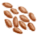

# 丛林沙拉  
> 精挑细选优质蔬菜！  
   
>   
  
<table class="table table-bordered" data-toggle="table" ><tbody><tr ><td  style="width:80%;text-align:left;vertical-align:top;"  >**重量：**150  **标签：**	[“可烹饪的”](tag_Cookable.md), [“椰子壳料理”](tag_MealCoconutShell.md)</td><td  style="width:20%;text-align:left;vertical-align:top;"  >

</td></tr></tbody></tbody></table>  
  
## 获取来源  
<table class="table table-bordered" data-toggle="table" ><thead><tr ><th  style="text-align:left;vertical-align:top;"  >来源</th><th  style="text-align:left;vertical-align:top;"  >操作</th></tr></thead><tr ><td  style="text-align:left;vertical-align:top;"  >[

[丛林沙拉(蓝图)](Bp_JungleSalad.md)](Bp_JungleSalad.md)</td><td  style="text-align:left;vertical-align:top;"  >蓝图制造</td></tr></tbody></table>  
  
## 动作  
<table class="table table-bordered" data-toggle="table" ><thead><tr ><th  style="text-align:left;vertical-align:top;"  >动作</th><th  style="text-align:left;vertical-align:top;"  >耗时</th><th  style="text-align:left;vertical-align:top;"  data-sortable="true"  >条件</th><th  style="text-align:left;vertical-align:top;"  >变化</th><th  style="text-align:left;vertical-align:top;"  >状态</th></tr></thead><tr ><td  style="text-align:left;vertical-align:top;"  >食用 [“食用蔬菜类动作(组)”](VegetarianAction.md) [“进食动作(组)”](EatingAction.md)</td><td  style="text-align:left;vertical-align:top;"  >1TP</td><td  style="text-align:left;vertical-align:top;"  ></td><td  style="text-align:left;vertical-align:top;"  >** 自身：** → [

[椰子壳](CoconutShell.md)](CoconutShell.md)</td><td  style="text-align:left;vertical-align:top;"  >[

[饱食](Satiation.md)](Satiation.md)+45 [

[胃](Stomach.md)](Stomach.md)+35 [

[水分](Hydration.md)](Hydration.md)+22 [

[情绪](Morale.md)](Morale.md)+5 [

[世界观](Structure.md)](Structure.md)+15 [

[蔬菜<nobr>厌倦度</nobr>](SaturationVegetables.md)](SaturationVegetables.md)+75 [

[椰子<nobr>厌倦度</nobr>](SaturationCoconuts.md)](SaturationCoconuts.md)+35 [

[坚果<nobr>厌倦度</nobr>](SaturationNuts.md)](SaturationNuts.md)+35 [

[污垢](Filth.md)](Filth.md)+15 [

[腹泻](Diarrhoea.md)](Diarrhoea.md)+30</td></tr></tbody></table>  
  
## 可拖至  

[祖父](Grandfather.md)

[祖父(健康)](GrandfatherHealthy.md)

  
  
## 属性   
<table class="table table-bordered" data-toggle="table" ><thead><tr ><th  style="text-align:left;vertical-align:top;"  >属性</th><th  style="text-align:left;vertical-align:top;"  >值</th><th  style="text-align:left;vertical-align:top;"  >耗时</th><th  style="text-align:left;vertical-align:top;"  >变化</th></tr></thead><tr ><td  style="text-align:left;vertical-align:top;"  >耐久</td><td  style="text-align:left;vertical-align:top;"  >初始：192</td><td  style="text-align:left;vertical-align:top;"  >每15分钟-1 最多需要：192TP</td><td  style="text-align:left;vertical-align:top;"  >** 到达0时： ** ** [Rot]  **   [

[腐烂物](RottenRemains.md)](RottenRemains.md)(+1)  ** 自身 ** → [

[椰子壳](CoconutShell.md)](CoconutShell.md)</td></tr></tbody></table>  
  

