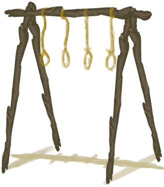

# 卡瓦根  
> 可以捣碎后泡入水中调制成一种舒缓茶，有舒缓压力、镇痛和退烧的功效。  
  
<table class="table table-bordered" data-toggle="table"  data-show-header="false"><thead style="display:none"><tr ><th  style="width:50%;text-align:left;vertical-align:top;"  >title</th><th  style="width:50%;text-align:left;vertical-align:top;"  ></th></tr></thead><tr ><td  style="width:50%;text-align:left;vertical-align:top;"  >**重量：**100  **标签：**	[“喂食（草食动物）”](tag_FeedHerb.md), [“饲料”](tag_Feed.md)</td><td  style="width:50%;text-align:left;vertical-align:top;"  >

<a href="KavaRoot.md" style="color:black">卡瓦根</a>

这种丛林灌木的根可以采摘、捣碎并浸泡在水中，制成具有止痛和退烧功效的薬用饮品。 作为一种欣快剂与镇静剂，它还有助于对抗抑郁和焦虑。</td></tr></tbody></table>  
  
## 获取来源  
<table class="table table-bordered" data-toggle="table"  ><thead style=""><tr ><th  style="text-align:left;vertical-align:top;"  >来源</th><th  style="text-align:left;vertical-align:top;"  >操作</th></tr></thead><tr ><td  style="text-align:left;vertical-align:top;"  >[

[卡瓦胡椒株](KavaPlant.md)](KavaPlant.md)</td><td  style="text-align:left;vertical-align:top;"  >采集根部</td></tr></tbody></table>  
  
## 动作  
<table class="table table-bordered" data-toggle="table"  ><thead style=""><tr ><th  style="text-align:left;vertical-align:top;"  >动作</th><th  style="text-align:left;vertical-align:top;"  >耗时</th><th  style="text-align:left;vertical-align:top;"  data-sortable="true"  >条件</th><th  style="text-align:left;vertical-align:top;"  >变化</th><th  style="text-align:left;vertical-align:top;"  >状态</th></tr></thead><tr ><td  style="text-align:left;vertical-align:top;"  >食用 [“食用蔬菜类动作(组)”](VegetarianAction.md) [“进食动作(组)”](EatingAction.md)</td><td  style="text-align:left;vertical-align:top;"  >15分</td><td  style="text-align:left;vertical-align:top;"  ></td><td  style="text-align:left;vertical-align:top;"  >** 自身：** →消失</td><td  style="text-align:left;vertical-align:top;"  >[

[饱食](Satiation.md)](Satiation.md)+10 [

[胃](Stomach.md)](Stomach.md)+2 [

[水分](Hydration.md)](Hydration.md) [

[压力](Stress.md)](Stress.md)-10 [

[情绪](Morale.md)](Morale.md)+1 [

[蔬菜<nobr>厌倦度</nobr>](SaturationVegetables.md)](SaturationVegetables.md)+30 [

[镇痛](Analgesia.md)](Analgesia.md)+25 [

[污垢](Filth.md)](Filth.md)+2</td></tr></tbody></table>  
  
## 可拖入  
<table class="table table-bordered" data-toggle="table"  ><thead style=""><tr ><th  style="text-align:left;vertical-align:top;"  >使用</th><th  style="text-align:left;vertical-align:top;"  >动作</th><th  style="text-align:left;vertical-align:top;"  >耗时</th><th  style="text-align:left;vertical-align:top;"  >条件</th><th  style="text-align:left;vertical-align:top;"  >变化</th><th  style="text-align:left;vertical-align:top;"  >玩家状态</th></tr></thead><tr ><td  style="text-align:left;vertical-align:top;"  >[“锤”](tag_Hammer.md)</td><td  style="text-align:left;vertical-align:top;"  >捣碎 [“手部动作(组)”](HandAction.md)</td><td  style="text-align:left;vertical-align:top;"  >15分</td><td  style="text-align:left;vertical-align:top;"  >[

[光亮](Light.md)](Light.md): 10-100</td><td  style="text-align:left;vertical-align:top;"  >** 自身: ** → [

[捣碎的卡瓦根](KavaRootGround.md)](KavaRootGround.md)</td><td  style="text-align:left;vertical-align:top;"  >[

[体重](Weight.md)](Weight.md)-1 [

[污垢](Filth.md)](Filth.md)+4 [

[手掌损伤](HandDamage.md)](HandDamage.md)+20 [

[薬草学(技能)](Skill_Herbology.md)](Skill_Herbology.md)+1</td></tr></tbody></table>  
  
## 可拖至  

[猪食槽](BoarFeeder.md)

[猪食槽(空)](BoarFeederEmpty.md)

[堆肥箱](CompostBin.md)

[未栽种的农田(空)](CropPlotEmpty.md)

[羊食槽](GoatFeeder.md)

[羊食槽(空)](GoatFeederEmpty.md)

[灰山鹑喂食器](PartridgeFeeder.md)

[灰山鹑喂食器(空)](PartridgeFeederEmpty.md)

[中陷阱的猕猴](CageTrapMacaque.md)

[母猪](BoarEnclosureFemale.md)

[公猪](BoarEnclosureMale.md)

[小猪](BoarEnclosurePiglet.md)

[母猪](BoarTiedFemale.md)

[公猪](BoarTiedMale.md)

[小猪](BoarTiedPiglet.md)

[母山羊](GoatEnclosureFemale.md)

[小羊](GoatEnclosureKid.md)

[哺乳期山羊](GoatEnclosureLactating.md)

[公山羊](GoatEnclosureMale.md)

[母山羊](GoatTiedFemale.md)

[哺乳期山羊](GoatTiedFemaleLactating.md)

[小羊](GoatTiedKid.md)

[公山羊](GoatTiedMale.md)

[猕猴朋友](MacaqueFriend.md)

[受伤的猕猴](MacaqueWounded.md)

[小灰山鹑](PartridgeChick.md)

[雌灰山鹑](PartridgeFemaleEnclosure.md)

[雌灰山鹑](PartridgeFemaleLive.md)

[雄灰山鹑](PartridgeMaleEnclosure.md)

[雄灰山鹑](PartridgeMaleLive.md)

  
  
## 可用于转化  
<table class="table table-bordered" data-toggle="table"  ><thead style=""><tr ><th  style="text-align:left;vertical-align:top;"  >转化为</th><th  style="text-align:left;vertical-align:top;"  >容器</th></tr></thead><tr ><td  style="text-align:left;vertical-align:top;"  >[

[干燥的卡瓦根](KavaRootDried.md)](KavaRootDried.md)</td><td  style="text-align:left;vertical-align:top;"  >[

[晾晒架](DryingRack.md)](DryingRack.md)</td></tr></tbody></table>  
  
## 属性   
<table class="table table-bordered" data-toggle="table"  ><thead style=""><tr ><th  style="text-align:left;vertical-align:top;"  >属性</th><th  style="text-align:left;vertical-align:top;"  >值</th><th  style="text-align:left;vertical-align:top;"  >耗时</th><th  style="text-align:left;vertical-align:top;"  >变化</th></tr></thead><tr ><td  style="text-align:left;vertical-align:top;"  >耐久</td><td  style="text-align:left;vertical-align:top;"  >初始：672</td><td  style="text-align:left;vertical-align:top;"  >每15分钟-1 最多需要：7天</td><td  style="text-align:left;vertical-align:top;"  >** 到达0时： **  ** 自身 ** → [

[腐烂物](RottenRemains.md)](RottenRemains.md)</td></tr><tr ><td  style="text-align:left;vertical-align:top;"  >进度</td><td  style="text-align:left;vertical-align:top;"  >初始：0 最大：336</td><td  style="text-align:left;vertical-align:top;"  >-</td><td  style="text-align:left;vertical-align:top;"  >** 到达上限时： **  ** 自身 ** → [

[干燥的卡瓦根](KavaRootDried.md)](KavaRootDried.md)</td></tr></tbody></table>  
  
## 被动效果  
<table class="table table-bordered" data-toggle="table"  ><thead style=""><tr ><th  style="text-align:left;vertical-align:top;"  >名称</th><th  style="text-align:left;vertical-align:top;"  >条件</th><th  style="text-align:left;vertical-align:top;"  >变化(每15分钟)</th><th  style="text-align:left;vertical-align:top;"  data-sortable="true"  >玩家状态</th></tr></thead><tr ><td  style="text-align:left;vertical-align:top;"  >Drying</td><td  style="text-align:left;vertical-align:top;"  >** 需要存在卡牌：** [“干燥环境”](tag_EnvDry.md) ** 需要状态：** [

[降水值](RainValue.md)](RainValue.md): 0-0</td><td  style="text-align:left;vertical-align:top;"  >进度+1(0.29%)</td><td  style="text-align:left;vertical-align:top;"  ></td></tr></tbody></table>  
  

