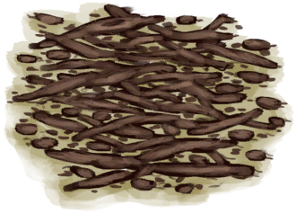

# 捣碎的卡瓦根  
> 可以泡入水中调制成一种舒缓茶，有舒缓压力、镇痛和退烧的功效。  
  
  属性  |   图片   
 ----  |  ----:   
 **重量：**50  **标签：**	[“喂/添加”](tag_Feed.md)  |     
  
## 获取来源  
来源  |  操作  
----  |  ----  
[卡瓦根](KavaRoot.md) , [“锤”](tag_Hammer.md)  |  捣碎  
[干燥的卡瓦根](KavaRootDried.md) , [“锤”](tag_Hammer.md)  |  捣碎  
## 动作  
动作  |  时间  |  条件  |  变化  |  状态  
----  |  ----  |  ----  |  ----  |  ----  
食用 [VegetarianAction](VegetarianAction.md) [EatingAction](EatingAction.md)  |  15分  |    |    |  [饱食](Satiation.md)+10 [胃](Stomach.md)+2 [水分](Hydration.md) [压力](Stress.md)-10 [情绪](Morale.md)+2 [蔬菜<nobr>厌倦度</nobr>](SaturationVegetables.md)+30 [镇痛](Analgesia.md)+50 [污垢](Filth.md)+4  
## 可拖入  
使用  |  动作  |  时间  |  条件  |  变化  |  玩家状态  
----  |  ----  |  ----  |  ----  |  ----  |  ----  
[“灌溉用水”](tag_WaterFresh.md)  |  浸泡  |  -  |    |  自身: → [卡瓦汤](LQ_Kava.md)  使用物: → [卡瓦汤](LQ_Kava.md)    |    
## 可拖至  
[猪食槽](BoarFeeder.md), [猪食槽(空)](BoarFeederEmpty.md), [堆肥箱](CompostBin.md), [灰山鹑喂食器](PartridgeFeeder.md), [灰山鹑喂食器(空)](PartridgeFeederEmpty.md), [中陷阱的猕猴](CageTrapMacaque.md), [母猪](BoarEnclosureFemale.md), [公猪](BoarEnclosureMale.md), [小猪](BoarEnclosurePiglet.md), [母猪](BoarTiedFemale.md), [公猪](BoarTiedMale.md), [小猪](BoarTiedPiglet.md), [猕猴朋友](MacaqueFriend.md), [受伤的猕猴](MacaqueWounded.md), [小灰山鹑](PartridgeChick.md), [雌灰山鹑](PartridgeFemaleEnclosure.md), [雌灰山鹑](PartridgeFemaleLive.md), [雄灰山鹑](PartridgeMaleEnclosure.md), [雄灰山鹑](PartridgeMaleLive.md)  
## 变化   
操作  |  值  |  时间  |  变化  
----  |  ----  |  ----  |  ----  
耐久  |  初始：672  |  每15分钟-1 最多需要：7天  |  ** 到达0时： ** → [腐烂物](RottenRemains.md)  
