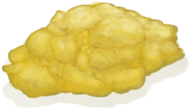
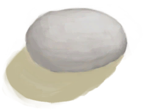

# 窑炉  
> 当温度达到足够高的时候，可以在其中烧制粘土  
  
<table class="table table-bordered" data-toggle="table"  data-show-header="false"><thead style="display:none"><tr ><th  style="width:50%;text-align:left;vertical-align:top;"  >title</th><th  style="width:50%;text-align:left;vertical-align:top;"  ></th></tr></thead><tr ><td  style="width:50%;text-align:left;vertical-align:top;"  >** 不可删除 **  **重量：**2500  **槽位：**3  **过滤器：**[“粘土”](tag_Clay.md)  ** 效果: ** [

[保温](InsulationCold.md)](InsulationCold.md)+5</td><td  style="width:50%;text-align:left;vertical-align:top;"  >

<a href="Kiln.md" style="color:black">窑炉</a>

一种基本的土窑，主要用于烧制粘土。点燃后会开始升温，当达到足够的温度后，里面的所有物品都会被烧制处理。  要<b>建造</b>窑炉，你首先需要制作<b>泥砖</b>，可以通过将<b>泥</b>与诸如<b>沙子、纤维、灰烬或碎海螺</b>之类的抗裂剂结合起来制成。  除了烧制粘土之外，窑还可以用<b>木材</b>烧制<b>木炭</b>，也可以将<b>石头或海螺</b>烧制成<b>生石灰</b>。</td></tr></tbody></table>  
  
## 获取来源  

** 使用**[火种](TinderLit.md)点燃

[窑炉(熄灭)](KilnExtinguished.md)

  
  
## 可拖入  

<table style="margin-bottom:0px;"><tr><td style="width:40%;text-align:left; background-color:#FEFEFE"><b>拖入：</b>[

[椰子壳](CoconutShell.md)](CoconutShell.md)</td><td style="width:40%;font-size:1em;font-weight:bold;background-color:#FEFEFE">添入椰子壳  </td></tr><tr style="background-color:#FFFFFF"><td style=""><b>使用物：</b>→消失</td><td style=""><b>自身：</b>燃料  +3(3.13%)</td></tr></table>
  

<table style="margin-bottom:0px;"><tr><td style="width:40%;text-align:left; background-color:#FEFEFE"><b>拖入：</b>[

[木材](Wood.md)](Wood.md)</td><td style="width:40%;font-size:1em;font-weight:bold;background-color:#FEFEFE">添入柴火  </td></tr><tr style="background-color:#FFFFFF"><td style=""><b>使用物：</b>→消失</td><td style=""><b>自身：</b>燃料  +28(29.17%)</td></tr></table>
  

<table style="margin-bottom:0px;"><tr><td style="width:40%;text-align:left; background-color:#FEFEFE"><b>拖入：</b>[“燃料”](tag_Fuel.md)</td><td style="width:40%;font-size:1em;font-weight:bold;background-color:#FEFEFE">添入燃料  </td></tr><tr style="background-color:#FFFFFF"><td style=""><b>使用物：</b>→消失</td><td style=""><b>自身：</b>燃料  +7(7.29%)</td></tr></table>
  

<table style="margin-bottom:0px;"><tr><td style="width:40%;text-align:left; background-color:#FEFEFE"><b>拖入：</b>[

[木炭](Charcoal.md)](Charcoal.md)</td><td style="width:40%;font-size:1em;font-weight:bold;background-color:#FEFEFE">添入木炭  </td></tr><tr style="background-color:#FFFFFF"><td style=""><b>使用物：</b>→消失</td><td style=""><b>自身：</b>燃料  +16(16.67%)</td></tr></table>
  

<table style="margin-bottom:0px;"><tr><td style="width:40%;text-align:left; background-color:#FEFEFE"><b>拖入：</b>[

[火炭](Embers.md)](Embers.md)</td><td style="width:40%;font-size:1em;font-weight:bold;background-color:#FEFEFE">添入火炭  </td></tr><tr style="background-color:#FFFFFF"><td style=""><b>使用物：</b>→消失</td><td style=""><b>自身：</b>燃料  +16(16.67%)</td></tr></table>
  

<table style="margin-bottom:0px;"><tr><td style="width:40%;text-align:left; background-color:#FEFEFE"><b>拖入：</b>[

[枯叶](LeavesDry.md)](LeavesDry.md) | [

[鸟巢](Nest.md)](Nest.md) | [

[木屑](WoodShavings.md)](WoodShavings.md) | [

[纤维](Fibers.md)](Fibers.md) | [

[纸](Papers.md)](Papers.md)</td><td style="width:40%;font-size:1em;font-weight:bold;background-color:#FEFEFE">点燃火绒  </td></tr><tr style="background-color:#FFFFFF"><td style=""><b>使用物：</b>→ [

[火种](TinderLit.md)](TinderLit.md)</td><td style=""><b>自身：</b></td></tr></table>
  

<table style="margin-bottom:0px;"><tr><td style="width:40%;text-align:left; background-color:#FEFEFE"><b>拖入：</b>[“树叶”](tag_Leaves.md)</td><td style="width:40%;font-size:1em;font-weight:bold;background-color:#FEFEFE">添入树叶  </td></tr><tr style="background-color:#FFFFFF"><td style=""><b>使用物：</b>→消失</td><td style=""><b>自身：</b>燃料  +2(2.08%)</td></tr></table>
  

<table style="margin-bottom:0px;"><tr><td style="width:40%;text-align:left; background-color:#FEFEFE"><b>拖入：</b>[

[风箱](Bellows.md)](Bellows.md)</td><td style="width:40%;font-size:1em;font-weight:bold;background-color:#FEFEFE">提升温度 (30分) </td></tr><tr style="background-color:#FFFFFF"><td style=""><b>使用物：</b>可用次数  -1</td><td style=""><b>自身：</b>温度

  +300(33.33%)</td></tr></table>
  
  
## 可拖至  

[香茅蜡烛(关)](CandleCitronellaOff.md)

[茉莉蜡烛(关)](CandleJasmineOff.md)

[蜡烛(关)](CandleOff.md)

  
  
## 转化  

<table style="margin-bottom:0px;"><tr><td  colspan=2 style="font-size:1em;font-weight:bold;background-color:#FEFEFE">蒸馏器</td><td style="text-align:right; background-color:#FEFEFE"></td></tr><tr style="background-color:#FFFFFF"><td style="width:30%;font-size:1em;text-align:right;vertical-align:middle;">[

[未烧制的蒸馏器](AlembicUnfired.md)](AlembicUnfired.md)</td><td style="text-align:center;width:20%;vertical-align:middle;">
5小时

蒸馏器
</td><td style="text-align:left;vertical-align:middle;">[

[蒸馏器](AlembicUndeployed.md)](AlembicUndeployed.md)(+1)</td></tr><tr style="text-align:left;background-color:#FEFEFE"><td colspan="3"><b></b>** 需要属性：** 温度

: 800～3000(88.89%～333.33%)</td></tr></table>
  

<table style="margin-bottom:0px;"><tr><td  colspan=2 style="font-size:1em;font-weight:bold;background-color:#FEFEFE">煅烧硫磺石</td><td style="text-align:right; background-color:#FEFEFE"></td></tr><tr style="background-color:#FFFFFF"><td style="width:30%;font-size:1em;text-align:right;vertical-align:middle;">[

[硫磺石](StoneHeavyBrimstone.md)](StoneHeavyBrimstone.md)</td><td style="text-align:center;width:20%;vertical-align:middle;">
8小时

煅烧硫磺石
</td><td style="text-align:left;vertical-align:middle;">[

[硫磺](Brimstone.md)](Brimstone.md)(+1)</td></tr><tr style="text-align:left;background-color:#FEFEFE"><td colspan="3"><b></b>** 需要属性：** 温度

: 900～3000(100%～333.33%)</td></tr></table>
  

<table style="margin-bottom:0px;"><tr><td  colspan=2 style="font-size:1em;font-weight:bold;background-color:#FEFEFE">煅烧大石块</td><td style="text-align:right; background-color:#FEFEFE"></td></tr><tr style="background-color:#FFFFFF"><td style="width:30%;font-size:1em;text-align:right;vertical-align:middle;">[

[大石块](StoneHeavy.md)](StoneHeavy.md)</td><td style="text-align:center;width:20%;vertical-align:middle;">
8小时

煅烧大石块
</td><td style="text-align:left;vertical-align:middle;">[

[煅烧后的大石块](StoneHeavyBurnt.md)](StoneHeavyBurnt.md)(+1)</td></tr><tr style="text-align:left;background-color:#FEFEFE"><td colspan="3"><b></b>** 需要属性：** 温度

: 900～3000(100%～333.33%)</td></tr></table>
  

<table style="margin-bottom:0px;"><tr><td  colspan=2 style="font-size:1em;font-weight:bold;background-color:#FEFEFE">煅烧砂浆</td><td style="text-align:right; background-color:#FEFEFE"></td></tr><tr style="background-color:#FFFFFF"><td style="width:30%;font-size:1em;text-align:right;vertical-align:middle;">[

[干燥的砂浆](MortarDry.md)](MortarDry.md)</td><td style="text-align:center;width:20%;vertical-align:middle;">
8小时

煅烧砂浆
</td><td style="text-align:left;vertical-align:middle;">[

[煅烧后的砂浆](MortarBurnt.md)](MortarBurnt.md)(+1)</td></tr><tr style="text-align:left;background-color:#FEFEFE"><td colspan="3"><b></b>** 需要属性：** 温度

: 900～3000(100%～333.33%)</td></tr></table>
  

<table style="margin-bottom:0px;"><tr><td  colspan=2 style="font-size:1em;font-weight:bold;background-color:#FEFEFE">煅烧石头</td><td style="text-align:right; background-color:#FEFEFE"></td></tr><tr style="background-color:#FFFFFF"><td style="width:30%;font-size:1em;text-align:right;vertical-align:middle;">[

[石头](Stone.md)](Stone.md) [

[石刀](StoneSharpened.md)](StoneSharpened.md)</td><td style="text-align:center;width:20%;vertical-align:middle;">
8小时

煅烧石头
</td><td style="text-align:left;vertical-align:middle;">[

[煅烧后的石头](StoneBurnt.md)](StoneBurnt.md)(+1)</td></tr><tr style="text-align:left;background-color:#FEFEFE"><td colspan="3"><b></b>** 需要属性：** 温度

: 900～3000(100%～333.33%)</td></tr></table>
  

<table style="margin-bottom:0px;"><tr><td  colspan=2 style="font-size:1em;font-weight:bold;background-color:#FEFEFE">保鲜罐</td><td style="text-align:right; background-color:#FEFEFE"></td></tr><tr style="background-color:#FFFFFF"><td style="width:30%;font-size:1em;text-align:right;vertical-align:middle;">[

[未烧制的保鲜罐](ClayPotCoolerUnfired.md)](ClayPotCoolerUnfired.md)</td><td style="text-align:center;width:20%;vertical-align:middle;">
6小时

保鲜罐
</td><td style="text-align:left;vertical-align:middle;">[

[保鲜罐](ClayPotCoolerUndeployed.md)](ClayPotCoolerUndeployed.md)(+1)</td></tr><tr style="text-align:left;background-color:#FEFEFE"><td colspan="3"><b></b>** 需要属性：** 温度

: 800～3000(88.89%～333.33%)</td></tr></table>
  

<table style="margin-bottom:0px;"><tr><td  colspan=2 style="font-size:1em;font-weight:bold;background-color:#FEFEFE">烧制熏蜂器</td><td style="text-align:right; background-color:#FEFEFE"></td></tr><tr style="background-color:#FFFFFF"><td style="width:30%;font-size:1em;text-align:right;vertical-align:middle;">[

[未烧制的熏蜂器](BeeSmokerUnfired.md)](BeeSmokerUnfired.md)</td><td style="text-align:center;width:20%;vertical-align:middle;">
3小时

烧制熏蜂器
</td><td style="text-align:left;vertical-align:middle;">[

[熏蜂器(关)](BeeSmokerOff.md)](BeeSmokerOff.md)(+1)</td></tr><tr style="text-align:left;background-color:#FEFEFE"><td colspan="3"><b></b>** 需要属性：** 温度

: 600～3000(66.67%～333.33%)</td></tr></table>
  

<table style="margin-bottom:0px;"><tr><td  colspan=2 style="font-size:1em;font-weight:bold;background-color:#FEFEFE">烧制陶碗</td><td style="text-align:right; background-color:#FEFEFE"></td></tr><tr style="background-color:#FFFFFF"><td style="width:30%;font-size:1em;text-align:right;vertical-align:middle;">[

[未烧制的陶碗](ClayBowlUnfired.md)](ClayBowlUnfired.md)</td><td style="text-align:center;width:20%;vertical-align:middle;">
4小时

烧制陶碗
</td><td style="text-align:left;vertical-align:middle;">[

[陶碗](ClayBowl.md)](ClayBowl.md)(+1)</td></tr></table>
  

<table style="margin-bottom:0px;"><tr><td  colspan=2 style="font-size:1em;font-weight:bold;background-color:#FEFEFE">烧制粘土火盆</td><td style="text-align:right; background-color:#FEFEFE"></td></tr><tr style="background-color:#FFFFFF"><td style="width:30%;font-size:1em;text-align:right;vertical-align:middle;">[

[未烧制的粘土火盆](ClayFirePitUnfired.md)](ClayFirePitUnfired.md)</td><td style="text-align:center;width:20%;vertical-align:middle;">
4小时

烧制粘土火盆
</td><td style="text-align:left;vertical-align:middle;">[

[粘土火盆(熄灭)](ClayFirePitExtinguished.md)](ClayFirePitExtinguished.md)(+1)</td></tr><tr style="text-align:left;background-color:#FEFEFE"><td colspan="3"><b></b>** 需要属性：** 温度

: 600～3000(66.67%～333.33%)</td></tr></table>
  

<table style="margin-bottom:0px;"><tr><td  colspan=2 style="font-size:1em;font-weight:bold;background-color:#FEFEFE">烧制小陶罐</td><td style="text-align:right; background-color:#FEFEFE"></td></tr><tr style="background-color:#FFFFFF"><td style="width:30%;font-size:1em;text-align:right;vertical-align:middle;">[

[未烧制的小陶罐](ClayJarUnfired.md)](ClayJarUnfired.md)</td><td style="text-align:center;width:20%;vertical-align:middle;">
3小时

烧制小陶罐
</td><td style="text-align:left;vertical-align:middle;">[

[小陶罐](ClayJar.md)](ClayJar.md)(+1)</td></tr><tr style="text-align:left;background-color:#FEFEFE"><td colspan="3"><b></b>** 需要属性：** 温度

: 600～3000(66.67%～333.33%)</td></tr></table>
  

<table style="margin-bottom:0px;"><tr><td  colspan=2 style="font-size:1em;font-weight:bold;background-color:#FEFEFE">烧制陶罐</td><td style="text-align:right; background-color:#FEFEFE"></td></tr><tr style="background-color:#FFFFFF"><td style="width:30%;font-size:1em;text-align:right;vertical-align:middle;">[

[未烧制的陶罐](ClayVaseUnfired.md)](ClayVaseUnfired.md)</td><td style="text-align:center;width:20%;vertical-align:middle;">
4小时

烧制陶罐
</td><td style="text-align:left;vertical-align:middle;">[

[陶罐](ClayVase.md)](ClayVase.md)(+1)</td></tr><tr style="text-align:left;background-color:#FEFEFE"><td colspan="3"><b></b>** 需要属性：** 温度

: 600～3000(66.67%～333.33%)</td></tr></table>
  

<table style="margin-bottom:0px;"><tr><td  colspan=2 style="font-size:1em;font-weight:bold;background-color:#FEFEFE">烧制烹饪锅</td><td style="text-align:right; background-color:#FEFEFE"></td></tr><tr style="background-color:#FFFFFF"><td style="width:30%;font-size:1em;text-align:right;vertical-align:middle;">[

[未烧制的烹饪锅](CookingPotUnfired.md)](CookingPotUnfired.md)</td><td style="text-align:center;width:20%;vertical-align:middle;">
4小时

烧制烹饪锅
</td><td style="text-align:left;vertical-align:middle;">[

[烹饪锅](CookingPot.md)](CookingPot.md)(+1)</td></tr><tr style="text-align:left;background-color:#FEFEFE"><td colspan="3"><b></b>** 需要属性：** 温度

: 600～3000(66.67%～333.33%)</td></tr></table>
  

<table style="margin-bottom:0px;"><tr><td  colspan=2 style="font-size:1em;font-weight:bold;background-color:#FEFEFE">烧制釉面陶罐</td><td style="text-align:right; background-color:#FEFEFE"></td></tr><tr style="background-color:#FFFFFF"><td style="width:30%;font-size:1em;text-align:right;vertical-align:middle;">[

[未烧制的釉面陶罐](GlazedVaseUnfired.md)](GlazedVaseUnfired.md)</td><td style="text-align:center;width:20%;vertical-align:middle;">
4小时

烧制釉面陶罐
</td><td style="text-align:left;vertical-align:middle;">[

[釉面陶罐](GlazedVase.md)](GlazedVase.md)(+1)</td></tr><tr style="text-align:left;background-color:#FEFEFE"><td colspan="3"><b></b>** 需要属性：** 温度

: 800～3000(88.89%～333.33%)</td></tr></table>
  

<table style="margin-bottom:0px;"><tr><td  colspan=2 style="font-size:1em;font-weight:bold;background-color:#FEFEFE">制作木炭</td><td style="text-align:right; background-color:#FEFEFE"></td></tr><tr style="background-color:#FFFFFF"><td style="width:30%;font-size:1em;text-align:right;vertical-align:middle;">[

[木材](Wood.md)](Wood.md)</td><td style="text-align:center;width:20%;vertical-align:middle;">
4小时

制作木炭
</td><td style="text-align:left;vertical-align:middle;">[

[木炭](Charcoal.md)](Charcoal.md)(+1)</td></tr><tr style="text-align:left;background-color:#FEFEFE"><td colspan="3"><b></b>** 需要属性：** 温度

: 400～3000(44.44%～333.33%)</td></tr></table>
  

<table style="margin-bottom:0px;"><tr><td  colspan=2 style="font-size:1em;font-weight:bold;background-color:#FEFEFE">制作生石灰</td><td style="text-align:right; background-color:#FEFEFE"></td></tr><tr style="background-color:#FFFFFF"><td style="width:30%;font-size:1em;text-align:right;vertical-align:middle;">[

[海螺](Conch.md)](Conch.md) [

[碎海螺壳](ConchBroken.md)](ConchBroken.md) [

[漂亮贝壳](SeashellsPretty.md)](SeashellsPretty.md)</td><td style="text-align:center;width:20%;vertical-align:middle;">
4小时

制作生石灰
</td><td style="text-align:left;vertical-align:middle;">[

[生石灰](Quicklime.md)](Quicklime.md)(+1)</td></tr><tr style="text-align:left;background-color:#FEFEFE"><td colspan="3"><b></b>** 需要属性：** 温度

: 900～3000(100%～333.33%)</td></tr></table>
  

<table style="margin-bottom:0px;"><tr><td  colspan=2 style="font-size:1em;font-weight:bold;background-color:#FEFEFE">制作硫酸</td><td style="text-align:right; background-color:#FEFEFE"></td></tr><tr style="background-color:#FFFFFF"><td style="width:30%;font-size:1em;text-align:right;vertical-align:middle;">[

[硫酸盐混合物](LQ_VitriolMix.md)](LQ_VitriolMix.md)</td><td style="text-align:center;width:20%;vertical-align:middle;">
2小时

制作硫酸
</td><td style="text-align:left;vertical-align:middle;">→ [

[硫酸](LQ_Vitriol.md)](LQ_Vitriol.md)</td></tr><tr style="text-align:left;background-color:#FEFEFE"><td colspan="3"><b></b>** 需要属性：** 温度

: 200～3000(22.22%～333.33%)</td></tr></table>
  
## 属性   

<table style="margin-bottom:0px;"><tr><td style="width:30%;text-align:left; background-color:#FEFEFE;font-size:1.3em;font-weight:bold;">

温度</td><td style="font-size:1em;background-color:#FEFEFE">初始：0 , 最大：900 每15分钟+8 , 最多需要：1天4小时8分</td></tr><tr style="background-color:#FFFFFF"><td colspan=2></td></tr></table>
  

<table style="margin-bottom:0px;"><tr><td style="width:30%;text-align:left; background-color:#FEFEFE;font-size:1.3em;font-weight:bold;">燃料</td><td style="font-size:1em;background-color:#FEFEFE">初始：32 , 最大：96 每15分钟-1 , 最多需要：1天</td></tr><tr style="background-color:#FFFFFF"><td colspan=2>** 到达0时： ** 自身: → [

[窑炉(熄灭)](KilnExtinguished.md)](KilnExtinguished.md) [

[灰烬](Ash.md)](Ash.md)(+1), [

[木炭](Charcoal.md)](Charcoal.md)(+0～+1)</td></tr></table>
  

