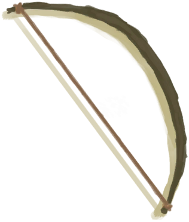

# 军刀  
> 一把坚固的军用小刀，非常好用。 变钝后可以再次打磨锋利。  
  
<table class="table table-bordered" data-toggle="table"  data-show-header="false"><thead style="display:none"><tr ><th  style="width:50%;text-align:left;vertical-align:top;"  >title</th><th  style="width:50%;text-align:left;vertical-align:top;"  ></th></tr></thead><tr ><td  style="width:50%;text-align:left;vertical-align:top;"  >**重量：**100  **标签：**	[“刮具”](tag_Scraper.md), [“切割工具”](tag_Cutter.md), [“高级切割工具”](tag_CutterAdv.md), [“锤”](tag_Hammer.md), [“军用的”](tag_Military.md), [“沉重的”](tag_Heavy.md), [“美丽的/好看的”](tag_Pretty.md)  **可用次数：**60</td><td  style="width:50%;text-align:left;vertical-align:top;"  >

<a href="KnifeMilitary.md" style="color:black">军刀</a>

</td></tr></tbody></table>  
  
## 获取来源  

打开

[补给胶囊](TV_SupplyCapsule.md)

** 使用**[石头](Stone.md)磨利

[军刀](KnifeMilitary.md)

** 使用**[石头](Stone.md) , [大石块](StoneHeavy.md)磨利

[钝刀](KnifeMilitaryBlunt.md)

  
  
## 可拖入  

<table style="margin-bottom:0px;"><tr><td style="width:40%;text-align:left; background-color:#FEFEFE"><b>拖入：</b>[

[石头](Stone.md)](Stone.md)</td><td style="width:40%;font-size:1em;font-weight:bold;background-color:#FEFEFE">磨利 (30分) [“手部动作(组)”](HandAction.md)</td></tr><tr style="background-color:#FFFFFF"><td style=""><b>使用物：</b>可用次数  <b>-1</b></td><td style=""><b>自身：</b>→ [

[军刀](KnifeMilitary.md)](KnifeMilitary.md)</td></tr></table>
  
  
## 可拖至  

[帐篷](TentDeployed.md)

[收起的帐篷](TentPacked.md)

[铜矿脉(洞穴上层)](CopperVein.md)

[干土堆](DirtPile.md)

[火炉(熄灭)](StoveExtinguished.md)

[没气的救生筏](LifeRaftDeflated.md)

[泥堆](MudPile.md)

[打开的降落伞](ParachuteDeployed.md)

[水槽](WateringTrough.md)

[骨头碎片](BoneSplinters.md)

[骨头](Bones.md)

[木炭](Charcoal.md)

[椰子](Coconut.md)

[青椰子](CoconutHusked.md)

[带孔椰子](CoconutPerforated.md)

[腐烂的椰子](CoconutRotten.md)

[海螺](Conch.md)

[铜制装饰品](CopperDecoration_Mold.md)

[北梭鱼](Bonefish.md)

[烤北梭鱼](BonefishCooked.md)

[北梭鱼肉](BonefishMeat.md)

[烟熏北梭鱼](BonefishSmoked.md)

[中陷阱的猕猴](CageTrapMacaque.md)

[干辣椒](ChiliesDried.md)

[眼镜蛇尸体](CobraDead.md)

[海螺肉](ConchMeat.md)

[鱼干](FishDried.md)

[咸鱼](FishSalted.md)

[腌制中的咸鱼肉](FishSaltedDrying.md)

[姜](Ginger.md)

[干姜](GingerDried.md)

[绯鲤](Goatfish.md)

[烤绯鲤](GoatfishCooked.md)

[烟熏绯鲤](GoatfishSmoked.md)

[石斑鱼](Grouper.md)

[石斑鱼肉](GrouperMeat.md)

[烤石斑鱼](GrouperMeatCooked.md)

[烟熏石斑鱼](GrouperMeatSmoked.md)

[鲱鱼](Herring.md)

[烤鲱鱼](HerringCooked.md)

[烟熏鲱鱼](HerringSmoked.md)

[茉莉花](JasmineFlowers.md)

[卡瓦根](KavaRoot.md)

[干燥的卡瓦根](KavaRootDried.md)

[大马鲅鱼](KingThreadfin.md)

[野猪尸体](BoarCarcass.md)

[小猪尸体](BoarCarcassPiglet.md)

[母猪](BoarEnclosureFemale.md)

[公猪](BoarEnclosureMale.md)

[小猪](BoarEnclosurePiglet.md)

[剥皮的野猪](BoarSkinned.md)

[剥皮的猪](BoarSkinnedPiglet.md)

[母猪](BoarTiedFemale.md)

[公猪](BoarTiedMale.md)

[小猪](BoarTiedPiglet.md)

[忠犬朋友](DogFriend.md)

[山羊尸体(母)](GoatCarcassFemale.md)

[小羊尸体](GoatCarcassKid.md)

[山羊尸体(公)](GoatCarcassMale.md)

[母山羊](GoatEnclosureFemale.md)

[小羊](GoatEnclosureKid.md)

[哺乳期山羊](GoatEnclosureLactating.md)

[公山羊](GoatEnclosureMale.md)

[剥皮的山羊](GoatSkinned.md)

[剥皮的小羊](GoatSkinnedKid.md)

[母山羊](GoatTiedFemale.md)

[哺乳期山羊](GoatTiedFemaleLactating.md)

[小羊](GoatTiedKid.md)

[公山羊](GoatTiedMale.md)

[猕猴朋友](MacaqueFriend.md)

[柠檬草](LemongrassStalks.md)

[猕猴尸体](MacaqueCarcass.md)

[受伤的猕猴](MacaqueWounded.md)

[鹦哥鱼](ParrotFish.md)

[烤鹦哥鱼](ParrotFishCooked.md)

[烟熏鹦哥鱼](ParrotFishSmoked.md)

[灰山鹑尸体](PartridgeDead.md)

[雌灰山鹑](PartridgeFemaleEnclosure.md)

[雌灰山鹑](PartridgeFemaleLive.md)

[雄灰山鹑](PartridgeMaleEnclosure.md)

[雄灰山鹑](PartridgeMaleLive.md)

[海蛇尸体](SeaKraitDead.md)

[海鸥尸体](SeagullDead.md)

[海怪尸体](SeahoundCarcass.md)

[鲨鱼尸体](SharkCarcass.md)

[烤鲨鱼肉](SharkCooked.md)

[鲨鱼肉](SharkMeat.md)

[烟熏鲨鱼肉](SharkSmoked.md)

[蜘蛛兰叶](SpiderLilyLeaves.md)

[干燥的蜘蛛兰叶](SpiderLilyLeavesDried.md)

[烤马鲅鱼](ThreadfinCooked.md)

[马鲅鱼肉](ThreadfinMeat.md)

[烟熏马鲅鱼](ThreadfinSmoked.md)

[参薯](Yam.md)

[晶洞](Geode.md)

[大海螺](GiantConch.md)

[巨蜥尸体](MonitorCarcass.md)

[剥皮的巨蜥](MonitorSkinned.md)

[煅烧后的砂浆](MortarBurnt.md)

[泥砖](MudBrick.md)

[水椰子](NipaFruit.md)

[硝石晶体](NiterCrystals.md)

[牡蛎](Oyster.md)

[新鲜兽皮](SkinFresh.md)

[蜥蜴生皮](SkinFreshReptile.md)

[蛇草](SnakeGrass.md)

[长木棍](StickLong.md)

[小树枝](Sticks.md)

[煅烧后的石头](StoneBurnt.md)

[煅烧后的大石块](StoneHeavyBurnt.md)

[热带杏仁](TropicalAlmonds.md)

[野猪牙](Tusk.md)

[海胆](Urchin.md)

[硫磺喷口(火山)](VentBrimstone.md)

[韦斯顿](Weston.md)

[木材](Wood.md)

[未完成的木雕](WoodCarving_Unfinished.md)

[金鸡纳树](CinchonaTree.md)

[狭窄通道(洞穴底层)](CrystalChamberEntranceClosed.md)

[狭窄通道(潮湿洞穴)](DarkCaveCaveEntranceClosed.md)

[狭窄通道(洞穴中层)](DarkChamberCaveEntranceClosed.md)

[狭窄通道(洞穴上层)](FloodedChamberEntranceClosed.md)

[狭窄通道(隧道)](HighChamberEntranceClosed.md)

[水椰](NipaPalm.md)

[水稻](RicePlant.md)

[劈开的西米树干](SagoSplitLog.md)

[滤水器](WaterFilter.md)

  
  
## 可用于蓝图  

<a href="Bp_AloeGel.md" style="color:black">芦荟膏</a>

<a href="Bp_Arrow.md" style="color:black">箭矢</a>

<a href="Bp_BedWooden.md" style="color:black">木床</a>

<a href="Bp_BoneKnife.md" style="color:black">骨刀</a>

<a href="Bp_Bookshelf.md" style="color:black">书架</a>

<a href="Bp_Bow.md" style="color:black">弓</a>

<a href="Bp_BowDrill.md" style="color:black">弓钻</a>

<a href="Bp_BrimstoneGel.md" style="color:black">硫磺膏</a>

<a href="Bp_BugRepellent.md" style="color:black">驱虫膏</a>

<a href="Bp_CeremonialDagger.md" style="color:black">仪式匕首</a>

<a href="Bp_Chair.md" style="color:black">椅子</a>

<a href="Bp_CopperSheet.md" style="color:black">铜板</a>

<a href="Bp_CopperShovel.md" style="color:black">铜铲</a>

<a href="Bp_DeadfallTrap.md" style="color:black">落石陷阱</a>

<a href="Bp_Drum.md" style="color:black">鼓</a>

<a href="Bp_EatingUtensilsWooden.md" style="color:black">木质餐具</a>

<a href="Bp_FishingSpear.md" style="color:black">鱼叉</a>

<a href="Bp_FlintAxe.md" style="color:black">燧石斧</a>

<a href="Bp_FlintSpear.md" style="color:black">燧石长矛</a>

<a href="Bp_Glue.md" style="color:black">胶水</a>

<a href="Bp_HandDrill.md" style="color:black">手钻</a>

<a href="Bp_Harpoon.md" style="color:black">鱼镖</a>

<a href="Bp_Honey.md" style="color:black">蜂蜜</a>

<a href="Bp_LizardDrum.md" style="color:black">蜥蜴皮手鼓</a>

<a href="Bp_LogTrap.md" style="color:black">原木陷阱</a>

<a href="Bp_Mortar.md" style="color:black">砂浆</a>

<a href="Bp_ObsidianSpear.md" style="color:black">黑曜石长矛</a>

<a href="Bp_PesticideBrimstone.md" style="color:black">硫磺农药</a>

<a href="Bp_Planks.md" style="color:black">木板</a>

<a href="Bp_PotteryWheel.md" style="color:black">陶轮</a>

<a href="Bp_Quinine.md" style="color:black">金鸡纳树皮粉</a>

<a href="Bp_RusticSpear.md" style="color:black">简易长矛</a>

<a href="Bp_ScrapAxe.md" style="color:black">废金属斧</a>

<a href="Bp_ScrapKnife.md" style="color:black">废金属刀</a>

<a href="Bp_ScrapShovel.md" style="color:black">废金属铲</a>

<a href="Bp_Shelf.md" style="color:black">架子</a>

<a href="Bp_Shield.md" style="color:black">盾牌</a>

<a href="Bp_SnareTrap.md" style="color:black">套索陷阱</a>

<a href="Bp_Spindle.md" style="color:black">纺锤</a>

<a href="Bp_Splint.md" style="color:black">夹板</a>

<a href="Bp_Table.md" style="color:black">木桌</a>

<a href="Bp_Treenails.md" style="color:black">木钉</a>

<a href="Bp_Vitriol.md" style="color:black">硫酸</a>

<a href="Bp_WoodCarvings.md" style="color:black">木雕</a>

<a href="Bp_WoodShavings.md" style="color:black">木屑</a>

<a href="Bp_WoodenShovel.md" style="color:black">木铲</a>

<a href="Bp_CandiedGinger.md" style="color:black">姜糖</a>

<a href="Bp_CoconutMilk.md" style="color:black">椰奶</a>

<a href="Bp_Bellows.md" style="color:black">风箱</a>

<a href="Bp_CopperBottle.md" style="color:black">铜瓶</a>

<a href="Bp_CopperJar.md" style="color:black">铜罐</a>

<a href="Bp_CopperNecklace.md" style="color:black">铜项链</a>

<a href="Bp_CopperNeedles.md" style="color:black">铜针</a>

<a href="Bp_EatingUtensilsCopper.md" style="color:black">铜制餐具</a>

<a href="Bp_GasMask.md" style="color:black">防毒面具</a>

<a href="Bp_SharkHeadpiece.md" style="color:black">鲨鱼头饰</a>

<a href="Bp_WoodenNeedles.md" style="color:black">木针</a>

  
  
  
## 属性   

<table style="margin-bottom:0px;"><tr><td style="width:30%;text-align:left; background-color:#FEFEFE;font-size:1.3em;font-weight:bold;">使用次数</td><td style="font-size:1em;background-color:#FEFEFE">初始：60 -</td></tr><tr style="background-color:#FFFFFF"><td colspan=2>** 到达0时： ** 自身: → [

[钝刀](KnifeMilitaryBlunt.md)](KnifeMilitaryBlunt.md)</td></tr></table>
  

