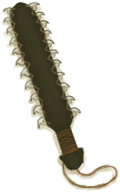
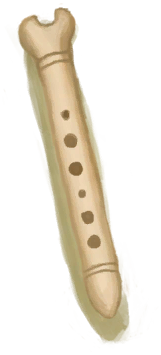
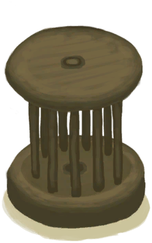

# 黑曜石刀  
> 非常锋利，但也很脆。  
  
<table class="table table-bordered" data-toggle="table"  data-show-header="false"><thead style="display:none"><tr ><th  style="width:50%;text-align:left;vertical-align:top;"  >title</th><th  style="width:50%;text-align:left;vertical-align:top;"  ></th></tr></thead><tr ><td  style="width:50%;text-align:left;vertical-align:top;"  >**重量：**100  **标签：**	[“刮具”](tag_Scraper.md), [“切割工具”](tag_Cutter.md), [“高级切割工具”](tag_CutterAdv.md), [“沉重的”](tag_Heavy.md), [“美丽的/好看的”](tag_Pretty.md)  **可用次数：**10</td><td  style="width:50%;text-align:left;vertical-align:top;"  >

<a href="KnifeObsidian.md" style="color:black">黑曜石刀</a>

这种极其锋利的刀具可以用一块<b>黑曜石</b>制作，前提是你的<b>石工</b>技能足够高。  <b>黑曜石刀具</b>与其他刀具（包括金属刀具）相比非常锋利，它们可以帮助你<b>更快</b>进行剥皮、刮皮和剔肉操作。它们是岛上屠夫和皮匠的绝佳工具。</td></tr></tbody></table>  
  
## 获取来源  

蓝图制造

[黑曜石刀(蓝图)](Bp_ObsidianKnife.md)

  
  
## 可拖至  

[帐篷](TentDeployed.md)

[收起的帐篷](TentPacked.md)

[没气的救生筏](LifeRaftDeflated.md)

[打开的降落伞](ParachuteDeployed.md)

[椰子](Coconut.md)

[青椰子](CoconutHusked.md)

[未完成的骨笛](FluteBone_Unfinished.md)

[未完成的木笛](FluteWooden_Unfinished.md)

[北梭鱼](Bonefish.md)

[烤北梭鱼](BonefishCooked.md)

[北梭鱼肉](BonefishMeat.md)

[烟熏北梭鱼](BonefishSmoked.md)

[中陷阱的猕猴](CageTrapMacaque.md)

[眼镜蛇尸体](CobraDead.md)

[鱼干](FishDried.md)

[咸鱼](FishSalted.md)

[腌制中的咸鱼](FishSaltedDrying.md)

[绯鲤](Goatfish.md)

[烤绯鲤](GoatfishCooked.md)

[烟熏绯鲤](GoatfishSmoked.md)

[石斑鱼](Grouper.md)

[石斑鱼肉](GrouperMeat.md)

[烤石斑鱼](GrouperMeatCooked.md)

[烟熏石斑鱼](GrouperMeatSmoked.md)

[鲱鱼](Herring.md)

[烤鲱鱼](HerringCooked.md)

[烟熏鲱鱼](HerringSmoked.md)

[大马鲅鱼](KingThreadfin.md)

[野猪尸体](BoarCarcass.md)

[小猪尸体](BoarCarcassPiglet.md)

[母猪](BoarEnclosureFemale.md)

[公猪](BoarEnclosureMale.md)

[小猪](BoarEnclosurePiglet.md)

[剥皮的野猪](BoarSkinned.md)

[剥皮的小猪](BoarSkinnedPiglet.md)

[母猪](BoarTiedFemale.md)

[公猪](BoarTiedMale.md)

[小猪](BoarTiedPiglet.md)

[忠犬朋友](DogFriend.md)

[山羊尸体(母)](GoatCarcassFemale.md)

[小羊尸体](GoatCarcassKid.md)

[山羊尸体(公)](GoatCarcassMale.md)

[母山羊](GoatEnclosureFemale.md)

[小羊](GoatEnclosureKid.md)

[泌乳期山羊](GoatEnclosureLactating.md)

[公山羊](GoatEnclosureMale.md)

[剥皮的山羊](GoatSkinned.md)

[剥皮的小羊](GoatSkinnedKid.md)

[母山羊](GoatTiedFemale.md)

[泌乳期山羊](GoatTiedFemaleLactating.md)

[小羊](GoatTiedKid.md)

[公山羊](GoatTiedMale.md)

[猕猴朋友](MacaqueFriend.md)

[海怪尸体](SeahoundCarcass.md)

[鲨鱼尸体](SharkCarcass.md)

[猕猴尸体](MacaqueCarcass.md)

[受伤的猕猴](MacaqueWounded.md)

[鹦哥鱼](ParrotFish.md)

[烤鹦哥鱼](ParrotFishCooked.md)

[烟熏鹦哥鱼](ParrotFishSmoked.md)

[灰山鹑尸体](PartridgeDead.md)

[雌灰山鹑](PartridgeFemaleEnclosure.md)

[雌灰山鹑](PartridgeFemaleLive.md)

[雄灰山鹑](PartridgeMaleEnclosure.md)

[雄灰山鹑](PartridgeMaleLive.md)

[海蛇尸体](SeaKraitDead.md)

[海鸥尸体](SeagullDead.md)

[烤鲨鱼肉](SharkCooked.md)

[鲨鱼肉](SharkMeat.md)

[烟熏鲨鱼肉](SharkSmoked.md)

[烤马鲅鱼](ThreadfinCooked.md)

[马鲅鱼肉](ThreadfinMeat.md)

[烟熏马鲅鱼](ThreadfinSmoked.md)

[参薯](Yam.md)

[巨蜥尸体](MonitorCarcass.md)

[剥皮的巨蜥](MonitorSkinned.md)

[水椰子](NipaFruit.md)

[牡蛎](Oyster.md)

[新鲜兽皮](SkinFresh.md)

[蜥蜴生皮](SkinFreshReptile.md)

[长木棍](StickLong.md)

[小树枝](Sticks.md)

[野猪牙](Tusk.md)

[木材](Wood.md)

[未完成的木雕](WoodCarving_Unfinished.md)

[金鸡纳树](CinchonaTree.md)

[水椰](NipaPalm.md)

[水稻](RicePlant.md)

[劈开的西米树干](SagoSplitLog.md)

  
  
## 可用于蓝图  

<a href="Bp_AloeGel.md" style="color:black">芦荟膏</a>

<a href="Bp_Arrow.md" style="color:black">箭矢</a>

<a href="Bp_ArrowBone.md" style="color:black">骨箭</a>

<a href="Bp_ArrowFlint.md" style="color:black">燧石箭</a>

<a href="Bp_BedWooden.md" style="color:black">木床</a>

<a href="Bp_BoneKnife.md" style="color:black">骨刀</a>

<a href="Bp_Bookshelf.md" style="color:black">书架</a>

<a href="Bp_Bow.md" style="color:black">弓</a>

<a href="Bp_BowComposite.md" style="color:black">复合弓</a>

<a href="Bp_BowDrill.md" style="color:black">弓钻</a>

<a href="Bp_Chair.md" style="color:black">椅子</a>

<a href="Bp_ClubSerrated.md" style="color:black">鲨齿棒</a>

<a href="Bp_CopperShovel.md" style="color:black">铜铲</a>

<a href="Bp_DeadfallTrap.md" style="color:black">落石陷阱</a>

<a href="Bp_Drum.md" style="color:black">鼓</a>

<a href="Bp_EatingUtensilsWooden.md" style="color:black">木质餐具</a>

<a href="Bp_FishingSpear.md" style="color:black">鱼叉</a>

<a href="Bp_FlintAxe.md" style="color:black">燧石斧</a>

<a href="Bp_FlintSpear.md" style="color:black">燧石长矛</a>

<a href="Bp_FluteBone.md" style="color:black">骨笛</a>

<a href="Bp_FluteWooden.md" style="color:black">木笛</a>

<a href="Bp_Glue.md" style="color:black">胶水</a>

<a href="Bp_HandDrill.md" style="color:black">手钻</a>

<a href="Bp_Harpoon.md" style="color:black">鱼镖</a>

<a href="Bp_LizardDrum.md" style="color:black">蜥蜴皮手鼓</a>

<a href="Bp_LogTrap.md" style="color:black">原木陷阱</a>

<a href="Bp_ObsidianSpear.md" style="color:black">黑曜石长矛</a>

<a href="Bp_Planks.md" style="color:black">木板</a>

<a href="Bp_PotteryWheel.md" style="color:black">陶轮</a>

<a href="Bp_RusticSpear.md" style="color:black">简易长矛</a>

<a href="Bp_Shelf.md" style="color:black">架子</a>

<a href="Bp_Shield.md" style="color:black">盾牌</a>

<a href="Bp_SnareTrap.md" style="color:black">套索陷阱</a>

<a href="Bp_Spindle.md" style="color:black">纺锤</a>

<a href="Bp_Splint.md" style="color:black">夹板</a>

<a href="Bp_Table.md" style="color:black">木桌</a>

<a href="Bp_Treenails.md" style="color:black">木钉</a>

<a href="Bp_WoodCarvings.md" style="color:black">木雕</a>

<a href="Bp_WoodShavings.md" style="color:black">木屑</a>

<a href="Bp_WoodenShovel.md" style="color:black">木铲</a>

<a href="Bp_CandiedGinger.md" style="color:black">姜糖</a>

<a href="Bp_Bellows.md" style="color:black">风箱</a>

<a href="Bp_CopperNecklace.md" style="color:black">铜项链</a>

<a href="Bp_CopperNeedles.md" style="color:black">铜针</a>

<a href="Bp_EatingUtensilsCopper.md" style="color:black">铜制餐具</a>

<a href="Bp_GasMask.md" style="color:black">防毒面具</a>

<a href="Bp_SharkHeadpiece.md" style="color:black">鲨鱼头饰</a>

<a href="Bp_WoodenNeedles.md" style="color:black">木针</a>

  
  
  
## 属性   

<table style="margin-bottom:0px;"><tr><td style="width:30%;text-align:left; background-color:#FEFEFE;font-size:1.3em;font-weight:bold;">使用次数</td><td style="font-size:1em;background-color:#FEFEFE">初始：10 -</td></tr><tr style="background-color:#FFFFFF"><td colspan=2>** 到达0时： ** 自身: →消失</td></tr></table>
  

