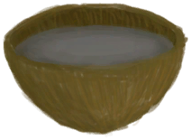

# 灰水  
> 可以煮沸制成碱液。  
  
<table class="table table-bordered" data-toggle="table"  data-show-header="false"><thead style="display:none"><tr ><th  style="width:50%;text-align:left;vertical-align:top;"  >title</th><th  style="width:50%;text-align:left;vertical-align:top;"  ></th></tr></thead><tr ><td  style="width:50%;text-align:left;vertical-align:top;"  >**标签：**	[“水(任意)”](tag_WaterAny.md)</td><td  style="width:50%;text-align:left;vertical-align:top;"  >

<a href="LQ_AshWater.md" style="color:black">灰水</a>

由<b>灰烬</b>与<b>水</b>混合而成。  煮沸它可以制作<b>碱液</b>，是一种强效消毒剂，适合用于制造<b>肥皂</b>。</td></tr></tbody></table>  
  
## 获取来源  
<table class="table table-bordered" data-toggle="table"  ><thead style=""><tr ><th  style="text-align:left;vertical-align:top;"  >来源</th><th  style="text-align:left;vertical-align:top;"  >操作</th></tr></thead><tr ><td  style="text-align:left;vertical-align:top;"  >[

[灰烬](Ash.md)](Ash.md)</td><td  style="text-align:left;vertical-align:top;"  >浸泡 ** 拖入：**[“灌溉用水”](tag_WaterFresh.md)</td></tr></tbody></table>  
  
## 动作  
<table class="table table-bordered" data-toggle="table"  ><thead style=""><tr ><th  style="text-align:left;vertical-align:top;"  >动作</th><th  style="text-align:left;vertical-align:top;"  data-sortable="true"  >耗时</th><th  style="text-align:left;vertical-align:top;"  data-sortable="true"  >条件</th><th  style="text-align:left;vertical-align:top;"  data-sortable="true"  >变化</th><th  style="text-align:left;vertical-align:top;"  >状态</th></tr></thead><tr ><td  style="text-align:left;vertical-align:top;"  >饮用 </td><td  style="text-align:left;vertical-align:top;"  >-</td><td  style="text-align:left;vertical-align:top;"  ></td><td  style="text-align:left;vertical-align:top;"  ></td><td  style="text-align:left;vertical-align:top;"  >[

[水分](Hydration.md)](Hydration.md)+40 [

[钠](Sodium.md)](Sodium.md)+75 [

[情绪](Morale.md)](Morale.md)-10 [

[恶心](Nausea.md)](Nausea.md)+50</td></tr></tbody></table>  
  
## 可拖至  

[人鱼巢](MermaidNest.md)

[干土堆](DirtPile.md)

[蒸馏器(关)](AlembicOff.md)

[蒸馏器(开)](AlembicOn.md)

[临时防毒面具](MaskMakeshift.md)

[细土](FineDirt.md)

[肥皂](SoapDry.md)

[湿肥皂](SoapWet.md)

  
  
## 被动效果  
<table class="table table-bordered" data-toggle="table"  ><thead style=""><tr ><th  style="text-align:left;vertical-align:top;"  >名称</th><th  style="text-align:left;vertical-align:top;"  data-sortable="true"  >条件</th><th  style="text-align:left;vertical-align:top;"  >变化(每15分钟)</th><th  style="text-align:left;vertical-align:top;"  data-sortable="true"  >玩家状态</th></tr></thead><tr ><td  style="text-align:left;vertical-align:top;"  >Evaporation</td><td  style="text-align:left;vertical-align:top;"  ></td><td  style="text-align:left;vertical-align:top;"  >含水量-1</td><td  style="text-align:left;vertical-align:top;"  ></td></tr><tr ><td  style="text-align:left;vertical-align:top;"  >Evaporation Large</td><td  style="text-align:left;vertical-align:top;"  ></td><td  style="text-align:left;vertical-align:top;"  >含水量-3</td><td  style="text-align:left;vertical-align:top;"  ></td></tr></tbody></table>  
  

