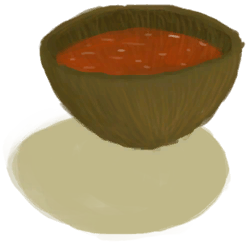

# 月季花茶  
> 安神静心，美味清甜。  
  
<table class="table table-bordered table2227" data-toggle="table"  data-show-header="false"><thead style="display:none"><tr ><th  style="width:50%;"  >title</th><th  style="width:50%;"  ></th></tr></thead><tr ><td  style="width:50%;"  >**重量：**0.33</td><td  style="width:50%;"  >

<a href="LQ_ChinaRoseTea.md" style="color:black">月季花茶</a>

月季可以在该岛的<b>丛林高地</b>中找到。  它的花是可食用的，也可以浸泡在开水中制成一种特殊的<b>茶</b>，具有放松和增强免疫系统的特性。  它们也可以<b>穿</b>在你的头发上或被蜜蜂用来制作<b>蜂蜜</b>。 </td></tr></tbody></table>  
  
## 获取来源  

** 使用**[开水](LQ_WaterBoiling.md)浸泡

[月季](ChinaRoseFlowers.md)

  
  
## 动作  

<table><tr><td rowspan="2" style="width:200px;text-align:center;font-size:1.3em;font-weight:bold">

饮用

</td><td></td></tr><tr><td><b>自身：</b>耐久  <b>-250(-52.08%)</b></td></tr><tr><td colspan="2"><b>状态变化：</b>[

[水分](Hydration.md)](Hydration.md)<b>+40</b>, [

[清醒度](Wakefulness.md)](Wakefulness.md)<b>-5</b>, [

[压力](Stress.md)](Stress.md)<b>-10</b> 加成<b>-1</b>, [

[月季效果](ChinaRoseEffect.md)](ChinaRoseEffect.md)<b>+24</b>, [

[情绪](Morale.md)](Morale.md)<b>+2</b></td></tr></table>
  
  
  
## 属性   

<table style="margin-bottom:0px;"><tr><td style="width:30%;text-align:left; background-color:#FEFEFE;font-size:1.3em;font-weight:bold;">耐久</td><td style="font-size:1em;background-color:#FEFEFE">初始：480 , 最大：480 每15分钟-0.5 , 最多需要：10天</td></tr><tr style="background-color:#FFFFFF"><td colspan=2>** 到达0时： ** 自身: → [

[不安全的水](LQ_WaterUnsafe.md)](LQ_WaterUnsafe.md)</td></tr></table>
  
## 被动效果  
<table class="table table-bordered table1947" data-toggle="table"  ><thead style=""><tr ><th  style=""  >名称</th><th  style=""  >条件</th><th  style=""  >变化(每15分钟)</th><th  style=""  data-sortable="true"  >玩家状态</th></tr></thead><tr ><td  style=""  >Evaporation</td><td  style=""  >** 需要容器：** [“容器（敞口）”](tag_ContainerOpen.md)</td><td  style=""  >耐久 -0.5(-0.11%) 含水量-1</td><td  style=""  ></td></tr></tbody></table>  
  

