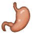

# 蜂蜜酒  
> 镇痛解忧，唯有美酒。  
  
<table class="table table-bordered table2968" data-toggle="table"  data-show-header="false"><thead style="display:none"><tr ><th  style="width:50%;"  >title</th><th  style="width:50%;"  ></th></tr></thead><tr ><td  style="width:50%;"  >**重量：**0.33</td><td  style="width:50%;"  >

<a href="LQ_Mead.md" style="color:black">蜂蜜酒</a>

蜂蜜酒是通过将<b>蜂蜜</b>兑入<b>水</b>中并让它自然发酵制成的。  这是一种可口的酒精饮料，可以用来提高<b>情绪和勇气</b>，麻痹<b>疼痛</b>，减轻<b>压力</b>。  不要过度饮酒，因为过量的酒精会导致<b>身体脱水</b>并使你感到<b>恶心</b>。</td></tr></tbody></table>  
  
## 获取来源  

转化

[蜂蜜水](LQ_HoneyWater.md)

  
  
## 动作  

<table><tr><td rowspan="2" style="width:200px;text-align:center;font-size:1.3em;font-weight:bold">

饮用

</td><td></td></tr><tr><td><b>自身：</b>耐久  <b>-300(-31.25%)</b></td></tr><tr><td colspan="2"><b>状态变化：</b>[

[水分](Hydration.md)](Hydration.md)<b>+35</b>, [

[胃](Stomach.md)](Stomach.md)<b>+15</b>, [

[腹泻](Diarrhoea.md)](Diarrhoea.md)<b>+5</b>, [

[饱食](Satiation.md)](Satiation.md)<b>+5</b>, [

[压力](Stress.md)](Stress.md)<b>-10</b> 加成<b>-1</b>, [

[情绪](Morale.md)](Morale.md)<b>+5</b>, [

[酒精](Alcohol.md)](Alcohol.md)<b>+12</b></td></tr></table>
  
  
  
## 可用于蓝图  

<a href="Bp_DrunkenCrab.md" style="color:black">醉蟹</a>

  
  
  
## 属性   

<table style="margin-bottom:0px;"><tr><td style="width:30%;text-align:left; background-color:#FEFEFE;font-size:1.3em;font-weight:bold;">耐久</td><td style="font-size:1em;background-color:#FEFEFE">初始：960 , 最大：960 每15分钟-0.5 , 最多需要：20天</td></tr><tr style="background-color:#FFFFFF"><td colspan=2>** 到达0时： ** 自身: → [

[醋](LQ_Vinegar.md)](LQ_Vinegar.md)</td></tr></table>
  
## 被动效果  
<table class="table table-bordered table8427" data-toggle="table"  ><thead style=""><tr ><th  style=""  >名称</th><th  style=""  >条件</th><th  style=""  >变化(每15分钟)</th><th  style=""  data-sortable="true"  >玩家状态</th></tr></thead><tr ><td  style=""  >Evaporation</td><td  style=""  >** 需要容器：** [“容器（敞口）”](tag_ContainerOpen.md)</td><td  style=""  >耐久 -0.5(-0.06%) 含水量-0.5</td><td  style=""  ></td></tr></tbody></table>  
  

