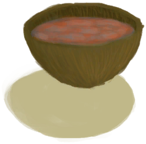

# 辣椒农薬  
> 保护庄稼远离螨虫和动物。  
  
<table class="table table-bordered table0366" data-toggle="table"  data-show-header="false"><thead style="display:none"><tr ><th  style="width:50%;"  >title</th><th  style="width:50%;"  ></th></tr></thead><tr ><td  style="width:50%;"  >**重量：**0.33</td><td  style="width:50%;"  >

<a href="LQ_PesticideChilli.md" style="color:black">辣椒农薬</a>

辣椒可以在岛上的<b>草原</b>地区找到。把辣椒放在<b>晾晒架</b>上晒干后，就可以捣碎成<b>粉</b>，并通过相应的蓝图与<b>肥皂</b>结合以制作辣椒农薬。 这种农薬的制造成本相对较低，可以预防和应对干燥地区常见的<b>螨虫侵害</b>。</td></tr></tbody></table>  
  
## 获取来源  

蓝图制造

[辣椒农薬(蓝图)](Bp_PesticideChilli.md)

  
  
## 可拖入  

<table style="margin-bottom:0px;"><tr><td style="width:40%;text-align:left; background-color:#FEFEFE"><b>拖入：</b>[“农作物”](tag_Crop.md)</td><td style="width:40%;font-size:1em;font-weight:bold;background-color:#FEFEFE">使用 (15分) </td></tr><tr style="background-color:#FFFFFF"><td style=""><b>使用物：</b>  <b>+380</b></td><td style=""><b>自身：</b></td></tr></table>
  
  
## 被动效果  
<table class="table table-bordered table0265" data-toggle="table"  ><thead style=""><tr ><th  style=""  >名称</th><th  style=""  >条件</th><th  style=""  >变化(每15分钟)</th><th  style=""  data-sortable="true"  >玩家状态</th></tr></thead><tr ><td  style=""  >Evaporation</td><td  style=""  >** 需要容器：** [“容器（敞口）”](tag_ContainerOpen.md)</td><td  style=""  >含水量-1</td><td  style=""  ></td></tr></tbody></table>  
  

