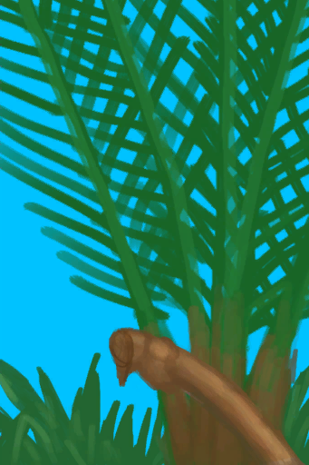

# 水椰树汁  
> 不赶快喝掉的话就会发酵成酒。  
  
<table class="table table-bordered" data-toggle="table"  data-show-header="false"><thead style="display:none"><tr ><th  style="width:50%;text-align:left;vertical-align:top;"  >title</th><th  style="width:50%;text-align:left;vertical-align:top;"  ></th></tr></thead><tr ><td  style="width:50%;text-align:left;vertical-align:top;"  >**重量：**0.33</td><td  style="width:50%;text-align:left;vertical-align:top;"  >

<a href="LQ_Sap.md" style="color:black">水椰树汁</a>

可以使用<b>切割工具或斧子</b>从水椰上切下果实并将任何<b>容器</b>放入其物品栏中来收集树汁。  随着时间的推移，<b>水椰树汁</b>会逐渐灌入容器。注意不要轻易让树汁暴露在空气中，否则会迅速发酵成<b>棕榈酒</b>。  水椰树汁也可以熬制成<b>糖</b>，只需要在<b>营火</b>上煮沸即可。</td></tr></tbody></table>  
  
## 获取来源  
<table class="table table-bordered" data-toggle="table"  ><thead style=""><tr ><th  style="text-align:left;vertical-align:top;"  >来源</th><th  style="text-align:left;vertical-align:top;"  >操作</th></tr></thead><tr ><td  style="text-align:left;vertical-align:top;"  >[

[水椰树](NipaSapStation.md)](NipaSapStation.md)</td><td  style="text-align:left;vertical-align:top;"  >水椰树汁</td></tr></tbody></table>  
  
## 动作  
<table class="table table-bordered" data-toggle="table"  ><thead style=""><tr ><th  style="text-align:left;vertical-align:top;"  >动作</th><th  style="text-align:left;vertical-align:top;"  data-sortable="true"  >耗时</th><th  style="text-align:left;vertical-align:top;"  data-sortable="true"  >条件</th><th  style="text-align:left;vertical-align:top;"  >变化</th><th  style="text-align:left;vertical-align:top;"  >状态</th></tr></thead><tr ><td  style="text-align:left;vertical-align:top;"  >饮用 </td><td  style="text-align:left;vertical-align:top;"  >-</td><td  style="text-align:left;vertical-align:top;"  ></td><td  style="text-align:left;vertical-align:top;"  >** 自身：** 耐久  -300(-3750%)</td><td  style="text-align:left;vertical-align:top;"  >[

[水分](Hydration.md)](Hydration.md)+30 [

[胃](Stomach.md)](Stomach.md)+15 [

[糖<nobr>厌倦度</nobr>](SaturationSugar.md)](SaturationSugar.md)+15 [

[腹泻](Diarrhoea.md)](Diarrhoea.md)+10 [

[饱食](Satiation.md)](Satiation.md)+10 [

[情绪](Morale.md)](Morale.md)+1</td></tr></tbody></table>  
  
## 可用于转化  
<table class="table table-bordered" data-toggle="table"  ><thead style=""><tr ><th  style="text-align:left;vertical-align:top;"  >转化为</th><th  style="text-align:left;vertical-align:top;"  >容器</th></tr></thead><tr ><td  style="text-align:left;vertical-align:top;"  >[

[糖](Sugar.md)](Sugar.md)</td><td  style="text-align:left;vertical-align:top;"  >[

[营火](Campfire.md)](Campfire.md)</td></tr><tr ><td  style="text-align:left;vertical-align:top;"  >[

[糖](Sugar.md)](Sugar.md)</td><td  style="text-align:left;vertical-align:top;"  >[

[粘土火盆](ClayFirePit.md)](ClayFirePit.md)</td></tr><tr ><td  style="text-align:left;vertical-align:top;"  >[

[糖](Sugar.md)](Sugar.md)</td><td  style="text-align:left;vertical-align:top;"  >[

[火堆](Fire.md)](Fire.md)</td></tr><tr ><td  style="text-align:left;vertical-align:top;"  >[

[糖](Sugar.md)](Sugar.md)</td><td  style="text-align:left;vertical-align:top;"  >[

[瓦斯炉(开)](GasCookerOn.md)](GasCookerOn.md)</td></tr><tr ><td  style="text-align:left;vertical-align:top;"  >[

[糖](Sugar.md)](Sugar.md)</td><td  style="text-align:left;vertical-align:top;"  >[

[火炉](Stove.md)](Stove.md)</td></tr></tbody></table>  
  
## 属性   
<table class="table table-bordered" data-toggle="table"  ><thead style=""><tr ><th  style="text-align:left;vertical-align:top;"  >属性</th><th  style="text-align:left;vertical-align:top;"  >值</th><th  style="text-align:left;vertical-align:top;"  data-sortable="true"  >耗时</th><th  style="text-align:left;vertical-align:top;"  >变化</th></tr></thead><tr ><td  style="text-align:left;vertical-align:top;"  >耐久</td><td  style="text-align:left;vertical-align:top;"  >初始：8 最大：8</td><td  style="text-align:left;vertical-align:top;"  >-</td><td  style="text-align:left;vertical-align:top;"  >** 到达0时： **  ** 自身 ** → [

[棕榈酒](LQ_PalmWine.md)](LQ_PalmWine.md)</td></tr></tbody></table>  
  
## 被动效果  
<table class="table table-bordered" data-toggle="table"  ><thead style=""><tr ><th  style="text-align:left;vertical-align:top;"  >名称</th><th  style="text-align:left;vertical-align:top;"  data-sortable="true"  >条件</th><th  style="text-align:left;vertical-align:top;"  >变化(每15分钟)</th><th  style="text-align:left;vertical-align:top;"  data-sortable="true"  >玩家状态</th></tr></thead><tr ><td  style="text-align:left;vertical-align:top;"  >Spoilage</td><td  style="text-align:left;vertical-align:top;"  ></td><td  style="text-align:left;vertical-align:top;"  >耐久 -1(-12.5%)</td><td  style="text-align:left;vertical-align:top;"  ></td></tr></tbody></table>  
  

