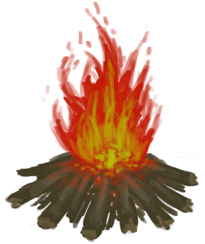

# 盐水  
> 喝起来太咸了。  
  
<table class="table table-bordered" data-toggle="table"  data-show-header="false"><thead style="display:none"><tr ><th  style="width:50%;text-align:left;vertical-align:top;"  >title</th><th  style="width:50%;text-align:left;vertical-align:top;"  ></th></tr></thead><tr ><td  style="width:50%;text-align:left;vertical-align:top;"  >**重量：**0.33  **标签：**	[“水(任意)”](tag_WaterAny.md)</td><td  style="width:50%;text-align:left;vertical-align:top;"  >

<a href="LQ_WaterSalt.md" style="color:black">盐水</a>

</td></tr></tbody></table>  
  
## 获取来源  

取水

[潮汐池(岩滩)](TidePool.md)

取水

[被淹没的潮汐池(岩滩)](TidePoolFlooded.md)

取水

[海水(覆溺洞穴)](Sea_Cave.md)

取水

[海(环礁)](Sea_Atoll.md)

取水

[海(海湾)](Sea_Bay.md)

取水

[海(沙滩)](Sea_Beach.md)

取水

[海(隐秘港湾)](Sea_Cove.md)

取水

[海(荒芜沙滩)](Sea_DesolateBeach.md)

取水

[海(红树林)](Sea_Mangroves.md)

取水

[海](Sea_Raft.md)

取水

[海(鸟岩岛)](Sea_Rocks.md)

  
  
## 动作  

<table><tr><td rowspan="2" style="width:200px;text-align:center;font-size:1.3em;font-weight:bold">

饮用

3分

</td><td></td></tr><tr><td></td></tr><tr><td colspan="2"><b>需求：</b>[肾脏](IfKidneys.md): <b>0-0</b></td></tr><tr><td colspan="2"><b>状态变化：</b>[

[水分](Hydration.md)](Hydration.md)<b>+10</b>, [

[钠](Sodium.md)](Sodium.md)<b>+250</b></td></tr></table>
  

<table><tr><td rowspan="2" style="width:200px;text-align:center;font-size:1.3em;font-weight:bold">

饮用

</td><td></td></tr><tr><td></td></tr><tr><td colspan="2"><b>需求：</b>[肾脏](IfKidneys.md): <b>1-1</b></td></tr><tr><td colspan="2"><b>状态变化：</b>[

[水分](Hydration.md)](Hydration.md)<b>+40</b>, [

[钠](Sodium.md)](Sodium.md)<b>+250</b></td></tr></table>
  

<table><tr><td rowspan="2" style="width:200px;text-align:center;font-size:1.3em;font-weight:bold">

洗个澡

15分

</td><td>[“手部动作(组)”](HandAction.md)</td></tr><tr><td></td></tr><tr><td colspan="2"><b>需求：</b>含水量: 100</td></tr><tr><td colspan="2"><b>相关卡牌变化：</b>装备中的[“腿部（内层）”](tag_Clothing.md)

  <b>+6(50%)</b>, 所有[眼镜蛇毒液](W_CobraSpit.md)燃料  <b>-75</b></td></tr><tr><td colspan="2"><b>状态变化：</b>[

[湿度](Wetness.md)](Wetness.md)<b>+100</b> (每15分钟), [

[情绪](Morale.md)](Morale.md)<b>+1</b>, [

[污垢](Filth.md)](Filth.md)<b>-150</b>, [

[泥巴防护](MudProtection.md)](MudProtection.md)<b>-50</b>, [

[芦荟膏防护](AloeVeraGelProtection.md)](AloeVeraGelProtection.md)<b>-50</b>, [

[驱虫](BugRepellentApplied.md)](BugRepellentApplied.md)<b>-50</b>, [

[阳光防护](SunProtection.md)](SunProtection.md)<b>-50</b></td></tr></table>
  
  
  
## 可拖至  

[人鱼巢](MermaidNest.md)

[干土堆](DirtPile.md)

[蒸馏器(关)](AlembicOff.md)

[蒸馏器(开)](AlembicOn.md)

[临时防毒面具](MaskMakeshift.md)

[细土](FineDirt.md)

[参薯片](YamCut.md)

[保鲜罐(关)](ClayPotCoolerOff.md)

[保鲜罐(开)](ClayPotCoolerOn.md)

[肥皂](SoapDry.md)

[湿肥皂](SoapWet.md)

[擦伤](W_Abrasion.md)

[左臂撕裂伤](W_ArmLacerationL.md)

[已缝合的左臂撕裂伤](W_ArmLacerationLStitched.md)

[右臂撕裂伤](W_ArmLacerationR.md)

[已缝合的右臂撕裂伤](W_ArmLacerationRStitched.md)

[眼镜蛇毒液](W_CobraSpit.md)

[狗咬伤](W_DogBite.md)

[左腿撕裂伤](W_LegLacerationL.md)

[已缝合的左腿撕裂伤](W_LegLacerationLStitched.md)

[右腿撕裂伤](W_LegLacerationR.md)

[已缝合的右腿撕裂伤](W_LegLacerationRStitched.md)

[猕猴咬伤](W_MacaqueBite.md)

[轻微撕裂伤](W_MinorLaceration.md)

[已缝合的轻微撕裂伤](W_MinorLacerationStitched.md)

[巨蜥咬伤](W_MonitorBite.md)

[海怪刺伤](W_SeahoundSting.md)

[鲨鱼咬伤](W_SharkBite.md)

[蜘蛛咬伤](W_SpiderBite.md)

[海胆刺伤](W_UrchinWound.md)

  
  
## 可用于蓝图  

<a href="Bp_Mortar.md" style="color:black">砂浆</a>

  
  
  
## 可用于转化  
<table class="table table-bordered" data-toggle="table"  ><thead style=""><tr ><th  style="text-align:left;vertical-align:top;"  >转化为</th><th  style="text-align:left;vertical-align:top;"  >容器</th></tr></thead><tr ><td  style="text-align:left;vertical-align:top;"  >[

[盐](Salt.md)](Salt.md)</td><td  style="text-align:left;vertical-align:top;"  >[

[营火](Campfire.md)](Campfire.md)</td></tr><tr ><td  style="text-align:left;vertical-align:top;"  >[

[盐](Salt.md)](Salt.md)</td><td  style="text-align:left;vertical-align:top;"  >[

[粘土火盆](ClayFirePit.md)](ClayFirePit.md)</td></tr><tr ><td  style="text-align:left;vertical-align:top;"  >[

[盐](Salt.md)](Salt.md)</td><td  style="text-align:left;vertical-align:top;"  >[

[火堆](Fire.md)](Fire.md)</td></tr><tr ><td  style="text-align:left;vertical-align:top;"  >[

[盐](Salt.md)](Salt.md)</td><td  style="text-align:left;vertical-align:top;"  >[

[瓦斯炉(开)](GasCookerOn.md)](GasCookerOn.md)</td></tr><tr ><td  style="text-align:left;vertical-align:top;"  >[

[盐](Salt.md)](Salt.md)</td><td  style="text-align:left;vertical-align:top;"  >[

[火炉](Stove.md)](Stove.md)</td></tr></tbody></table>  
  
## 被动效果  
<table class="table table-bordered" data-toggle="table"  ><thead style=""><tr ><th  style="text-align:left;vertical-align:top;"  >名称</th><th  style="text-align:left;vertical-align:top;"  >条件</th><th  style="text-align:left;vertical-align:top;"  >变化(每15分钟)</th><th  style="text-align:left;vertical-align:top;"  data-sortable="true"  >玩家状态</th></tr></thead><tr ><td  style="text-align:left;vertical-align:top;"  >Evaporation</td><td  style="text-align:left;vertical-align:top;"  >** 需要容器：** [“容器（敞口）”](tag_ContainerOpen.md)</td><td  style="text-align:left;vertical-align:top;"  >含水量-1</td><td  style="text-align:left;vertical-align:top;"  ></td></tr><tr ><td  style="text-align:left;vertical-align:top;"  >Evaporation Large</td><td  style="text-align:left;vertical-align:top;"  >** 需要容器：** [“容器（蓄水池）”](tag_ContainerReservoir.md)</td><td  style="text-align:left;vertical-align:top;"  >含水量-3</td><td  style="text-align:left;vertical-align:top;"  ></td></tr></tbody></table>  
  
## 状态触发  
<table class="table table-bordered" data-toggle="table"  ><thead style=""><tr ><th  style="text-align:left;vertical-align:top;"  >名称</th><th  style="text-align:left;vertical-align:top;"  >条件</th><th  style="text-align:left;vertical-align:top;"  >变化</th></tr></thead><tr ><td  style="text-align:left;vertical-align:top;"  >下雨时更换</td><td  style="text-align:left;vertical-align:top;"  >[

[降水值](RainValue.md)](RainValue.md): <b>1-5</b></td><td  style="text-align:left;vertical-align:top;"  >→ [

[水](LQ_Water.md)](LQ_Water.md)</td></tr></tbody></table>  
  

