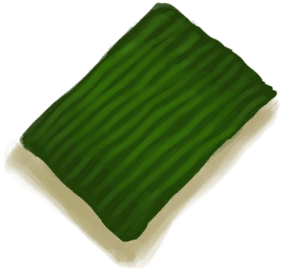

# 叶片绷带  
> 临时制作的疗伤绷带，一定程度上可以防止伤口感染，加速痊愈。  
   
> 敷料可以<b>保护外伤免受感染</b>并加快伤口愈合。  如果你没有标准的无菌<b>伤口敷料</b>，也可以使用<b>一块中等大小的布</b>做一个。 如果可以的话，你还可以<b>将灰附在小块布上</b>用来消毒。  如果没有布，也可以用某些大叶子制作敷料，例如<b>大叶仙茅</b>。  请务必在敷上敷料前<b>用水或肥皂清洗伤口</b>，如果出血量很大，请先使用<b>止血带</b>。  
  
<table class="table table-bordered"><tbody><tr ><td  style="width:80%;text-align:left;vertical-align:top;" >**重量：**50  **标签：**	[“小的”](tag_Tiny.md), [“敷料”](tag_Dressing.md)  **装备：**</td><td  style="width:20%;text-align:left;vertical-align:top;" >

</td></tr></tbody></tbody></table>  
  
## 获取来源  
<table class="table table-bordered"><thead><tr ><th  style="text-align:left;vertical-align:top;" >来源</th><th  style="text-align:left;vertical-align:top;" >操作</th></tr></thead><tr ><td  style="text-align:left;vertical-align:top;" >[

[大叶仙茅叶片](WeevilLilyLeaves.md)](WeevilLilyLeaves.md)</td><td  style="text-align:left;vertical-align:top;" >制作绷带</td></tr></tbody></table>  
  
## 属性   
<table class="table table-bordered"><thead><tr ><th  style="text-align:left;vertical-align:top;" >属性</th><th  style="text-align:left;vertical-align:top;" >值</th><th  style="text-align:left;vertical-align:top;" >耗时</th><th  style="text-align:left;vertical-align:top;" >变化</th></tr></thead><tr ><td  style="text-align:left;vertical-align:top;" >耐久</td><td  style="text-align:left;vertical-align:top;" >初始：192</td><td  style="text-align:left;vertical-align:top;" >每15分钟-1 最多需要：2天</td><td  style="text-align:left;vertical-align:top;" >** 到达0时： **  ** 自身 ** →消失</td></tr></tbody></table>  
  

