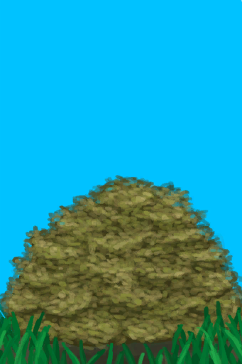

# 树叶  
> 可以喂动物、堆肥或者干燥后作为火绒。  
   
> 用于制作<b>树叶床</b>，干燥后可用作火绒。  它们可以通过探索<b>丛林</b>的干燥地区或砍伐<b>树木及枣树丛</b>获得。  
  
<table class="table table-bordered" data-toggle="table" ><tbody><tr ><td  style="width:80%;text-align:left;vertical-align:top;"  >**重量：**100  **标签：**	[“树叶”](tag_Leaves.md)</td><td  style="width:20%;text-align:left;vertical-align:top;"  >

</td></tr></tbody></tbody></table>  
  
## 获取来源  
<table class="table table-bordered" data-toggle="table" ><thead><tr ><th  style="text-align:left;vertical-align:top;"  >来源</th><th  style="text-align:left;vertical-align:top;"  >操作</th></tr></thead><tr ><td  style="text-align:left;vertical-align:top;"  >[

[金鸡纳树](CinchonaTree.md)](CinchonaTree.md)</td><td  style="text-align:left;vertical-align:top;"  >砍树 ** 拖入：**[“斧”](tag_Axe.md)</td></tr><tr ><td  style="text-align:left;vertical-align:top;"  >[

[剥净的金鸡纳树](CinchonaTreeCleared.md)](CinchonaTreeCleared.md)</td><td  style="text-align:left;vertical-align:top;"  >砍树 ** 拖入：**[“斧”](tag_Axe.md)</td></tr><tr ><td  style="text-align:left;vertical-align:top;"  >[

[小芒果树](MangoTreeYoung.md)](MangoTreeYoung.md)</td><td  style="text-align:left;vertical-align:top;"  >砍树 ** 拖入：**[“斧”](tag_Axe.md)</td></tr><tr ><td  style="text-align:left;vertical-align:top;"  >[

[大树](LargeTree.md)](LargeTree.md)</td><td  style="text-align:left;vertical-align:top;"  >转化</td></tr><tr ><td  style="text-align:left;vertical-align:top;"  >[

[倒下的大树](LargeTreeFelled.md)](LargeTreeFelled.md)</td><td  style="text-align:left;vertical-align:top;"  >修整原木 ** 拖入：**[石斧](StoneAxe.md)</td></tr><tr ><td  style="text-align:left;vertical-align:top;"  >[

[倒下的大树](LargeTreeFelled.md)](LargeTreeFelled.md)</td><td  style="text-align:left;vertical-align:top;"  >修整原木 ** 拖入：**[“斧”](tag_Axe.md)</td></tr><tr ><td  style="text-align:left;vertical-align:top;"  >[

[摘光的芒果树](MangoTreeCleared.md)](MangoTreeCleared.md)</td><td  style="text-align:left;vertical-align:top;"  >转化</td></tr><tr ><td  style="text-align:left;vertical-align:top;"  >[

[摘光的热带杏仁树](TropicalAlmondTreeCleared.md)](TropicalAlmondTreeCleared.md)</td><td  style="text-align:left;vertical-align:top;"  >转化</td></tr><tr ><td  style="text-align:left;vertical-align:top;"  >[

[小树](SmallTree.md)](SmallTree.md)</td><td  style="text-align:left;vertical-align:top;"  >砍树 ** 拖入：**[“斧”](tag_Axe.md)</td></tr><tr ><td  style="text-align:left;vertical-align:top;"  >[

[野枣丛](WildJujube.md)](WildJujube.md)</td><td  style="text-align:left;vertical-align:top;"  >砍倒 ** 拖入：**[“斧”](tag_Axe.md)</td></tr><tr ><td  style="text-align:left;vertical-align:top;"  >[

[摘光的野枣从](WildJujubeCleared.md)](WildJujubeCleared.md)</td><td  style="text-align:left;vertical-align:top;"  >砍倒 ** 拖入：**[“斧”](tag_Axe.md)</td></tr></tbody></table>  
  
## 可拖至  

[叶床](LeafBed.md)

[有遮蔽的叶床](ShelteredLeafBed.md)

[堆肥箱](CompostBin.md)

[蒸馏器(关)](AlembicOff.md)

[蒸馏器(开)](AlembicOn.md)

[营火](Campfire.md)

[营火(熄灭)](CampfireExtinguished.md)

[粘土火盆](ClayFirePit.md)

[粘土火盆(熄灭)](ClayFirePitExtinguished.md)

[火堆](Fire.md)

[火堆(熄灭)](FireExtinguished.md)

[熔炉](Forge.md)

[熔炉(熄灭)](ForgeExtinguished.md)

[窑炉](Kiln.md)

[高级窑炉](KilnAdvanced.md)

[高级窑炉(熄灭)](KilnAdvancedExtinguished.md)

[窑炉(熄灭)](KilnExtinguished.md)

[火炉](Stove.md)

[火炉(熄灭)](StoveExtinguished.md)

[羊食槽](GoatFeeder.md)

[羊食槽(空)](GoatFeederEmpty.md)

[母山羊](GoatEnclosureFemale.md)

[小羊](GoatEnclosureKid.md)

[哺乳期山羊](GoatEnclosureLactating.md)

[公山羊](GoatEnclosureMale.md)

[母山羊](GoatTiedFemale.md)

[哺乳期山羊](GoatTiedFemaleLactating.md)

[小羊](GoatTiedKid.md)

[公山羊](GoatTiedMale.md)

  
  
## 可用于蓝图  

[

[山羊饲料(蓝图)](Bp_FeedGoat.md)](Bp_FeedGoat.md)

[

[叶床(蓝图)](Bp_Leafbed.md)](Bp_Leafbed.md)

  
  
  
## 属性   
<table class="table table-bordered" data-toggle="table" ><thead><tr ><th  style="text-align:left;vertical-align:top;"  >属性</th><th  style="text-align:left;vertical-align:top;"  >值</th><th  style="text-align:left;vertical-align:top;"  >耗时</th><th  style="text-align:left;vertical-align:top;"  >变化</th></tr></thead><tr ><td  style="text-align:left;vertical-align:top;"  >耐久</td><td  style="text-align:left;vertical-align:top;"  >初始：480</td><td  style="text-align:left;vertical-align:top;"  >每15分钟-1 最多需要：480TP</td><td  style="text-align:left;vertical-align:top;"  >** 到达0时： **  ** 自身 ** → [

[枯叶](LeavesDry.md)](LeavesDry.md)</td></tr></tbody></table>  
  

