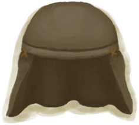
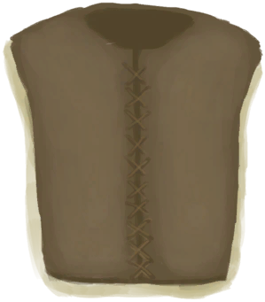

# 腿部防护  
> 保护你的腿免受不同类型的伤害。  
  

<b>基础值: </b> 0 
  

<b>变化范围: </b> 0 ~ 10 
  

<b>基础变化率: </b> 无 
  
  
## 可被以下操作改变  
<table class="table table-bordered" data-toggle="table"  ><thead style=""><tr ><th  style="text-align:left;vertical-align:top;"  >来源</th><th  style="text-align:left;vertical-align:top;"  >操作</th><th  style="text-align:left;vertical-align:top;"  data-sortable="true"  >值</th></tr></thead><tr ><td  style="text-align:left;vertical-align:top;"  >[

[皮头盔](LeatherHelmet.md)](LeatherHelmet.md)</td><td  style="text-align:left;vertical-align:top;"  >被动效果</td><td  style="text-align:left;vertical-align:top;"  >6</td></tr><tr ><td  style="text-align:left;vertical-align:top;"  >[

[皮夹克](LeatherJacketDisabled.md)](LeatherJacketDisabled.md)</td><td  style="text-align:left;vertical-align:top;"  >被动效果</td><td  style="text-align:left;vertical-align:top;"  >6</td></tr><tr ><td  style="text-align:left;vertical-align:top;"  >[

[皮裤](LeatherPants.md)](LeatherPants.md)</td><td  style="text-align:left;vertical-align:top;"  >被动效果</td><td  style="text-align:left;vertical-align:top;"  >6</td></tr><tr ><td  style="text-align:left;vertical-align:top;"  >[

[Leather Pants Stealth 1000](LeatherStealthyPants.md)](LeatherStealthyPants.md)(未实装)</td><td  style="text-align:left;vertical-align:top;"  >被动效果</td><td  style="text-align:left;vertical-align:top;"  >6</td></tr><tr ><td  style="text-align:left;vertical-align:top;"  >[

[皮背心](LeatherVest.md)](LeatherVest.md)</td><td  style="text-align:left;vertical-align:top;"  >被动效果</td><td  style="text-align:left;vertical-align:top;"  >6</td></tr><tr ><td  style="text-align:left;vertical-align:top;"  >[

[军裤](MilitaryPants.md)](MilitaryPants.md)</td><td  style="text-align:left;vertical-align:top;"  >被动效果</td><td  style="text-align:left;vertical-align:top;"  >4</td></tr></tbody></table>  
  
  
## 被以下操作需求  
<table class="table table-bordered" data-toggle="table"  ><thead style=""><tr ><th  style="text-align:left;vertical-align:top;"  >来源</th><th  style="text-align:left;vertical-align:top;"  >操作</th><th  style="text-align:left;vertical-align:top;"  data-sortable="true"  >值</th></tr></thead><tr ><td  style="text-align:left;vertical-align:top;"  >[一条海蛇！(事件)](Event_SeaKraitStep.md)</td><td  style="text-align:left;vertical-align:top;"  >别想伤到我</td><td  style="text-align:left;vertical-align:top;"  >5 ~ 10</td></tr><tr ><td  style="text-align:left;vertical-align:top;"  >[你看到了一头巨蜥！(事件)(洞穴)](Combat_EventMonitor_1_Explore.md)</td><td  style="text-align:left;vertical-align:top;"  >影响</td><td  style="text-align:left;vertical-align:top;"  >1 ~ 10</td></tr><tr ><td  style="text-align:left;vertical-align:top;"  >[猕猴们攻击了你！(事件)](Event_MacaqueDenFight.md)</td><td  style="text-align:left;vertical-align:top;"  >影响</td><td  style="text-align:left;vertical-align:top;"  >1 ~ 10</td></tr><tr ><td  style="text-align:left;vertical-align:top;"  >[一只猕猴！(事件)](Event_MacaqueFight.md)</td><td  style="text-align:left;vertical-align:top;"  >影响</td><td  style="text-align:left;vertical-align:top;"  >1 ~ 10</td></tr><tr ><td  style="text-align:left;vertical-align:top;"  >[一只猕猴！(事件)](Event_MacaqueFightRaid.md)</td><td  style="text-align:left;vertical-align:top;"  >影响</td><td  style="text-align:left;vertical-align:top;"  >1 ~ 10</td></tr><tr ><td  style="text-align:left;vertical-align:top;"  >[一只猕猴！(事件)](Event_MacaqueUndeadFight.md)</td><td  style="text-align:left;vertical-align:top;"  >影响</td><td  style="text-align:left;vertical-align:top;"  >1 ~ 10</td></tr><tr ><td  style="text-align:left;vertical-align:top;"  >[一头巨蜥！(事件)](Event_MonitorFight.md)</td><td  style="text-align:left;vertical-align:top;"  >影响</td><td  style="text-align:left;vertical-align:top;"  >1 ~ 10</td></tr><tr ><td  style="text-align:left;vertical-align:top;"  >[一头海怪！(事件)](Event_SeahoundFight.md)</td><td  style="text-align:left;vertical-align:top;"  >影响</td><td  style="text-align:left;vertical-align:top;"  >1 ~ 10</td></tr><tr ><td  style="text-align:left;vertical-align:top;"  >[一条鲨鱼！(事件)](Event_SharkFight.md)</td><td  style="text-align:left;vertical-align:top;"  >影响</td><td  style="text-align:left;vertical-align:top;"  >1 ~ 10</td></tr><tr ><td  style="text-align:left;vertical-align:top;"  >[一条海蛇！(事件)](Event_SeaKraitStep.md)</td><td  style="text-align:left;vertical-align:top;"  >继续</td><td  style="text-align:left;vertical-align:top;"  >1 ~ 4.9</td></tr><tr ><td  style="text-align:left;vertical-align:top;"  >[滑倒了！(事件)](Event_SlipRocks.md)</td><td  style="text-align:left;vertical-align:top;"  >影响</td><td  style="text-align:left;vertical-align:top;"  >1 ~ 10</td></tr><tr ><td  style="text-align:left;vertical-align:top;"  >[鲨鱼](SharkVisitor.md)</td><td  style="text-align:left;vertical-align:top;"  >影响</td><td  style="text-align:left;vertical-align:top;"  >1 ~ 10</td></tr><tr ><td  style="text-align:left;vertical-align:top;"  >[一条海蛇！(事件)](Event_SeaKraitStep.md)</td><td  style="text-align:left;vertical-align:top;"  >继续</td><td  style="text-align:left;vertical-align:top;"  >0</td></tr></tbody></table>  
  

