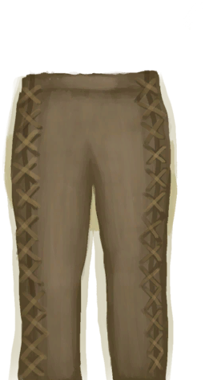
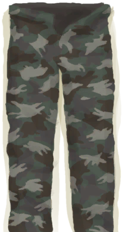

# 腿部防护  
> 保护你的腿免受不同类型的伤害。  
  

<b>基础值: </b> 0 
  

<b>变化范围: </b> 0 ~ 10 
  

<b>基础变化率: </b> 无 
  
## 可被以下操作改变  
<table class="table table-bordered table3002" data-toggle="table"  ><thead style=""><tr ><th  style=""  >来源</th><th  style=""  >操作</th><th  style=""  data-sortable="true"  >值</th></tr></thead><tr ><td  style=""  >[

[皮裤](LeatherPants.md)](LeatherPants.md)</td><td  style=""  >被动效果</td><td  style=""  >6</td></tr><tr ><td  style=""  >[

[军裤](MilitaryPants.md)](MilitaryPants.md)</td><td  style=""  >被动效果</td><td  style=""  >4</td></tr></tbody></table>  
  
## 被以下操作需求  
<table class="table table-bordered table0715" data-toggle="table"  ><thead style=""><tr ><th  style=""  >来源</th><th  style=""  >操作</th><th  style=""  >值</th></tr></thead><tr ><td  style=""  >[一条海蛇！(事件)](Event_SeaKraitStep.md)</td><td  style=""  >别想伤到我</td><td  style=""  >5 ~ 10</td></tr><tr ><td  style=""  >[猕猴们攻击了你！(事件)](Event_MacaqueDenFight.md)</td><td  style=""  >影响</td><td  style=""  >1 ~ 10</td></tr><tr ><td  style=""  >[一只猕猴！(事件)](Event_MacaqueFight.md)</td><td  style=""  >影响</td><td  style=""  >1 ~ 10</td></tr><tr ><td  style=""  >[一只猕猴！(事件)](Event_MacaqueFightRaid.md)</td><td  style=""  >影响</td><td  style=""  >1 ~ 10</td></tr><tr ><td  style=""  >[一只猕猴！(事件)](Event_MacaqueUndeadFight.md)</td><td  style=""  >影响</td><td  style=""  >1 ~ 10</td></tr><tr ><td  style=""  >[一头巨蜥！(事件)(洞穴)](Event_MonitorFight.md)</td><td  style=""  >影响</td><td  style=""  >1 ~ 10</td></tr><tr ><td  style=""  >[一头海怪！(事件)](Event_SeahoundFight.md)</td><td  style=""  >影响</td><td  style=""  >1 ~ 10</td></tr><tr ><td  style=""  >[一条鲨鱼！(事件)](Event_SharkFight.md)</td><td  style=""  >影响</td><td  style=""  >1 ~ 10</td></tr><tr ><td  style=""  >[一条海蛇！(事件)](Event_SeaKraitStep.md)</td><td  style=""  >继续</td><td  style=""  >1 ~ 4.9</td></tr><tr ><td  style=""  >[滑倒了！(事件)](Event_SlipRocks.md)</td><td  style=""  >影响</td><td  style=""  >1 ~ 10</td></tr><tr ><td  style=""  >[鲨鱼](SharkVisitor.md)</td><td  style=""  >影响</td><td  style=""  >1 ~ 10</td></tr><tr ><td  style=""  >[一条海蛇！(事件)](Event_SeaKraitStep.md)</td><td  style=""  >继续</td><td  style=""  >0</td></tr></tbody></table>  
  

