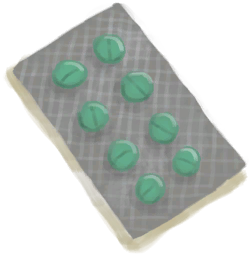

# 没气的救生筏  
> 我那坏掉的救生筏，也许可以用来再加工成别的东西。  
  
<table class="table table-bordered" data-toggle="table"  data-show-header="false"><thead style="display:none"><tr ><th  style="width:50%;text-align:left;vertical-align:top;"  >title</th><th  style="width:50%;text-align:left;vertical-align:top;"  ></th></tr></thead><tr ><td  style="width:50%;text-align:left;vertical-align:top;"  >** 不可删除 **  **槽位：**12  **初始卡牌：**

[

[集装袋(A)](ContainerBagA.md)](ContainerBagA.md)

[

[集装袋(B)](ContainerBagB.md)](ContainerBagB.md)

[

[急救包(救生筏)](FirstAidKitLifeRaft.md)](FirstAidKitLifeRaft.md)

[

[泻立停](AntiDiarrhoeaPills.md)](AntiDiarrhoeaPills.md)

[

[止痛药](Painkillers.md)](Painkillers.md)

[

[抗生素](Antibiotics.md)](Antibiotics.md)

[

[伤口敷料](WoundDressing.md)](WoundDressing.md)(2)

[

[压缩干粮包](FoodRationsPackage.md)](FoodRationsPackage.md)

[

[应急水袋](WaterRationsPackage.md)](WaterRationsPackage.md)

[

[钓鱼线](FishingLine.md)](FishingLine.md)

[

[塑料瓶(满)](PlasticBottleFull.md)](PlasticBottleFull.md)

[

[安全刀](SafetyKnife.md)](SafetyKnife.md)

[

[信号镜](SignalingMirror.md)](SignalingMirror.md)

[

[信号弹](FlareHand.md)](FlareHand.md)(4)

  
  
  **容量：**2000</td><td  style="width:50%;text-align:left;vertical-align:top;"  >

<a href="LifeRaftDeflated.md" style="color:black">没气的救生筏</a>

</td></tr></tbody></table>  
  
## 获取来源  

特质影响

[救生筏](Pk_1_LifeRaft.md)

  
  
## 可拖入  

<table style="margin-bottom:0px;"><tr><td style="width:40%;text-align:left; background-color:#FEFEFE"><b>拖入：</b>[“切割工具”](tag_Cutter.md)</td><td style="width:40%;font-size:1em;font-weight:bold;background-color:#FEFEFE">切下塑料布 (45分) [“手部动作(组)”](HandAction.md)</td></tr><tr><td colspan="2"><b>需求：</b>[

[光亮](Light.md)](Light.md): <b>10-100</b></td></tr><tr style="background-color:#FFFFFF"><td style=""><b>使用物：</b>使用次数  <b>-1(-0.67%)</b></td><td style=""><b>自身：</b>进度  <b>-1(-50%)</b></td></tr><tr><td colspan="2"><b>状态变化：</b>[

[体重](Weight.md)](Weight.md)<b>-1</b></td></tr><tr><td colspan="2">[

[塑料布](PlasticSheet.md)](PlasticSheet.md)(<b>+1</b>)</td></tr></table>
  
  
## 属性   

<table style="margin-bottom:0px;"><tr><td style="width:30%;text-align:left; background-color:#FEFEFE;font-size:1.3em;font-weight:bold;">进度</td><td style="font-size:1em;background-color:#FEFEFE">初始：2 , 最大：2 -</td></tr><tr style="background-color:#FFFFFF"><td colspan=2>** 到达0时： ** 自身: →消失</td></tr></table>
  

