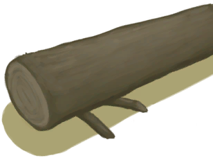

# 原木  
> 建筑或者木筏的完美材料。  
   
>   
  
<table class="table table-bordered" data-toggle="table" ><tbody><tr ><td  style="width:80%;text-align:left;vertical-align:top;"  >** 不可删除 **  **重量：**2500  **标签：**	[“大的”](tag_Large.md), [“沉重的”](tag_Heavy.md)</td><td  style="width:20%;text-align:left;vertical-align:top;"  >

</td></tr></tbody></tbody></table>  
  
## 获取来源  
<table class="table table-bordered" data-toggle="table" ><thead><tr ><th  style="text-align:left;vertical-align:top;"  >来源</th><th  style="text-align:left;vertical-align:top;"  >操作</th></tr></thead><tr ><td  style="text-align:left;vertical-align:top;"  >[

[原木陷阱](LogTrap.md)](LogTrap.md)</td><td  style="text-align:left;vertical-align:top;"  >拆除陷阱</td></tr><tr ><td  style="text-align:left;vertical-align:top;"  >[

[原木陷阱(未重置)](LogTrapTriggered.md)](LogTrapTriggered.md)</td><td  style="text-align:left;vertical-align:top;"  >拆除陷阱</td></tr><tr ><td  style="text-align:left;vertical-align:top;"  >[

[倒下的大树](LargeTreeFelled.md)](LargeTreeFelled.md)</td><td  style="text-align:left;vertical-align:top;"  >修整原木 ** 拖入：**[石斧](StoneAxe.md)</td></tr><tr ><td  style="text-align:left;vertical-align:top;"  >[

[倒下的大树](LargeTreeFelled.md)](LargeTreeFelled.md)</td><td  style="text-align:left;vertical-align:top;"  >修整原木 ** 拖入：**[“斧”](tag_Axe.md)</td></tr><tr ><td  style="text-align:left;vertical-align:top;"  >[

[倒下的棕榈树](PalmTreeFelled.md)](PalmTreeFelled.md)</td><td  style="text-align:left;vertical-align:top;"  >清除 ** 拖入：**[石斧](StoneAxe.md)</td></tr><tr ><td  style="text-align:left;vertical-align:top;"  >[

[倒下的棕榈树](PalmTreeFelled.md)](PalmTreeFelled.md)</td><td  style="text-align:left;vertical-align:top;"  >清除 ** 拖入：**[“斧”](tag_Axe.md)</td></tr><tr ><td  style="text-align:left;vertical-align:top;"  >[

[椰子树(IH)](PalmTree_IH.md)](PalmTree_IH.md)</td><td  style="text-align:left;vertical-align:top;"  >砍倒 ** 拖入：**[石斧](StoneAxe.md)</td></tr><tr ><td  style="text-align:left;vertical-align:top;"  >[

[椰子树(IH)](PalmTree_IH.md)](PalmTree_IH.md)</td><td  style="text-align:left;vertical-align:top;"  >砍倒 ** 拖入：**[铜斧](AxeCopper.md)</td></tr><tr ><td  style="text-align:left;vertical-align:top;"  >[

[倒下的热带杏仁树](TropicalAlmondTreeFelled.md)](TropicalAlmondTreeFelled.md)</td><td  style="text-align:left;vertical-align:top;"  >清理树枝 ** 拖入：**[石斧](StoneAxe.md)</td></tr><tr ><td  style="text-align:left;vertical-align:top;"  >[

[倒下的热带杏仁树](TropicalAlmondTreeFelled.md)](TropicalAlmondTreeFelled.md)</td><td  style="text-align:left;vertical-align:top;"  >清理树枝 ** 拖入：**[“斧”](tag_Axe.md)</td></tr></tbody></table>  
  
## 可拖入  
<table class="table table-bordered" data-toggle="table" ><thead><tr ><th  style="text-align:left;vertical-align:top;"  >使用</th><th  style="text-align:left;vertical-align:top;"  >动作</th><th  style="text-align:left;vertical-align:top;"  >耗时</th><th  style="text-align:left;vertical-align:top;"  >条件</th><th  style="text-align:left;vertical-align:top;"  >变化</th><th  style="text-align:left;vertical-align:top;"  >玩家状态</th></tr></thead><tr ><td  style="text-align:left;vertical-align:top;"  >[

[石斧](StoneAxe.md)](StoneAxe.md)</td><td  style="text-align:left;vertical-align:top;"  >截成两段 [“手部动作(组)”](HandAction.md)</td><td  style="text-align:left;vertical-align:top;"  >8TP</td><td  style="text-align:left;vertical-align:top;"  >[

[光亮](Light.md)](Light.md): 10-100</td><td  style="text-align:left;vertical-align:top;"  >** 自身: ** →消失  ** 使用物: ** 可用次数  -2  ** 获得: ** ** [log half]  **   [

[半根原木](HalfLog.md)](HalfLog.md)(+2) </td><td  style="text-align:left;vertical-align:top;"  >[

[体重](Weight.md)](Weight.md)-8 [

[耐力](Stamina.md)](Stamina.md)-16 [

[手掌损伤](HandDamage.md)](HandDamage.md)+80 [

[木工(技能)](Skill_Woodworking.md)](Skill_Woodworking.md)+0.5</td></tr><tr ><td  style="text-align:left;vertical-align:top;"  >[“斧”](tag_Axe.md)</td><td  style="text-align:left;vertical-align:top;"  >截成两段 </td><td  style="text-align:left;vertical-align:top;"  >6TP</td><td  style="text-align:left;vertical-align:top;"  >[

[光亮](Light.md)](Light.md): 10-100</td><td  style="text-align:left;vertical-align:top;"  >** 自身: ** →消失  ** 使用物: ** 可用次数  -2  ** 获得: ** ** [log half]  **   [

[半根原木](HalfLog.md)](HalfLog.md)(+2) </td><td  style="text-align:left;vertical-align:top;"  >[

[体重](Weight.md)](Weight.md)-6 [

[耐力](Stamina.md)](Stamina.md)-12 [

[手掌损伤](HandDamage.md)](HandDamage.md)+60</td></tr></tbody></table>  
  
## 可用于蓝图  

[

[猪食槽(蓝图)](Bp_BoarFeeder.md)](Bp_BoarFeeder.md)

[

[地窖(蓝图)](Bp_Cellar.md)](Bp_Cellar.md)

[

[原木陷阱(蓝图)](Bp_LogTrap.md)](Bp_LogTrap.md)

[

[泥屋(蓝图)](Bp_MudHut.md)](Bp_MudHut.md)

[

[木板(蓝图)](Bp_Planks.md)](Bp_Planks.md)

[

[木筏(蓝图)](Bp_Raft.md)](Bp_Raft.md)

  
  
  

