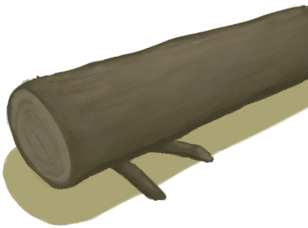

# 原木陷阱  
> 我应该在里面放上诱饵，过段时间再来看看。  
  
<table class="table table-bordered" data-toggle="table"  data-show-header="false"><thead style="display:none"><tr ><th  style="width:50%;text-align:left;vertical-align:top;"  >title</th><th  style="width:50%;text-align:left;vertical-align:top;"  ></th></tr></thead><tr ><td  style="width:50%;text-align:left;vertical-align:top;"  >** 不可删除 **  ** 不可堆叠 **  **槽位：**1  **过滤器：**[“诱饵”](tag_Bait.md) , [“饲料”](tag_Feed.md)</td><td  style="width:50%;text-align:left;vertical-align:top;"  >

<a href="LogTrapTriggered.md" style="color:black">原木陷阱</a>

一种更大类型的落石陷阱，由<b>原木</b>和一些<b>树枝</b>组成。  可以用来抓住如<b>猕猴，野猪，山羊，巨蜥</b>之类的大型动物。  这些陷阱需要<b>诱饵</b>才能用，并且每次触发后必须<b>重置</b>。 除非真的有必要，否则不要更换诱饵，不然会重置陷阱的计时器。</td></tr></tbody></table>  
  
## 动作  
<table class="table table-bordered" data-toggle="table"  ><thead style=""><tr ><th  style="text-align:left;vertical-align:top;"  >动作</th><th  style="text-align:left;vertical-align:top;"  >耗时</th><th  style="text-align:left;vertical-align:top;"  >条件</th><th  style="text-align:left;vertical-align:top;"  >变化</th><th  style="text-align:left;vertical-align:top;"  >状态</th></tr></thead><tr ><td  style="text-align:left;vertical-align:top;"  >重置陷阱 [“手部动作(组)”](HandAction.md)</td><td  style="text-align:left;vertical-align:top;"  >1小时30分</td><td  style="text-align:left;vertical-align:top;"  >[

[光亮](Light.md)](Light.md): 10-100</td><td  style="text-align:left;vertical-align:top;"  >** 自身：** → [

[原木陷阱](LogTrap.md)](LogTrap.md)</td><td  style="text-align:left;vertical-align:top;"  >[

[陷阱(技能)](Skill_Trapping.md)](Skill_Trapping.md)+0.5</td></tr><tr ><td  style="text-align:left;vertical-align:top;"  >拆除陷阱 [“手部动作(组)”](HandAction.md)</td><td  style="text-align:left;vertical-align:top;"  >30分</td><td  style="text-align:left;vertical-align:top;"  >[

[光亮](Light.md)](Light.md): 10-100</td><td  style="text-align:left;vertical-align:top;"  >** 自身：** →消失  ** 获得： ** ** [Materials]  **   [

[长木棍](StickLong.md)](StickLong.md)(+1)   [

[小树枝](Sticks.md)](Sticks.md)(+1)   [

[原木](Log.md)](Log.md)(+1) 基础权重：1</td><td  style="text-align:left;vertical-align:top;"  ></td></tr></tbody></table>  
  

