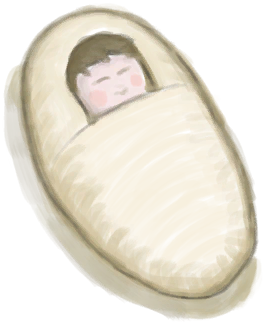
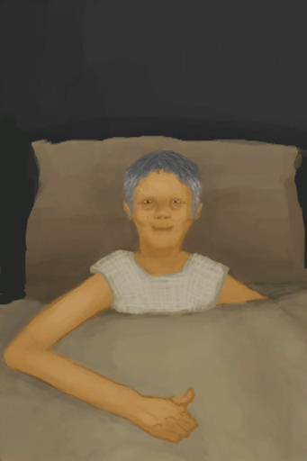

# 孤独感  
> 孤独感会随着时间的推移而增加，你的情绪和世界观会随之降低。  有像韦斯顿或是猕猴这样的朋友可以让你不那么孤独。当你已经在岛上生活了很长时间时，拥有高舒适度的家也会有帮助。  
  
#### ** 基础值: ** 0   
#### ** 变化范围: ** 0 ~ 4880  
#### ** 基础变化率: ** +1 / 每15分钟   
## 阶段  
<table class="table table-bordered"><thead><tr ><th  style="text-align:left;vertical-align:top;" >范围</th><th  style="text-align:left;vertical-align:top;" >名称</th><th  style="text-align:left;vertical-align:top;" >描述</th><th  style="text-align:left;vertical-align:top;" >影响状态</th><th  style="text-align:left;vertical-align:top;" >影响动作</th></tr></thead><tr ><td  style="text-align:left;vertical-align:top;" >900 ～ 2440</td><td  style="text-align:left;vertical-align:top;" >

孤独</td><td  style="text-align:left;vertical-align:top;" >我感到一丝孤独……</td><td  style="text-align:left;vertical-align:top;" >[

[世界观](Structure.md)](Structure.md)加成-1 [

[情绪](Morale.md)](Morale.md)加成-0.25 [

[压力](Stress.md)](Stress.md)加成+0.75</td><td  style="text-align:left;vertical-align:top;" ></td></tr><tr ><td  style="text-align:left;vertical-align:top;" >2441 ～ 3660</td><td  style="text-align:left;vertical-align:top;" >

孤独</td><td  style="text-align:left;vertical-align:top;" >我感到孤独……</td><td  style="text-align:left;vertical-align:top;" >[

[世界观](Structure.md)](Structure.md)加成-2 [

[情绪](Morale.md)](Morale.md)加成-0.75 [

[压力](Stress.md)](Stress.md)加成+1.5</td><td  style="text-align:left;vertical-align:top;" ></td></tr><tr ><td  style="text-align:left;vertical-align:top;" >3661 ～ 4880</td><td  style="text-align:left;vertical-align:top;" >

孤独</td><td  style="text-align:left;vertical-align:top;" >我感到十分孤独……</td><td  style="text-align:left;vertical-align:top;" >[

[世界观](Structure.md)](Structure.md)加成-3 [

[情绪](Morale.md)](Morale.md)加成-1.5 [

[精神失常](MindState.md)](MindState.md)加成+0.5 [

[孤独感](Loneliness.md)](Loneliness.md)加成-0.5 [

[压力](Stress.md)](Stress.md)加成+1.5～+2</td><td  style="text-align:left;vertical-align:top;" ></td></tr></tbody></table>  
  
## 相关卡牌  
[情绪](Morale.md)  |  [船长亲密关系](CaptainPropinquity.md)  |  [船长陪伴](CaptainCompany.md)  |  [舒适度](Comfort.md)  |  [娱乐](Entertainment.md)  |  [韦斯顿的陪伴](WestonCompany.md)  |  [韦斯顿亲密关系](WestonPropinquity.md)  |  [孤立感](Isolation.md)  
## 加成值影响因素  
<table class="table table-bordered"><thead><tr ><th  style="text-align:left;vertical-align:top;" >来源</th><th  style="text-align:left;vertical-align:top;" >操作</th><th  style="text-align:left;vertical-align:top;" >值</th></tr></thead><tr ><td  style="text-align:left;vertical-align:top;" >[婴儿](Baby.md)</td><td  style="text-align:left;vertical-align:top;" >被动</td><td  style="text-align:left;vertical-align:top;" >加成-1</td></tr><tr ><td  style="text-align:left;vertical-align:top;" >[母猪](BoarEnclosureFemale.md)</td><td  style="text-align:left;vertical-align:top;" >条件被动</td><td  style="text-align:left;vertical-align:top;" >加成-1</td></tr><tr ><td  style="text-align:left;vertical-align:top;" >[公猪](BoarEnclosureMale.md)</td><td  style="text-align:left;vertical-align:top;" >条件被动</td><td  style="text-align:left;vertical-align:top;" >加成-1</td></tr><tr ><td  style="text-align:left;vertical-align:top;" >[小猪](BoarEnclosurePiglet.md)</td><td  style="text-align:left;vertical-align:top;" >条件被动</td><td  style="text-align:left;vertical-align:top;" >加成-1</td></tr><tr ><td  style="text-align:left;vertical-align:top;" >[母山羊](GoatEnclosureFemale.md)</td><td  style="text-align:left;vertical-align:top;" >条件被动</td><td  style="text-align:left;vertical-align:top;" >加成-1</td></tr><tr ><td  style="text-align:left;vertical-align:top;" >[小羊](GoatEnclosureKid.md)</td><td  style="text-align:left;vertical-align:top;" >条件被动</td><td  style="text-align:left;vertical-align:top;" >加成-1</td></tr><tr ><td  style="text-align:left;vertical-align:top;" >[哺乳期山羊](GoatEnclosureLactating.md)</td><td  style="text-align:left;vertical-align:top;" >条件被动</td><td  style="text-align:left;vertical-align:top;" >加成-1</td></tr><tr ><td  style="text-align:left;vertical-align:top;" >[公山羊](GoatEnclosureMale.md)</td><td  style="text-align:left;vertical-align:top;" >条件被动</td><td  style="text-align:left;vertical-align:top;" >加成-1</td></tr><tr ><td  style="text-align:left;vertical-align:top;" >[韦斯顿](Weston.md)</td><td  style="text-align:left;vertical-align:top;" >被动</td><td  style="text-align:left;vertical-align:top;" >加成-1</td></tr><tr ><td  style="text-align:left;vertical-align:top;" >[忠犬朋友](DogFriend.md)</td><td  style="text-align:left;vertical-align:top;" >被动</td><td  style="text-align:left;vertical-align:top;" >加成-2</td></tr><tr ><td  style="text-align:left;vertical-align:top;" >[猕猴朋友](MacaqueFriend.md)</td><td  style="text-align:left;vertical-align:top;" >被动</td><td  style="text-align:left;vertical-align:top;" >加成-2</td></tr><tr ><td  style="text-align:left;vertical-align:top;" >

[独来独往](Pk_4_Loner.md)</td><td  style="text-align:left;vertical-align:top;" >特质影响</td><td  style="text-align:left;vertical-align:top;" >加成-2</td></tr><tr ><td  style="text-align:left;vertical-align:top;" >[祖父](Grandfather.md)</td><td  style="text-align:left;vertical-align:top;" >被动</td><td  style="text-align:left;vertical-align:top;" >加成-5</td></tr><tr ><td  style="text-align:left;vertical-align:top;" >[祖父(健康)](GrandfatherHealthy.md)</td><td  style="text-align:left;vertical-align:top;" >被动</td><td  style="text-align:left;vertical-align:top;" >加成-10</td></tr></tbody></table>  
  
## 可被以下操作改变  
<table class="table table-bordered"><thead><tr ><th  style="text-align:left;vertical-align:top;" >来源</th><th  style="text-align:left;vertical-align:top;" >操作</th><th  style="text-align:left;vertical-align:top;" >值</th></tr></thead><tr ><td  style="text-align:left;vertical-align:top;" >[

[婴儿](Baby.md)](Baby.md)</td><td  style="text-align:left;vertical-align:top;" >喂奶</td><td  style="text-align:left;vertical-align:top;" >-5</td></tr><tr ><td  style="text-align:left;vertical-align:top;" >[

[婴儿](Baby.md)](Baby.md)</td><td  style="text-align:left;vertical-align:top;" >哄哄</td><td  style="text-align:left;vertical-align:top;" >-5</td></tr><tr ><td  style="text-align:left;vertical-align:top;" >[

[婴儿](Baby.md)](Baby.md)</td><td  style="text-align:left;vertical-align:top;" >一起玩耍</td><td  style="text-align:left;vertical-align:top;" >-10</td></tr><tr ><td  style="text-align:left;vertical-align:top;" >[

[祖父](Grandfather.md)](Grandfather.md)</td><td  style="text-align:left;vertical-align:top;" >喂食 ** 拖入：**[“人类食物”](tag_HumanFood.md)</td><td  style="text-align:left;vertical-align:top;" >-15</td></tr><tr ><td  style="text-align:left;vertical-align:top;" >[

[祖父(健康)](GrandfatherHealthy.md)](GrandfatherHealthy.md)</td><td  style="text-align:left;vertical-align:top;" >喂食 ** 拖入：**[“人类食物”](tag_HumanFood.md)</td><td  style="text-align:left;vertical-align:top;" >-15</td></tr><tr ><td  style="text-align:left;vertical-align:top;" >[

[船长](Captain.md)](Captain.md)</td><td  style="text-align:left;vertical-align:top;" >聊天</td><td  style="text-align:left;vertical-align:top;" >-20</td></tr><tr ><td  style="text-align:left;vertical-align:top;" >[

[中陷阱的猕猴](CageTrapMacaque.md)](CageTrapMacaque.md)</td><td  style="text-align:left;vertical-align:top;" >抚摸</td><td  style="text-align:left;vertical-align:top;" >-20</td></tr><tr ><td  style="text-align:left;vertical-align:top;" >[

[中陷阱的猕猴](CageTrapMacaque.md)](CageTrapMacaque.md)</td><td  style="text-align:left;vertical-align:top;" >喂食 ** 拖入：**[鱼片](FishSlices.md) , [烤鱼片](FishSlicesCooked.md) , [虾](Prawns.md) , [烤虾](PrawnsCooked.md) , [鱼杂](FishScraps.md) , [烤鱼杂](FishScrapsCooked.md)</td><td  style="text-align:left;vertical-align:top;" >-20</td></tr><tr ><td  style="text-align:left;vertical-align:top;" >[

[中陷阱的猕猴](CageTrapMacaque.md)](CageTrapMacaque.md)</td><td  style="text-align:left;vertical-align:top;" >喂食 ** 拖入：**[“饲料”](tag_Feed.md)</td><td  style="text-align:left;vertical-align:top;" >-20</td></tr><tr ><td  style="text-align:left;vertical-align:top;" >[

[母猪](BoarEnclosureFemale.md)](BoarEnclosureFemale.md)</td><td  style="text-align:left;vertical-align:top;" >抚摸</td><td  style="text-align:left;vertical-align:top;" >-20</td></tr><tr ><td  style="text-align:left;vertical-align:top;" >[

[公猪](BoarEnclosureMale.md)](BoarEnclosureMale.md)</td><td  style="text-align:left;vertical-align:top;" >抚摸</td><td  style="text-align:left;vertical-align:top;" >-20</td></tr><tr ><td  style="text-align:left;vertical-align:top;" >[

[小猪](BoarEnclosurePiglet.md)](BoarEnclosurePiglet.md)</td><td  style="text-align:left;vertical-align:top;" >抚摸</td><td  style="text-align:left;vertical-align:top;" >-20</td></tr><tr ><td  style="text-align:left;vertical-align:top;" >[

[忠犬朋友](DogFriend.md)](DogFriend.md)</td><td  style="text-align:left;vertical-align:top;" >喂食 ** 拖入：**[鱼片](FishSlices.md) , [烤鱼片](FishSlicesCooked.md) , [虾](Prawns.md) , [烤虾](PrawnsCooked.md) , [鱼杂](FishScraps.md) , [烤鱼杂](FishScrapsCooked.md) , [螃蟹](Crab.md) , [烤螃蟹](CrabCooked.md)</td><td  style="text-align:left;vertical-align:top;" >-20 ~ 0</td></tr><tr ><td  style="text-align:left;vertical-align:top;" >[

[忠犬朋友](DogFriend.md)](DogFriend.md)</td><td  style="text-align:left;vertical-align:top;" >喂食 ** 拖入：**[鱼片](FishSlices.md) , [烤鱼片](FishSlicesCooked.md) , [虾](Prawns.md) , [烤虾](PrawnsCooked.md) , [鱼杂](FishScraps.md) , [烤鱼杂](FishScrapsCooked.md) , [螃蟹](Crab.md) , [烤螃蟹](CrabCooked.md)</td><td  style="text-align:left;vertical-align:top;" >-20</td></tr><tr ><td  style="text-align:left;vertical-align:top;" >[

[忠犬朋友](DogFriend.md)](DogFriend.md)</td><td  style="text-align:left;vertical-align:top;" >喂食 ** 拖入：**[“肉”](tag_Meat.md) , [“鱼肉”](tag_Fish.md)</td><td  style="text-align:left;vertical-align:top;" >-20</td></tr><tr ><td  style="text-align:left;vertical-align:top;" >[

[忠犬朋友](DogFriend.md)](DogFriend.md)</td><td  style="text-align:left;vertical-align:top;" >Give Bones ** 拖入：**[骨头](Bones.md)</td><td  style="text-align:left;vertical-align:top;" >-20</td></tr><tr ><td  style="text-align:left;vertical-align:top;" >[

[母山羊](GoatEnclosureFemale.md)](GoatEnclosureFemale.md)</td><td  style="text-align:left;vertical-align:top;" >抚摸</td><td  style="text-align:left;vertical-align:top;" >-20</td></tr><tr ><td  style="text-align:left;vertical-align:top;" >[

[小羊](GoatEnclosureKid.md)](GoatEnclosureKid.md)</td><td  style="text-align:left;vertical-align:top;" >抚摸</td><td  style="text-align:left;vertical-align:top;" >-20</td></tr><tr ><td  style="text-align:left;vertical-align:top;" >[

[哺乳期山羊](GoatEnclosureLactating.md)](GoatEnclosureLactating.md)</td><td  style="text-align:left;vertical-align:top;" >抚摸</td><td  style="text-align:left;vertical-align:top;" >-20</td></tr><tr ><td  style="text-align:left;vertical-align:top;" >[

[公山羊](GoatEnclosureMale.md)](GoatEnclosureMale.md)</td><td  style="text-align:left;vertical-align:top;" >抚摸</td><td  style="text-align:left;vertical-align:top;" >-20</td></tr><tr ><td  style="text-align:left;vertical-align:top;" >[

[猕猴朋友](MacaqueFriend.md)](MacaqueFriend.md)</td><td  style="text-align:left;vertical-align:top;" >喂食 ** 拖入：**[鱼片](FishSlices.md) , [烤鱼片](FishSlicesCooked.md) , [虾](Prawns.md) , [烤虾](PrawnsCooked.md) , [鱼杂](FishScraps.md) , [烤鱼杂](FishScrapsCooked.md)</td><td  style="text-align:left;vertical-align:top;" >-20</td></tr><tr ><td  style="text-align:left;vertical-align:top;" >[

[猕猴朋友](MacaqueFriend.md)](MacaqueFriend.md)</td><td  style="text-align:left;vertical-align:top;" >喂食 ** 拖入：**[“饲料”](tag_Feed.md)</td><td  style="text-align:left;vertical-align:top;" >-20</td></tr><tr ><td  style="text-align:left;vertical-align:top;" >[

[受伤的猕猴](MacaqueWounded.md)](MacaqueWounded.md)</td><td  style="text-align:left;vertical-align:top;" >抚摸</td><td  style="text-align:left;vertical-align:top;" >-20</td></tr><tr ><td  style="text-align:left;vertical-align:top;" >[

[受伤的猕猴](MacaqueWounded.md)](MacaqueWounded.md)</td><td  style="text-align:left;vertical-align:top;" >喂食 ** 拖入：**[鱼片](FishSlices.md) , [烤鱼片](FishSlicesCooked.md) , [虾](Prawns.md) , [烤虾](PrawnsCooked.md) , [鱼杂](FishScraps.md) , [烤鱼杂](FishScrapsCooked.md)</td><td  style="text-align:left;vertical-align:top;" >-20</td></tr><tr ><td  style="text-align:left;vertical-align:top;" >[

[受伤的猕猴](MacaqueWounded.md)](MacaqueWounded.md)</td><td  style="text-align:left;vertical-align:top;" >喂食 ** 拖入：**[“饲料”](tag_Feed.md)</td><td  style="text-align:left;vertical-align:top;" >-20</td></tr><tr ><td  style="text-align:left;vertical-align:top;" >[

[韦斯顿](Weston.md)](Weston.md)</td><td  style="text-align:left;vertical-align:top;" >聊天</td><td  style="text-align:left;vertical-align:top;" >-20</td></tr><tr ><td  style="text-align:left;vertical-align:top;" >[

[忠犬朋友](DogFriend.md)](DogFriend.md)</td><td  style="text-align:left;vertical-align:top;" >抚摸</td><td  style="text-align:left;vertical-align:top;" >-30</td></tr><tr ><td  style="text-align:left;vertical-align:top;" >[

[忠犬朋友](DogFriend.md)](DogFriend.md)</td><td  style="text-align:left;vertical-align:top;" >一起玩耍</td><td  style="text-align:left;vertical-align:top;" >-30</td></tr><tr ><td  style="text-align:left;vertical-align:top;" >[

[祖父](Grandfather.md)](Grandfather.md)</td><td  style="text-align:left;vertical-align:top;" >陪伴</td><td  style="text-align:left;vertical-align:top;" >-30</td></tr><tr ><td  style="text-align:left;vertical-align:top;" >[

[猕猴朋友](MacaqueFriend.md)](MacaqueFriend.md)</td><td  style="text-align:left;vertical-align:top;" >抚摸</td><td  style="text-align:left;vertical-align:top;" >-30</td></tr><tr ><td  style="text-align:left;vertical-align:top;" >[

[祖父](Grandfather.md)](Grandfather.md)</td><td  style="text-align:left;vertical-align:top;" >喂食 ** 拖入：**[“椰子壳料理”](tag_MealCoconutShell.md)</td><td  style="text-align:left;vertical-align:top;" >-50</td></tr><tr ><td  style="text-align:left;vertical-align:top;" >[

[祖父](Grandfather.md)](Grandfather.md)</td><td  style="text-align:left;vertical-align:top;" >喂食 ** 拖入：**[“已烹饪的”](tag_MealCookingpot.md)</td><td  style="text-align:left;vertical-align:top;" >-50</td></tr><tr ><td  style="text-align:left;vertical-align:top;" >[

[祖父(健康)](GrandfatherHealthy.md)](GrandfatherHealthy.md)</td><td  style="text-align:left;vertical-align:top;" >喂食 ** 拖入：**[“椰子壳料理”](tag_MealCoconutShell.md)</td><td  style="text-align:left;vertical-align:top;" >-50</td></tr><tr ><td  style="text-align:left;vertical-align:top;" >[

[祖父(健康)](GrandfatherHealthy.md)](GrandfatherHealthy.md)</td><td  style="text-align:left;vertical-align:top;" >喂食 ** 拖入：**[“已烹饪的”](tag_MealCookingpot.md)</td><td  style="text-align:left;vertical-align:top;" >-50</td></tr><tr ><td  style="text-align:left;vertical-align:top;" >[

[手机(开)](PhoneOn.md)](PhoneOn.md)</td><td  style="text-align:left;vertical-align:top;" >看照片</td><td  style="text-align:left;vertical-align:top;" >-50</td></tr><tr ><td  style="text-align:left;vertical-align:top;" >[

[手机](PhoneOnLight.md)](PhoneOnLight.md)</td><td  style="text-align:left;vertical-align:top;" >看照片</td><td  style="text-align:left;vertical-align:top;" >-50</td></tr><tr ><td  style="text-align:left;vertical-align:top;" >[

[祖父(健康)](GrandfatherHealthy.md)](GrandfatherHealthy.md)</td><td  style="text-align:left;vertical-align:top;" >陪伴</td><td  style="text-align:left;vertical-align:top;" >-60</td></tr></tbody></table>  
  
## 被以下操作需求  
<table class="table table-bordered"><thead><tr ><th  style="text-align:left;vertical-align:top;" >来源</th><th  style="text-align:left;vertical-align:top;" >操作</th><th  style="text-align:left;vertical-align:top;" >值</th></tr></thead><tr ><td  style="text-align:left;vertical-align:top;" >[头骨](Skull.md)</td><td  style="text-align:left;vertical-align:top;" >聊聊吧</td><td  style="text-align:left;vertical-align:top;" >900 ~ 4880</td></tr></tbody></table>  
  

