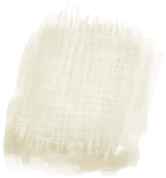

# 织布机  
> 可以用它把小布解编成线团，或者用现有的布匹与线团组合出更大的布匹。  
   
> 织布机是一种用于将<b>细线</b>编织成<b>布</b>的设备。  将两根<b>纤维</b>组合在一起得到<b>细线</b>。将两根<b>细线</b>组合在一起，得到一个<b>线团</b>。 将线团拖到<b>空的织布机</b>上来制作布料。为了制作更大的布，可以先<b>取下</b>布，再将这现成的<b>布料</b>拖到已放有<b>线团</b>的织布机上。  
  
<table class="table table-bordered" data-toggle="table" ><tbody><tr ><td  style="width:80%;text-align:left;vertical-align:top;"  >** 区域唯一 **  ** 不可删除 **</td><td  style="width:20%;text-align:left;vertical-align:top;"  >

</td></tr></tbody></tbody></table>  
  
## 获取来源  
<table class="table table-bordered" data-toggle="table" ><thead><tr ><th  style="text-align:left;vertical-align:top;"  >来源</th><th  style="text-align:left;vertical-align:top;"  >操作</th></tr></thead><tr ><td  style="text-align:left;vertical-align:top;"  >[

[织布机（空）](LoomEmpty.md)](LoomEmpty.md)</td><td  style="text-align:left;vertical-align:top;"  >将线放到织布机上 ** 拖入：**[线团](YarnFiber.md)</td></tr></tbody></table>  
  
## 动作  
<table class="table table-bordered" data-toggle="table" ><thead><tr ><th  style="text-align:left;vertical-align:top;"  >动作</th><th  style="text-align:left;vertical-align:top;"  >耗时</th><th  style="text-align:left;vertical-align:top;"  >条件</th><th  style="text-align:left;vertical-align:top;"  >变化</th><th  style="text-align:left;vertical-align:top;"  >状态</th></tr></thead><tr ><td  style="text-align:left;vertical-align:top;"  >织布 [“手部动作(组)”](HandAction.md)</td><td  style="text-align:left;vertical-align:top;"  >2TP</td><td  style="text-align:left;vertical-align:top;"  >[

[光亮](Light.md)](Light.md): 10-100</td><td  style="text-align:left;vertical-align:top;"  >** 自身：** → [

[织布机（空）](LoomEmpty.md)](LoomEmpty.md)  ** 获得： ** ** [Cloth]  **   [

[布片](ClothSmall.md)](ClothSmall.md)(+1) 基础权重：1</td><td  style="text-align:left;vertical-align:top;"  >[

[纺织(技能)](Skill_Tailoring.md)](Skill_Tailoring.md)+0.5</td></tr></tbody></table>  
  
## 可拖入  
<table class="table table-bordered" data-toggle="table" ><thead><tr ><th  style="text-align:left;vertical-align:top;"  >使用</th><th  style="text-align:left;vertical-align:top;"  >动作</th><th  style="text-align:left;vertical-align:top;"  >耗时</th><th  style="text-align:left;vertical-align:top;"  >条件</th><th  style="text-align:left;vertical-align:top;"  >变化</th><th  style="text-align:left;vertical-align:top;"  >玩家状态</th></tr></thead><tr ><td  style="text-align:left;vertical-align:top;"  >[

[布片](ClothSmall.md)](ClothSmall.md)</td><td  style="text-align:left;vertical-align:top;"  >扩大布匹 [“手部动作(组)”](HandAction.md)</td><td  style="text-align:left;vertical-align:top;"  >2TP</td><td  style="text-align:left;vertical-align:top;"  >[

[光亮](Light.md)](Light.md): 10-100</td><td  style="text-align:left;vertical-align:top;"  >** 自身: ** → [

[织布机（空）](LoomEmpty.md)](LoomEmpty.md)  ** 使用物: ** →消失  ** 获得: ** ** [Cloth]  **   [

[布](Cloth.md)](Cloth.md)(+1) 基础权重：1</td><td  style="text-align:left;vertical-align:top;"  >[

[纺织(技能)](Skill_Tailoring.md)](Skill_Tailoring.md)+0.5</td></tr><tr ><td  style="text-align:left;vertical-align:top;"  >[

[布](Cloth.md)](Cloth.md)</td><td  style="text-align:left;vertical-align:top;"  >扩大布匹 [“手部动作(组)”](HandAction.md)</td><td  style="text-align:left;vertical-align:top;"  >2TP</td><td  style="text-align:left;vertical-align:top;"  >[

[光亮](Light.md)](Light.md): 10-100</td><td  style="text-align:left;vertical-align:top;"  >** 自身: ** → [

[织布机（空）](LoomEmpty.md)](LoomEmpty.md)  ** 使用物: ** →消失  ** 获得: ** ** [Large Cloth]  **   [

[大块的布](ClothLarge.md)](ClothLarge.md)(+1) 基础权重：1</td><td  style="text-align:left;vertical-align:top;"  >[

[纺织(技能)](Skill_Tailoring.md)](Skill_Tailoring.md)+0.5</td></tr><tr ><td  style="text-align:left;vertical-align:top;"  >[

[大块的布](ClothLarge.md)](ClothLarge.md)</td><td  style="text-align:left;vertical-align:top;"  >扩大布匹 [“手部动作(组)”](HandAction.md)</td><td  style="text-align:left;vertical-align:top;"  >2TP</td><td  style="text-align:left;vertical-align:top;"  >[

[光亮](Light.md)](Light.md): 10-100</td><td  style="text-align:left;vertical-align:top;"  >** 自身: ** → [

[织布机（空）](LoomEmpty.md)](LoomEmpty.md)  ** 使用物: ** →消失  ** 获得: ** ** [Very Large Cloth]  **   [

[超大块布](ClothVeryLarge.md)](ClothVeryLarge.md)(+1) 基础权重：1</td><td  style="text-align:left;vertical-align:top;"  >[

[纺织(技能)](Skill_Tailoring.md)](Skill_Tailoring.md)+0.5</td></tr></tbody></table>  
  

