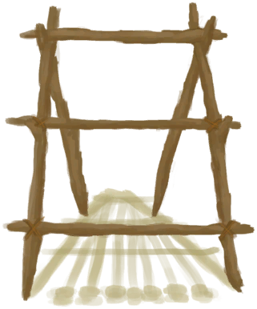

[返回首页](index.md)   |  [查看所有建筑](building.md)
# 织布机（空）  
> 可以把线团织成布。  
  
  属性  |   图片   
 ----  |  ----:   
   |     
  
## 获取来源  
来源  |  操作  
----  |  ----  
[织布机(蓝图)](Bp_Loom.md)  |  蓝图制造  
[织布机](Loom.md)  |  织布  
[织布机](Loom.md) , [布片](ClothSmall.md)  |  扩大布匹  
[织布机](Loom.md) , [布](Cloth.md)  |  扩大布匹  
[织布机](Loom.md) , [大块的布](ClothLarge.md)  |  扩大布匹  
## 动作  
动作  |  时间  |  条件  |  变化  |  状态  
----  |  ----  |  ----  |  ----  |  ----  
拆卸织布机  |  45分  |  [光亮](Light.md):10-100  |  [长木棍](StickLong.md)(7) [细线](CordFiber.md)(4)  |    
## 可拖入  
使用  |  动作  |  时间  |  条件  |  变化  |  状态  
----  |  ----  |  ----  |  ----  |  ----  |  ----  
[线团](YarnFiber.md)  |  将线放到织布机上  |  30分  |  [光亮](Light.md):10-100  |  自身: → [织布机](Loom.md)  使用物: → [纺锤](Spindle.md)    |  [纺织(技能)](Skill_Tailoring.md)+0.5  
[布片](ClothSmall.md)  |  解编布匹  |  15分  |  [光亮](Light.md):10-100  |  使用物: → [细线](CordFiber.md)  获得: [细线](CordFiber.md)(2)   |  [纺织(技能)](Skill_Tailoring.md)+0.5  
[布](Cloth.md)  |  解编布匹  |  30分  |  [光亮](Light.md):10-100  |  使用物: → [布片](ClothSmall.md)  获得: [细线](CordFiber.md)(2)   |  [纺织(技能)](Skill_Tailoring.md)+0.5  
[大块的布](ClothLarge.md)  |  解编布匹  |  1小时  |  [光亮](Light.md):10-100  |  使用物: → [布](Cloth.md)  获得: [细线](CordFiber.md)(2)   |  [纺织(技能)](Skill_Tailoring.md)+0.5  
