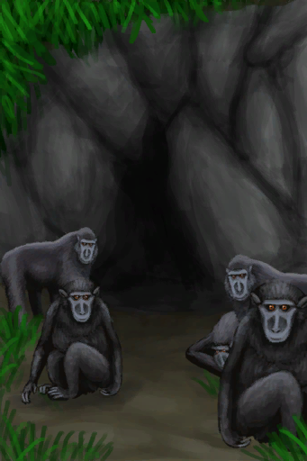

# 猕猴窝  
> 一个周围全是猕猴的小洞穴，我得小心应付。  
  
<table class="table table-bordered" data-toggle="table"  data-show-header="false"><thead style="display:none"><tr ><th  style="width:50%;text-align:left;vertical-align:top;"  >title</th><th  style="width:50%;text-align:left;vertical-align:top;"  ></th></tr></thead><tr ><td  style="width:50%;text-align:left;vertical-align:top;"  >** 区域唯一 **  **环境：**[丛林高地(环境)](Env_JungleHighlands.md)</td><td  style="width:50%;text-align:left;vertical-align:top;"  >

<a href="MacaqueDenEntrance.md" style="color:black">猕猴窝</a>

一个洞穴，似乎被这个岛上的猕猴群用作它们的行动基地。  尽管被这些家伙<b>偷走</b>的东西最终大概率都存在这里，但除非你做足了<b>战斗</b>准备，否则不建议靠近这个地方。这些猕猴显然有着很强的领地意识，并且不欢迎访客。</td></tr></tbody></table>  
  
## 动作  
<table class="table table-bordered" data-toggle="table"  ><thead style=""><tr ><th  style="text-align:left;vertical-align:top;"  >动作</th><th  style="text-align:left;vertical-align:top;"  data-sortable="true"  >耗时</th><th  style="text-align:left;vertical-align:top;"  data-sortable="true"  >条件</th><th  style="text-align:left;vertical-align:top;"  >变化</th><th  style="text-align:left;vertical-align:top;"  data-sortable="true"  >状态</th></tr></thead><tr ><td  style="text-align:left;vertical-align:top;"  >进入 </td><td  style="text-align:left;vertical-align:top;"  >-</td><td  style="text-align:left;vertical-align:top;"  ></td><td  style="text-align:left;vertical-align:top;"  >** 获得： ** ** [Entrance]  **   [

[猕猴们攻击了你！(事件)](Event_MacaqueDenFight.md)](Event_MacaqueDenFight.md)(+1) 基础权重：1</td><td  style="text-align:left;vertical-align:top;"  ></td></tr></tbody></table>  
  
## 可拖入  
<table class="table table-bordered" data-toggle="table"  ><thead style=""><tr ><th  style="text-align:left;vertical-align:top;"  >使用</th><th  style="text-align:left;vertical-align:top;"  >动作</th><th  style="text-align:left;vertical-align:top;"  >耗时</th><th  style="text-align:left;vertical-align:top;"  data-sortable="true"  >条件</th><th  style="text-align:left;vertical-align:top;"  >变化</th><th  style="text-align:left;vertical-align:top;"  >玩家状态</th></tr></thead><tr ><td  style="text-align:left;vertical-align:top;"  >[

[炸‍葯(开)](DynamiteOn.md)](DynamiteOn.md)</td><td  style="text-align:left;vertical-align:top;"  >我TM来啦！ </td><td  style="text-align:left;vertical-align:top;"  >15分</td><td  style="text-align:left;vertical-align:top;"  ></td><td  style="text-align:left;vertical-align:top;"  > ** 使用物: ** →消失  ** 获得: **   [

[猕猴肉](MacaqueMeat.md)](MacaqueMeat.md)(+2～+6)   [

[烤猕猴肉](MacaqueMeatCooked.md)](MacaqueMeatCooked.md)(+2～+6)   [

[猕猴尸体](MacaqueCarcass.md)](MacaqueCarcass.md)(+1～+2)   [

[受伤的猕猴](MacaqueWounded.md)](MacaqueWounded.md)(+0～+1)   [

[骨头碎片](BoneSplinters.md)](BoneSplinters.md)(+2～+6) </td><td  style="text-align:left;vertical-align:top;"  >[猕猴种群数量](Pop_Macaque.md)-20000 [害怕猕猴](MacaqueFear.md)+10000 [

[情绪](Morale.md)](Morale.md)+100</td></tr></tbody></table>  
  
## 状态触发  
<table class="table table-bordered" data-toggle="table"  ><thead style=""><tr ><th  style="text-align:left;vertical-align:top;"  >名称</th><th  style="text-align:left;vertical-align:top;"  >条件</th><th  style="text-align:left;vertical-align:top;"  >变化</th></tr></thead><tr ><td  style="text-align:left;vertical-align:top;"  >猕猴灭绝</td><td  style="text-align:left;vertical-align:top;"  >[猕猴种群数量](Pop_Macaque.md): 0-1999</td><td  style="text-align:left;vertical-align:top;"  >→ [

[猕猴窝(空)](MacaqueDenEntranceClear.md)](MacaqueDenEntranceClear.md)</td></tr></tbody></table>  
  

