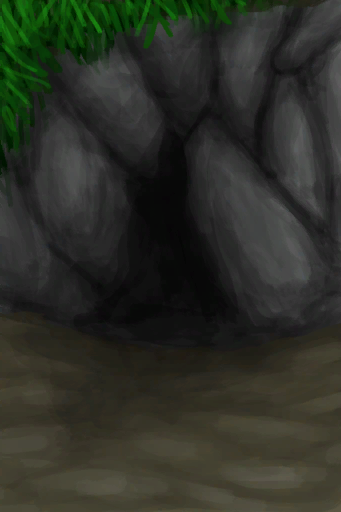

# 猕猴窝  
> 一个小洞穴，曾经是猕猴们的家。  
  
  猕猴窝  |   图片   
 ----  |  ----:   
 ** 区域唯一 **  |     
  
## 动作  
动作  |  耗时  |  条件  |  变化  |  状态  
----  |  ----  |  ----  |  ----  |  ----  
进入   |  -  |    |  [猕猴窝(环境)](Env_MacaqueDen.md)(+1) 基础权重：1   |    
