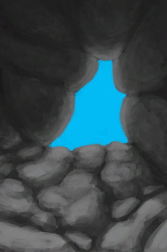

# 离开  
> 离开洞穴  
  
  属性  |   图片   
 ----  |  ----:   
 **环境：**[猕猴窝(环境)](Env_MacaqueDen.md)  ** 只允许存在一个 **  |     
  
## 动作  
动作  |  时间  |  条件  |  变化  |  状态  
----  |  ----  |  ----  |  ----  |  ----  
离开   |  -  |    |  → [丛林(环境)](Env_Jungle.md)  [丛林高地(环境)](Env_JungleHighlands.md)(+1) 基础权重：1   |    
