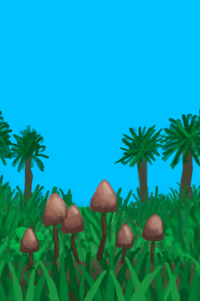

[返回首页](index.md)   |  [查看所有建筑](building.md)
# 迷幻菇  
> 一种可食用植物。  
  
  属性  |   图片   
 ----  |  ----:   
   |     
  
## 获取来源  
来源  |  操作  
----  |  ----  
[西部草原](GrasslandsW.md)  |  探索  
## 动作  
动作  |  时间  |  条件  |  变化  |  状态  
----  |  ----  |  ----  |  ----  |  ----  
采集  |  15分  |    |  → [柠檬草](LemongrassStalks.md)  [迷幻菇](MagicMushrooms.md)(+1)  |  [药草学(技能)](Skill_Herbology.md)+1  
