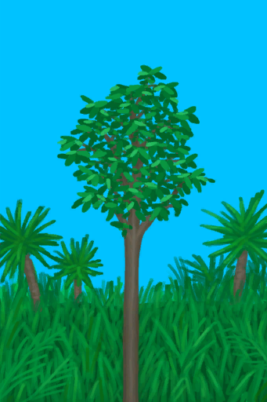
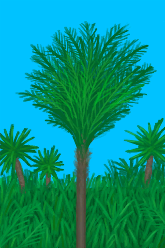
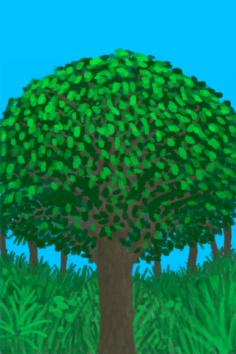
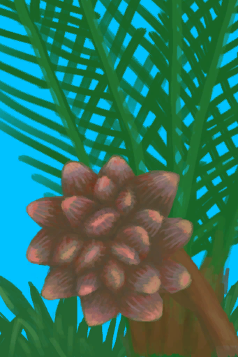
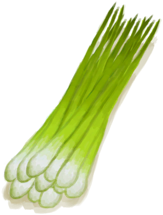
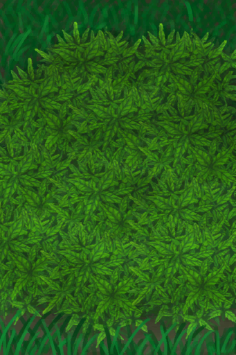
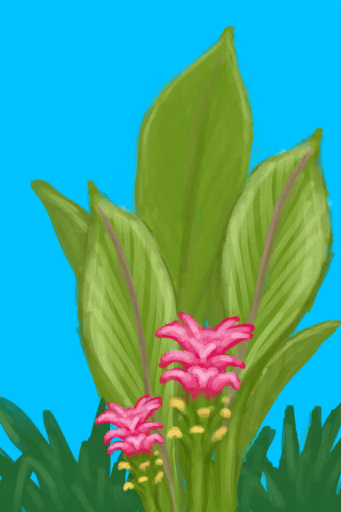

# 红树林  
> 一片被水淹没的森林，树根缠结、红树丛生。  
  

<a href="Mangroves.md" style="color:black">红树林</a>

<a href="Bay.md" style="color:black">海湾</a>

<a href="DesolateBeach.md" style="color:black">荒芜沙滩</a>

<a href="GrasslandsW.md" style="color:black">西部草原</a>

<a href="Sea_Mangroves.md" style="color:black">海</a>

  
  
<table class="table table-bordered" data-toggle="table"  data-show-header="false"><thead style="display:none"><tr ><th  style="width:50%;text-align:left;vertical-align:top;"  >title</th><th  style="width:50%;text-align:left;vertical-align:top;"  data-sortable="true"  ></th></tr></thead><tr ><td  style="width:50%;text-align:left;vertical-align:top;"  >** 区域唯一 **  **环境：**[红树林(环境)](Env_Mangroves.md)  ** 环境效果: ** [

[雨水防护](RainProtection.md)](RainProtection.md)<b>+2</b> [

[绝热](InsulationHeat.md)](InsulationHeat.md)<b>+2</b> [

[阳光防护](SunProtection.md)](SunProtection.md)<b>+2</b> [

[蚊虫数量](BugPopulation.md)](BugPopulation.md)<b>+2</b> [

[猎手接近](HuntersProximity.md)](HuntersProximity.md)<b>-0.5</b> [

[内陆恐惧症](LandSickness.md)](LandSickness.md)加成<b>-8</b></td><td  style="width:50%;text-align:left;vertical-align:top;"  ></td></tr></tbody></table>  
  
## 探索  
<table class="table table-bordered" data-toggle="table"  ><thead style=""><tr ><th  style="text-align:left;vertical-align:top;"  >进度</th><th  style="text-align:left;vertical-align:top;"  >目的地</th></tr></thead><tr ><td  style="text-align:left;vertical-align:top;"  >50%</td><td  style="text-align:left;vertical-align:top;"  >[前往西部草原(红树林)](Path_MangrovesToGrasslandsW.md)</td></tr><tr ><td  style="text-align:left;vertical-align:top;"  >100%</td><td  style="text-align:left;vertical-align:top;"  >[地区探索完毕(事件)(红树林)](Event_MangrovesExplored.md)</td></tr></tbody></table>  
  
## 动作  

<table><tr><td rowspan="2" style="width:200px;text-align:center;font-size:1.3em;font-weight:bold">

探索

15分

</td><td>[“腿部动作(组)”](LegAction.md)</td></tr><tr><td></td></tr><tr><td colspan="2"><b>需求：</b>[

[光亮](Light.md)](Light.md): <b>10-100</b></td></tr><tr><td colspan="2"><b>状态变化：</b>[

[足部损伤](FootDamage.md)](FootDamage.md)<b>+8</b>, [

[耐力](Stamina.md)](Stamina.md)<b>-4</b>, [

[压力](Stress.md)](Stress.md)<b>-10</b>, [探索红树林](Exploration_Mangroves.md)<b>+1</b>, [真人秀 红树林 - 探索](TV_MangrovesExplore.md)<b>+1</b></td></tr><tr><td colspan="2">

<table style="margin-bottom:3px;"><tr><td rowspan=2 style="text-align:center" width="80px">
基础权重

300
</td><td style="font-size:0.6em;line-height:0.6em;font-weight:bold">Palm Fronds</td></tr><tr><td>[

[棕榈叶](PalmFronds.md)](PalmFronds.md)(<b>+3～+6</b>)</td></tr></table>

<table style="margin-bottom:3px;"><tr><td rowspan=2 style="text-align:center" width="80px">
基础权重

200000
</td><td style="font-size:0.6em;line-height:0.6em;font-weight:bold">Small Tree</td></tr><tr><td>[

[小树](SmallTree.md)](SmallTree.md)(<b>+1</b>)</td></tr></table>

<table style="margin-bottom:3px;"><tr><td rowspan=2 style="text-align:center" width="80px">
基础权重

200000
</td><td style="font-size:0.6em;line-height:0.6em;font-weight:bold">Small Palm</td></tr><tr><td>[

[小棕榈树](SmallPalm.md)](SmallPalm.md)(<b>+1</b>)</td></tr></table>

<table style="margin-bottom:3px;"><tr><td rowspan=2 style="text-align:center" width="80px">
基础权重

100
</td><td style="font-size:0.6em;line-height:0.6em;font-weight:bold">Stone❗限5次</td></tr><tr><td>[

[石头](Stone.md)](Stone.md)(<b>+1</b>)</td></tr></table>

<table style="margin-bottom:3px;"><tr><td rowspan=2 style="text-align:center" width="80px">
基础权重

0
</td><td style="font-size:0.6em;line-height:0.6em;font-weight:bold">Supply Crate</td></tr><tr><td>[

[补给胶囊](TV_SupplyCapsule.md)](TV_SupplyCapsule.md)(<b>+1</b>)</td></tr><tr><td colspan=2><li>[

[真人秀 红树林](TV_Mangroves.md)](TV_Mangroves.md)为<b>1</b>时权重<b>+50</b></li><li>[真人秀 红树林 - 探索](TV_MangrovesExplore.md)为<b>0～9</b>时权重<b>-999</b></li></td></tr></table>

<table style="margin-bottom:3px;"><tr><td rowspan=2 style="text-align:center" width="80px">
基础权重

200000
</td><td style="font-size:0.6em;line-height:0.6em;font-weight:bold">Tree</td></tr><tr><td>[

[大树](LargeTree.md)](LargeTree.md)(<b>+1</b>)</td></tr></table>

<table style="margin-bottom:3px;"><tr><td rowspan=2 style="text-align:center" width="80px">
基础权重

50
</td><td style="font-size:0.6em;line-height:0.6em;font-weight:bold">Heavy Stone❗限2次</td></tr><tr><td>[

[大石块](StoneHeavy.md)](StoneHeavy.md)(<b>+1</b>)</td></tr></table>

<table style="margin-bottom:3px;"><tr><td rowspan=2 style="text-align:center" width="80px">
基础权重

200
</td><td style="font-size:0.6em;line-height:0.6em;font-weight:bold">Mud Deposit</td></tr><tr><td>[

[泥滩](MudDeposit.md)](MudDeposit.md)(<b>+1</b>)</td></tr></table>

<table style="margin-bottom:3px;"><tr><td rowspan=2 style="text-align:center" width="80px">
基础权重

0
</td><td style="font-size:0.6em;line-height:0.6em;font-weight:bold">Crab</td></tr><tr><td>[

[螃蟹](Crab.md)](Crab.md)(<b>+1</b>)[螃蟹种群数量](Pop_Crab.md)<b>-1000</b></td></tr><tr><td colspan=2><li>[螃蟹种群数量](Pop_Crab.md)为<b>1000～60000</b>时权重<b>+100～+300</b></li><li>[

[视力](Myopia.md)](Myopia.md)为<b>1～3</b>时权重<b>-100～-200</b></li></td></tr></table>

<table style="margin-bottom:3px;"><tr><td rowspan=2 style="text-align:center" width="80px">
基础权重

0
</td><td style="font-size:0.6em;line-height:0.6em;font-weight:bold">Nipa</td></tr><tr><td>[

[水椰](NipaPalm.md)](NipaPalm.md)(<b>+1</b>)[红树林水椰种群数量](Nipa_MangrovesPop.md)<b>-1000</b></td></tr><tr><td colspan=2><li>[红树林水椰种群数量](Nipa_MangrovesPop.md)为<b>1000～8000</b>时权重<b>+25～+200</b></li><li>[

[视力](Myopia.md)](Myopia.md)为<b>1～3</b>时权重<b>-50～-100</b></li><li>[

[药草学(技能)](Skill_Herbology.md)](Skill_Herbology.md)为<b>0～150</b>时权重<b>-100～+0</b></li></td></tr></table>

<table style="margin-bottom:3px;"><tr><td rowspan=2 style="text-align:center" width="80px">
基础权重

400
</td><td style="font-size:0.6em;line-height:0.6em;font-weight:bold">Snake Grass</td></tr><tr><td>[

[蛇草丛](SnakegrassPatch.md)](SnakegrassPatch.md)(<b>+1</b>)</td></tr><tr><td colspan=2><li>[

[药草学(技能)](Skill_Herbology.md)](Skill_Herbology.md)为<b>0～150</b>时权重<b>+0～+200</b></li></td></tr></table>

<table style="margin-bottom:3px;"><tr><td rowspan=2 style="text-align:center" width="80px">
基础权重

0
</td><td style="font-size:0.6em;line-height:0.6em;font-weight:bold">Ginger</td></tr><tr><td>[

[姜株](GingerPlant.md)](GingerPlant.md)(<b>+1</b>)[红树林姜种群数量](Ginger_MangrovesPop.md)<b>-1000</b></td></tr><tr><td colspan=2><li>[红树林姜种群数量](Ginger_MangrovesPop.md)为<b>1000～15000</b>时权重<b>+25～+150</b></li><li>[

[视力](Myopia.md)](Myopia.md)为<b>1～3</b>时权重<b>-20～-50</b></li><li>[

[药草学(技能)](Skill_Herbology.md)](Skill_Herbology.md)为<b>0～150</b>时权重<b>-100～+0</b></li></td></tr></table>

<table style="margin-bottom:3px;"><tr><td rowspan=2 style="text-align:center" width="80px">
基础权重

100
</td><td style="font-size:0.6em;line-height:0.6em;font-weight:bold">Krait</td></tr><tr><td>[

[一条海蛇！(事件)](Event_SeaKraitStep.md)](Event_SeaKraitStep.md)(<b>+1</b>)</td></tr><tr><td colspan=2><li>[

[视力](Myopia.md)](Myopia.md)为<b>1～3</b>时权重<b>+20～+60</b></li></td></tr></table>

<table style="margin-bottom:3px;"><tr><td rowspan=2 style="text-align:center" width="80px">
基础权重

0
</td><td style="font-size:0.6em;line-height:0.6em;font-weight:bold">Monitor Encounter</td></tr><tr><td>[

[一头巨蜥！(事件)(洞穴)](Event_MonitorFight.md)](Event_MonitorFight.md)(<b>+1</b>)</td></tr><tr><td colspan=2><li>[首月次数](FirstMonthCounter.md)为<b>0～672</b>时权重<b>-1000</b></li><li>[巨蜥种群数量](Pop_Monitor.md)为<b>1000～14000</b>时权重<b>+10～+25</b></li><li>[

[视力](Myopia.md)](Myopia.md)为<b>1～3</b>时权重<b>+0</b></li><li>[探索红树林](Exploration_Mangroves.md)为<b>0～4</b>时权重<b>-1000</b></li><li>[“战斗事件”](tag_FightEvent.md)存在于*手中/面板*，权重<b>-999999</b>(可叠加),</li></td></tr></table>

<table style="margin-bottom:3px;"><tr><td rowspan=2 style="text-align:center" width="80px">
基础权重

0
</td><td style="font-size:0.6em;line-height:0.6em;font-weight:bold">Drone Encounter</td></tr><tr><td>[

[攻击无人机！(事件)](Event_DroneFight.md)](Event_DroneFight.md)(<b>+1</b>)</td></tr><tr><td colspan=2><li>[杀手无人机种群数量](Pop_Drone.md)为<b>1000～4000</b>时权重<b>+10～+75</b></li><li>[

[视力](Myopia.md)](Myopia.md)为<b>1～3</b>时权重<b>+0</b></li><li>[“战斗事件”](tag_FightEvent.md)存在于*手中/面板*，权重<b>-999999</b>(可叠加),</li></td></tr></table>
<button class="btn btn-secondary btn-sm" style="" data-toggle="modal" onclick="setCollectionDataBase64('eyJ0aXRsZSI6IuamgueOh+aooeaLnzog5o6i57SiICjnuqLmoJHmnpcpIiwiY29sbGVjdGlvbnMiOlt7ImRyb3AiOiI8ZGl2IHN0eWxlPVwid2lkdGg6MjVweDtkaXNwbGF5OmlubGluZS1ibG9jazt0ZXh0LWFsaWduOmNlbnRlclwiPjxpbWcgZGVjb2Rpbmc9XCJhc3luY1wiIHNyYz1cIi4uL3dpa2kvU3ByaXRlL1BhbG1UcmVlTGVhdmVzLnBuZ1wiIGhyZWY9XCJhLm1kXCIgc3R5bGU9XCJtYXgtd2lkdGg6MjVweDttYXgtaGVpZ2h0OjI1cHg7XCI+PC9kaXY+5qOV5qaI5Y+2IiwiYmFzZSI6MzAwLCJjb25kaXRpb24iOltdfSx7ImRyb3AiOiI8ZGl2IHN0eWxlPVwid2lkdGg6MjVweDtkaXNwbGF5OmlubGluZS1ibG9jazt0ZXh0LWFsaWduOmNlbnRlclwiPjxpbWcgZGVjb2Rpbmc9XCJhc3luY1wiIHNyYz1cIi4uL3dpa2kvU3ByaXRlL1NtYWxsVHJlZS5wbmdcIiBocmVmPVwiYS5tZFwiIHN0eWxlPVwibWF4LXdpZHRoOjI1cHg7bWF4LWhlaWdodDoyNXB4O1wiPjwvZGl2PuWwj+agkSIsImJhc2UiOjIwMDAwMCwiY29uZGl0aW9uIjpbXSwiaXNVbmlxdWUiOnRydWV9LHsiZHJvcCI6IjxkaXYgc3R5bGU9XCJ3aWR0aDoyNXB4O2Rpc3BsYXk6aW5saW5lLWJsb2NrO3RleHQtYWxpZ246Y2VudGVyXCI+PGltZyBkZWNvZGluZz1cImFzeW5jXCIgc3JjPVwiLi4vd2lraS9TcHJpdGUvU21hbGxQYWxtLnBuZ1wiIGhyZWY9XCJhLm1kXCIgc3R5bGU9XCJtYXgtd2lkdGg6MjVweDttYXgtaGVpZ2h0OjI1cHg7XCI+PC9kaXY+5bCP5qOV5qaI5qCRIiwiYmFzZSI6MjAwMDAwLCJjb25kaXRpb24iOltdLCJpc1VuaXF1ZSI6dHJ1ZX0seyJkcm9wIjoiPGRpdiBzdHlsZT1cIndpZHRoOjI1cHg7ZGlzcGxheTppbmxpbmUtYmxvY2s7dGV4dC1hbGlnbjpjZW50ZXJcIj48aW1nIGRlY29kaW5nPVwiYXN5bmNcIiBzcmM9XCIuLi93aWtpL1Nwcml0ZS9UVkNyYXRlLnBuZ1wiIGhyZWY9XCJhLm1kXCIgc3R5bGU9XCJtYXgtd2lkdGg6MjVweDttYXgtaGVpZ2h0OjI1cHg7XCI+PC9kaXY+6KGl57uZ6IO25ZuKIiwiYmFzZSI6MCwiY29uZGl0aW9uIjpbeyJrZXkiOiJUVl9NYW5ncm92ZXMiLCJ0aXRsZSI6Iuecn+S6uuengCDnuqLmoJHmnpciLCJ0eXBlIjoicmFuZ2UiLCJtYXgiOlswLDFdLCJyYW5nZSI6WzEsMV0sIndlaWdodCI6WzUwLDUwXSwiZGVmYXVsdFZhbHVlIjowLCJ3aGVuT3V0T2ZSYW5nZSI6MH0seyJrZXkiOiJUVl9NYW5ncm92ZXNFeHBsb3JlIiwidGl0bGUiOiLnnJ/kurrnp4Ag57qi5qCR5p6XIC0g5o6i57SiIiwidHlwZSI6InJhbmdlIiwibWF4IjpbMCwyMF0sInJhbmdlIjpbMCw5XSwid2VpZ2h0IjpbLTk5OSwtOTk5XSwiZGVmYXVsdFZhbHVlIjowLCJ3aGVuT3V0T2ZSYW5nZSI6MH1dfSx7ImRyb3AiOiI8ZGl2IHN0eWxlPVwid2lkdGg6MjVweDtkaXNwbGF5OmlubGluZS1ibG9jazt0ZXh0LWFsaWduOmNlbnRlclwiPjxpbWcgZGVjb2Rpbmc9XCJhc3luY1wiIHNyYz1cIi4uL3dpa2kvU3ByaXRlL0NvdHRvbndvb2RUcmVlLnBuZ1wiIGhyZWY9XCJhLm1kXCIgc3R5bGU9XCJtYXgtd2lkdGg6MjVweDttYXgtaGVpZ2h0OjI1cHg7XCI+PC9kaXY+5aSn5qCRIiwiYmFzZSI6MjAwMDAwLCJjb25kaXRpb24iOltdLCJpc1VuaXF1ZSI6dHJ1ZX0seyJkcm9wIjoiPGRpdiBzdHlsZT1cIndpZHRoOjI1cHg7ZGlzcGxheTppbmxpbmUtYmxvY2s7dGV4dC1hbGlnbjpjZW50ZXJcIj48aW1nIGRlY29kaW5nPVwiYXN5bmNcIiBzcmM9XCIuLi93aWtpL1Nwcml0ZS9QdWRkbGVEcnkucG5nXCIgaHJlZj1cImEubWRcIiBzdHlsZT1cIm1heC13aWR0aDoyNXB4O21heC1oZWlnaHQ6MjVweDtcIj48L2Rpdj7ms6Xmu6kiLCJiYXNlIjoyMDAsImNvbmRpdGlvbiI6W119LHsiZHJvcCI6IjxkaXYgc3R5bGU9XCJ3aWR0aDoyNXB4O2Rpc3BsYXk6aW5saW5lLWJsb2NrO3RleHQtYWxpZ246Y2VudGVyXCI+PGltZyBkZWNvZGluZz1cImFzeW5jXCIgc3JjPVwiLi4vd2lraS9TcHJpdGUvQ3JhYi5wbmdcIiBocmVmPVwiYS5tZFwiIHN0eWxlPVwibWF4LXdpZHRoOjI1cHg7bWF4LWhlaWdodDoyNXB4O1wiPjwvZGl2Puieg+ifuSIsImJhc2UiOjAsImNvbmRpdGlvbiI6W3sia2V5IjoiUG9wX0NyYWIiLCJ0aXRsZSI6Iuieg+ifueenjee+pOaVsOmHjyIsInR5cGUiOiJyYW5nZSIsIm1heCI6WzAsNjAwMDBdLCJyYW5nZSI6WzEwMDAsNjAwMDBdLCJ3ZWlnaHQiOlsxMDAsMzAwXSwiZGVmYXVsdFZhbHVlIjo2MDAwMCwid2hlbk91dE9mUmFuZ2UiOjB9LHsia2V5IjoiTXlvcGlhIiwidGl0bGUiOiLop4blipsiLCJ0eXBlIjoicmFuZ2UiLCJtYXgiOlswLDNdLCJyYW5nZSI6WzEsM10sIndlaWdodCI6Wy0xMDAsLTIwMF0sImRlZmF1bHRWYWx1ZSI6MCwid2hlbk91dE9mUmFuZ2UiOjB9XX0seyJkcm9wIjoiPGRpdiBzdHlsZT1cIndpZHRoOjI1cHg7ZGlzcGxheTppbmxpbmUtYmxvY2s7dGV4dC1hbGlnbjpjZW50ZXJcIj48aW1nIGRlY29kaW5nPVwiYXN5bmNcIiBzcmM9XCIuLi93aWtpL1Nwcml0ZS9OaXBhUGFsbS5wbmdcIiBocmVmPVwiYS5tZFwiIHN0eWxlPVwibWF4LXdpZHRoOjI1cHg7bWF4LWhlaWdodDoyNXB4O1wiPjwvZGl2PuawtOaksCIsImJhc2UiOjAsImNvbmRpdGlvbiI6W3sia2V5IjoiTmlwYV9NYW5ncm92ZXNQb3AiLCJ0aXRsZSI6Iue6ouagkeael+awtOaksOenjee+pOaVsOmHjyIsInR5cGUiOiJyYW5nZSIsIm1heCI6WzAsODAwMF0sInJhbmdlIjpbMTAwMCw4MDAwXSwid2VpZ2h0IjpbMjUsMjAwXSwiZGVmYXVsdFZhbHVlIjo4MDAwLCJ3aGVuT3V0T2ZSYW5nZSI6MH0seyJrZXkiOiJNeW9waWEiLCJ0aXRsZSI6IuinhuWKmyIsInR5cGUiOiJyYW5nZSIsIm1heCI6WzAsM10sInJhbmdlIjpbMSwzXSwid2VpZ2h0IjpbLTUwLC0xMDBdLCJkZWZhdWx0VmFsdWUiOjAsIndoZW5PdXRPZlJhbmdlIjowfSx7ImtleSI6IlNraWxsX0hlcmJvbG9neSIsInRpdGxlIjoi6I2v6I2J5a2mKOaKgOiDvSkiLCJ0eXBlIjoicmFuZ2UiLCJtYXgiOlswLDE1MF0sInJhbmdlIjpbMCwxNTBdLCJ3ZWlnaHQiOlstMTAwLDBdLCJkZWZhdWx0VmFsdWUiOjAsIndoZW5PdXRPZlJhbmdlIjowfV19LHsiZHJvcCI6IjxkaXYgc3R5bGU9XCJ3aWR0aDoyNXB4O2Rpc3BsYXk6aW5saW5lLWJsb2NrO3RleHQtYWxpZ246Y2VudGVyXCI+PGltZyBkZWNvZGluZz1cImFzeW5jXCIgc3JjPVwiLi4vd2lraS9TcHJpdGUvU25ha2VncmFzc1BhdGNoLnBuZ1wiIGhyZWY9XCJhLm1kXCIgc3R5bGU9XCJtYXgtd2lkdGg6MjVweDttYXgtaGVpZ2h0OjI1cHg7XCI+PC9kaXY+6JuH6I2J5LibIiwiYmFzZSI6NDAwLCJjb25kaXRpb24iOlt7ImtleSI6IlNraWxsX0hlcmJvbG9neSIsInRpdGxlIjoi6I2v6I2J5a2mKOaKgOiDvSkiLCJ0eXBlIjoicmFuZ2UiLCJtYXgiOlswLDE1MF0sInJhbmdlIjpbMCwxNTBdLCJ3ZWlnaHQiOlswLDIwMF0sImRlZmF1bHRWYWx1ZSI6MCwid2hlbk91dE9mUmFuZ2UiOjB9XX0seyJkcm9wIjoiPGRpdiBzdHlsZT1cIndpZHRoOjI1cHg7ZGlzcGxheTppbmxpbmUtYmxvY2s7dGV4dC1hbGlnbjpjZW50ZXJcIj48aW1nIGRlY29kaW5nPVwiYXN5bmNcIiBzcmM9XCIuLi93aWtpL1Nwcml0ZS9HaW5nZXJQbGFudC5wbmdcIiBocmVmPVwiYS5tZFwiIHN0eWxlPVwibWF4LXdpZHRoOjI1cHg7bWF4LWhlaWdodDoyNXB4O1wiPjwvZGl2PuWnnOagqiIsImJhc2UiOjAsImNvbmRpdGlvbiI6W3sia2V5IjoiR2luZ2VyX01hbmdyb3Zlc1BvcCIsInRpdGxlIjoi57qi5qCR5p6X5aec56eN576k5pWw6YePIiwidHlwZSI6InJhbmdlIiwibWF4IjpbMCwxNTAwMF0sInJhbmdlIjpbMTAwMCwxNTAwMF0sIndlaWdodCI6WzI1LDE1MF0sImRlZmF1bHRWYWx1ZSI6MTUwMDAsIndoZW5PdXRPZlJhbmdlIjowfSx7ImtleSI6Ik15b3BpYSIsInRpdGxlIjoi6KeG5YqbIiwidHlwZSI6InJhbmdlIiwibWF4IjpbMCwzXSwicmFuZ2UiOlsxLDNdLCJ3ZWlnaHQiOlstMjAsLTUwXSwiZGVmYXVsdFZhbHVlIjowLCJ3aGVuT3V0T2ZSYW5nZSI6MH0seyJrZXkiOiJTa2lsbF9IZXJib2xvZ3kiLCJ0aXRsZSI6IuiNr+iNieWtpijmioDog70pIiwidHlwZSI6InJhbmdlIiwibWF4IjpbMCwxNTBdLCJyYW5nZSI6WzAsMTUwXSwid2VpZ2h0IjpbLTEwMCwwXSwiZGVmYXVsdFZhbHVlIjowLCJ3aGVuT3V0T2ZSYW5nZSI6MH1dfSx7ImRyb3AiOiI8ZGl2IHN0eWxlPVwid2lkdGg6MjVweDtkaXNwbGF5OmlubGluZS1ibG9jazt0ZXh0LWFsaWduOmNlbnRlclwiPjxpbWcgZGVjb2Rpbmc9XCJhc3luY1wiIHNyYz1cIi4uL3dpa2kvU3ByaXRlL1NlYUtyYWl0LnBuZ1wiIGhyZWY9XCJhLm1kXCIgc3R5bGU9XCJtYXgtd2lkdGg6MjVweDttYXgtaGVpZ2h0OjI1cHg7XCI+PC9kaXY+5LiA5p2h5rW36JuH77yBKOS6i+S7tikiLCJiYXNlIjoxMDAsImNvbmRpdGlvbiI6W3sia2V5IjoiTXlvcGlhIiwidGl0bGUiOiLop4blipsiLCJ0eXBlIjoicmFuZ2UiLCJtYXgiOlswLDNdLCJyYW5nZSI6WzEsM10sIndlaWdodCI6WzIwLDYwXSwiZGVmYXVsdFZhbHVlIjowLCJ3aGVuT3V0T2ZSYW5nZSI6MH1dfSx7ImRyb3AiOiI8ZGl2IHN0eWxlPVwid2lkdGg6MjVweDtkaXNwbGF5OmlubGluZS1ibG9jazt0ZXh0LWFsaWduOmNlbnRlclwiPjxpbWcgZGVjb2Rpbmc9XCJhc3luY1wiIHNyYz1cIi4uL3dpa2kvU3ByaXRlL01vbml0b3JFdmVudC5wbmdcIiBocmVmPVwiYS5tZFwiIHN0eWxlPVwibWF4LXdpZHRoOjI1cHg7bWF4LWhlaWdodDoyNXB4O1wiPjwvZGl2PuS4gOWktOW3qOicpe+8gSjkuovku7YpKOa0nueptCkiLCJiYXNlIjowLCJjb25kaXRpb24iOlt7ImtleSI6IkZpcnN0TW9udGhDb3VudGVyIiwidGl0bGUiOiLpppbmnIjmrKHmlbAiLCJ0eXBlIjoicmFuZ2UiLCJtYXgiOlswLDU3NjBdLCJyYW5nZSI6WzAsNjcyXSwid2VpZ2h0IjpbLTEwMDAsLTEwMDBdLCJkZWZhdWx0VmFsdWUiOjAsIndoZW5PdXRPZlJhbmdlIjowfSx7ImtleSI6IlBvcF9Nb25pdG9yIiwidGl0bGUiOiLlt6jonKXnp43nvqTmlbDph48iLCJ0eXBlIjoicmFuZ2UiLCJtYXgiOlswLDE0MDAwXSwicmFuZ2UiOlsxMDAwLDE0MDAwXSwid2VpZ2h0IjpbMTAsMjVdLCJkZWZhdWx0VmFsdWUiOjE0MDAwLCJ3aGVuT3V0T2ZSYW5nZSI6MH0seyJrZXkiOiJNeW9waWEiLCJ0aXRsZSI6IuinhuWKmyIsInR5cGUiOiJyYW5nZSIsIm1heCI6WzAsM10sInJhbmdlIjpbMSwzXSwid2VpZ2h0IjpbMCwwXSwiZGVmYXVsdFZhbHVlIjowLCJ3aGVuT3V0T2ZSYW5nZSI6MH0seyJrZXkiOiJFeHBsb3JhdGlvbl9NYW5ncm92ZXMiLCJ0aXRsZSI6IuaOoue0oue6ouagkeaelyIsInR5cGUiOiJyYW5nZSIsIm1heCI6WzAsNV0sInJhbmdlIjpbMCw0XSwid2VpZ2h0IjpbLTEwMDAsLTEwMDBdLCJkZWZhdWx0VmFsdWUiOjAsIndoZW5PdXRPZlJhbmdlIjowfSx7ImtleSI6InRhZ19GaWdodEV2ZW50X2Ftb3VudCIsInRpdGxlIjoi4oCc5oiY5paX5LqL5Lu24oCdIiwidHlwZSI6InJhbmdlIiwicmFuZ2UiOlswLDIwXSwibWF4IjpbMCwyMF0sIndlaWdodCI6WzAsLTE5OTk5OTgwXSwiZGVmYXVsdFZhbHVlIjowLCJ3aGVuT3V0T2ZSYW5nZSI6MCwibWF4U3RhY2tHcm91cCI6IiJ9XX0seyJkcm9wIjoiPGRpdiBzdHlsZT1cIndpZHRoOjI1cHg7ZGlzcGxheTppbmxpbmUtYmxvY2s7dGV4dC1hbGlnbjpjZW50ZXJcIj48aW1nIGRlY29kaW5nPVwiYXN5bmNcIiBzcmM9XCIuLi93aWtpL1Nwcml0ZS9Ecm9uZS5wbmdcIiBocmVmPVwiYS5tZFwiIHN0eWxlPVwibWF4LXdpZHRoOjI1cHg7bWF4LWhlaWdodDoyNXB4O1wiPjwvZGl2PuaUu+WHu+aXoOS6uuacuu+8gSjkuovku7YpIiwiYmFzZSI6MCwiY29uZGl0aW9uIjpbeyJrZXkiOiJQb3BfRHJvbmUiLCJ0aXRsZSI6IuadgOaJi+aXoOS6uuacuuenjee+pOaVsOmHjyIsInR5cGUiOiJyYW5nZSIsIm1heCI6WzAsNDAwMF0sInJhbmdlIjpbMTAwMCw0MDAwXSwid2VpZ2h0IjpbMTAsNzVdLCJkZWZhdWx0VmFsdWUiOjAsIndoZW5PdXRPZlJhbmdlIjowfSx7ImtleSI6Ik15b3BpYSIsInRpdGxlIjoi6KeG5YqbIiwidHlwZSI6InJhbmdlIiwibWF4IjpbMCwzXSwicmFuZ2UiOlsxLDNdLCJ3ZWlnaHQiOlswLDBdLCJkZWZhdWx0VmFsdWUiOjAsIndoZW5PdXRPZlJhbmdlIjowfSx7ImtleSI6InRhZ19GaWdodEV2ZW50X2Ftb3VudCIsInRpdGxlIjoi4oCc5oiY5paX5LqL5Lu24oCdIiwidHlwZSI6InJhbmdlIiwicmFuZ2UiOlswLDIwXSwibWF4IjpbMCwyMF0sIndlaWdodCI6WzAsLTE5OTk5OTgwXSwiZGVmYXVsdFZhbHVlIjowLCJ3aGVuT3V0T2ZSYW5nZSI6MCwibWF4U3RhY2tHcm91cCI6IiJ9XX0seyJkcm9wIjoiPGRpdiBzdHlsZT1cIndpZHRoOjI1cHg7ZGlzcGxheTppbmxpbmUtYmxvY2s7dGV4dC1hbGlnbjpjZW50ZXJcIj48aW1nIGRlY29kaW5nPVwiYXN5bmNcIiBzcmM9XCIuLi93aWtpL1Nwcml0ZS9TdG9uZS5wbmdcIiBocmVmPVwiYS5tZFwiIHN0eWxlPVwibWF4LXdpZHRoOjI1cHg7bWF4LWhlaWdodDoyNXB4O1wiPjwvZGl2Puefs+WktCIsImJhc2UiOjEwMCwiY29uZGl0aW9uIjpbXSwiaXNMaW1pdCI6dHJ1ZX0seyJkcm9wIjoiPGRpdiBzdHlsZT1cIndpZHRoOjI1cHg7ZGlzcGxheTppbmxpbmUtYmxvY2s7dGV4dC1hbGlnbjpjZW50ZXJcIj48aW1nIGRlY29kaW5nPVwiYXN5bmNcIiBzcmM9XCIuLi93aWtpL1Nwcml0ZS9TYW5kc3RvbmUucG5nXCIgaHJlZj1cImEubWRcIiBzdHlsZT1cIm1heC13aWR0aDoyNXB4O21heC1oZWlnaHQ6MjVweDtcIj48L2Rpdj7lpKfnn7PlnZciLCJiYXNlIjo1MCwiY29uZGl0aW9uIjpbXSwiaXNMaW1pdCI6dHJ1ZX1dfQ==')" data-target="#modelCollectionSimulator">概率模拟</button>
</td></tr></table>
  
  
  
## 可拖入  

<table style="margin-bottom:0px;"><tr><td style="width:40%;text-align:left; background-color:#FEFEFE"><b>拖入：</b>[“高级斧”](tag_AxeAdv.md)</td><td style="width:40%;font-size:1em;font-weight:bold;background-color:#FEFEFE">砍伐木材 (30分) [“手部动作(组)”](HandAction.md)</td></tr><tr><td colspan="2"><b>需求：</b>[

[光亮](Light.md)](Light.md): <b>10-100</b>, [

[耐力](Stamina.md)](Stamina.md): <b>11-32</b></td></tr><tr style="background-color:#FFFFFF"><td style=""><b>使用物：</b>使用次数  <b>-1(-2%)</b></td><td style=""><b>自身：</b></td></tr><tr><td colspan="2"><b>状态变化：</b>[

[耐力](Stamina.md)](Stamina.md)<b>-4</b>, [

[手掌损伤](HandDamage.md)](HandDamage.md)<b>+25</b>, [

[木工(技能)](Skill_Woodworking.md)](Skill_Woodworking.md)<b>+0.25</b></td></tr><tr><td colspan="2">[

[木材](Wood.md)](Wood.md)(<b>+2</b>), [

[小树枝](Sticks.md)](Sticks.md)(<b>+4</b>)</td></tr></table>
  

<table style="margin-bottom:0px;"><tr><td style="width:40%;text-align:left; background-color:#FEFEFE"><b>拖入：</b>[“斧”](tag_Axe.md)</td><td style="width:40%;font-size:1em;font-weight:bold;background-color:#FEFEFE">砍伐木材 (30分) [“手部动作(组)”](HandAction.md)</td></tr><tr><td colspan="2"><b>需求：</b>[

[光亮](Light.md)](Light.md): <b>10-100</b>, [

[耐力](Stamina.md)](Stamina.md): <b>11-32</b></td></tr><tr style="background-color:#FFFFFF"><td style=""><b>使用物：</b>使用次数  <b>-1(-2%)</b></td><td style=""><b>自身：</b></td></tr><tr><td colspan="2"><b>状态变化：</b>[

[耐力](Stamina.md)](Stamina.md)<b>-4</b>, [

[手掌损伤](HandDamage.md)](HandDamage.md)<b>+25</b>, [

[木工(技能)](Skill_Woodworking.md)](Skill_Woodworking.md)<b>+0.25</b></td></tr><tr><td colspan="2">[

[木材](Wood.md)](Wood.md)(<b>+1</b>), [

[小树枝](Sticks.md)](Sticks.md)(<b>+2</b>)</td></tr></table>
  
  

