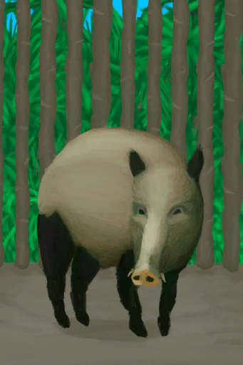
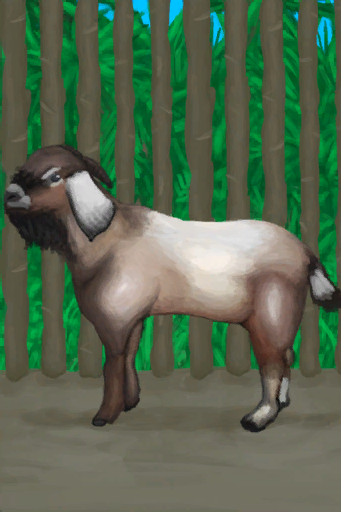

# 粪便  
> 可用作肥料。  
  
<table class="table table-bordered" data-toggle="table"  data-show-header="false"><thead style="display:none"><tr ><th  style="width:50%;text-align:left;vertical-align:top;"  >title</th><th  style="width:50%;text-align:left;vertical-align:top;"  ></th></tr></thead><tr ><td  style="width:50%;text-align:left;vertical-align:top;"  >**重量：**75  **标签：**	[“低效肥料”](tag_FertilizerWeak.md)  ** 效果: ** [

[不适](Discomfort.md)](Discomfort.md)+50</td><td  style="width:50%;text-align:left;vertical-align:top;"  >

<a href="Manure.md" style="color:black">粪便</a>

</td></tr></tbody></table>  
  
## 获取来源  
<table class="table table-bordered" data-toggle="table"  ><thead style=""><tr ><th  style="text-align:left;vertical-align:top;"  >来源</th><th  style="text-align:left;vertical-align:top;"  >操作</th></tr></thead><tr ><td  style="text-align:left;vertical-align:top;"  >[

[礼物！(事件)](Event_MacaqueFriendGift.md)](Event_MacaqueFriendGift.md)</td><td  style="text-align:left;vertical-align:top;"  >看看礼物</td></tr><tr ><td  style="text-align:left;vertical-align:top;"  >[

[中陷阱的猕猴](CageTrapMacaque.md)](CageTrapMacaque.md)</td><td  style="text-align:left;vertical-align:top;"  >转化</td></tr><tr ><td  style="text-align:left;vertical-align:top;"  >[

[母猪](BoarEnclosureFemale.md)](BoarEnclosureFemale.md)</td><td  style="text-align:left;vertical-align:top;"  >转化</td></tr><tr ><td  style="text-align:left;vertical-align:top;"  >[

[公猪](BoarEnclosureMale.md)](BoarEnclosureMale.md)</td><td  style="text-align:left;vertical-align:top;"  >转化</td></tr><tr ><td  style="text-align:left;vertical-align:top;"  >[

[忠犬朋友](DogFriend.md)](DogFriend.md)</td><td  style="text-align:left;vertical-align:top;"  >转化</td></tr><tr ><td  style="text-align:left;vertical-align:top;"  >[

[母山羊](GoatEnclosureFemale.md)](GoatEnclosureFemale.md)</td><td  style="text-align:left;vertical-align:top;"  >转化</td></tr><tr ><td  style="text-align:left;vertical-align:top;"  >[

[哺乳期山羊](GoatEnclosureLactating.md)](GoatEnclosureLactating.md)</td><td  style="text-align:left;vertical-align:top;"  >转化</td></tr><tr ><td  style="text-align:left;vertical-align:top;"  >[

[公山羊](GoatEnclosureMale.md)](GoatEnclosureMale.md)</td><td  style="text-align:left;vertical-align:top;"  >转化</td></tr><tr ><td  style="text-align:left;vertical-align:top;"  >[

[猕猴朋友](MacaqueFriend.md)](MacaqueFriend.md)</td><td  style="text-align:left;vertical-align:top;"  >转化</td></tr><tr ><td  style="text-align:left;vertical-align:top;"  >[

[受伤的猕猴](MacaqueWounded.md)](MacaqueWounded.md)</td><td  style="text-align:left;vertical-align:top;"  >转化</td></tr><tr ><td  style="text-align:left;vertical-align:top;"  >[

[东部草原](GrasslandsE.md)](GrasslandsE.md)</td><td  style="text-align:left;vertical-align:top;"  >探索</td></tr><tr ><td  style="text-align:left;vertical-align:top;"  >[

[西部草原](GrasslandsW.md)](GrasslandsW.md)</td><td  style="text-align:left;vertical-align:top;"  >探索</td></tr></tbody></table>  
  
## 可拖至  

[堆肥箱](CompostBin.md)

[杏仁树田](CropPlotAlmondTree.md)

[芦荟田](CropPlotAloeVera.md)

[香蕉树田](CropPlotBananaTree.md)

[辣椒田](CropPlotChilies.md)

[月季田](CropPlotChinaRose.md)

[金鸡纳树田](CropPlotCinchonaTree.md)

[咖啡田](CropPlotCoffee.md)

[未浇灌的农田](CropPlotDry.md)

[未栽种的农田(空)](CropPlotEmpty.md)

[姜田](CropPlotGinger.md)

[茉莉花田](CropPlotJasmine.md)

[卡瓦胡椒田](CropPlotKava.md)

[柠檬草田](CropPlotLemonGrass.md)

[芒果树田](CropPlotMangoTree.md)

[水椰树田](CropPlotNipaPalm.md)

[棕榈丛田](CropPlotPalmBush.md)

[椰子树田](CropPlotPalmTree.md)

[稻田](CropPlotRice.md)

[毁坏的田地](CropPlotRuined.md)

[西米树田](CropPlotSagoPalm.md)

[蛇草田](CropPlotSnakeGrass.md)

[蜘蛛兰田](CropPlotSpiderLily.md)

[大叶仙茅田](CropPlotWeevilLily.md)

[野枣田](CropPlotWildJujube.md)

[参薯田](CropPlotYam.md)

[杂菌菌床](MushroomBedAssorted.md)

[未浇灌的菌床](MushroomBedDry.md)

[未种植的菌床(空)](MushroomBedEmpty.md)

[迷幻菇菌床](MushroomBedMagic.md)

[马勃菌菌床](MushroomBedPuffballs.md)

  
  
## 可用于蓝图  

[

[空蜂箱(蓝图)](Bp_BeeSkepEmpty.md)](Bp_BeeSkepEmpty.md)

[

[农田(蓝图)](Bp_CropPlot.md)](Bp_CropPlot.md)

[

[菌床(蓝图)](Bp_MushroomBed.md)](Bp_MushroomBed.md)

[

[硝石矿床(蓝图)](Bp_NiterBed.md)](Bp_NiterBed.md)

[

[水稻田(蓝图)](Bp_RicePaddy.md)](Bp_RicePaddy.md)

  
  
  

