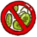

## 人鱼  

<table style="margin-bottom:0px;"><tr><td rowspan=2 style="width:160px"></td><td style="font-size:1.8em"><b>人鱼</b></td><td style="width:50%">解锁价格：3🌙</td></tr><tr><td  colspan=2 style=""><i>从浪潮中你浮现而出，怀着海洋赐予的子嗣。
这个与世隔绝的孤岛将成为你的巢穴。

来自深海的生灵啊，你的肌肤必须保持湿润，远离阳光；你可以饮用海水而不伤身体，海水对你如同清泉；黑暗中你也能看透一切，好似亦有光。
你的食量惊人，但只有肉食能满足你和生育孩子需要的营养。

生存，茁壮，海的女儿……等待你子嗣的降临吧！</i></td><tr><td colspan=2><b>初始环境：</b>[

[沙滩](Beach.md)](Beach.md)<td colspan=1><b>初始天气：</b>[

[晴朗](TropicalIsland_ClearStart.md)](TropicalIsland_ClearStart.md)</tr></tr><tr><td colspan=3><b>初始状态：</b>[

[水分](Hydration.md)](Hydration.md)<b>+90</b></tr><tr><td colspan=3><b>初始特性：</b>

[荒芜沙滩](Pk_1_LocationDesolateBeach.md)

[海怪来袭](Pk_1_Seahounds.md)

[夜视](Pk_3_NightVision.md)

[夜晚开局](Pk_1_NightStart.md)

[超级肾脏](Pk_3_SpecializedKidneys.md)

[鱼人皮肤](Pk_3_PermeableSkin.md)

[紫外线过敏](Pk_3_SunAllergy.md)

[野人](Pk_4_Feral.md)

[胃口大开](Pk_4_Gluttonous.md)

[超级代谢](Pk_4_HyperMetabolism.md)

[强免疫系统](Pk_4_ImmuneSystemStrong.md)

[内陆恐惧症](Pk_4_LandSickness.md)

[肉食主义者](Pk_4_Carnivore.md)

[怀孕](Pk_6_Pregnancy.md)

[游泳健将](Pk_5_Swimmer.md)

[鱼叉手](Pk_5_SpearFisher.md)

  
  
</tr><tr><td colspan=3><b>初始衣物：</b> 

  
  
</tr><tr><td colspan=3><b>初始卡牌：</b> 

  
  
</tr><tr><td colspan=3><b>初始蓝图：</b> 

<a href="Bp_MermaidNest.md" style="color:black">人鱼巢</a>

<a href="Bp_FishingSpear.md" style="color:black">鱼叉</a>

<a href="Bp_Harpoon.md" style="color:black">鱼镖</a>

<a href="Bp_MermaidNest.md" style="color:black">人鱼巢</a>

  
  
</tr></table>
    
  
## 目标  

<b>海上的生活</b>

<table style="margin-bottom:0px;"><tr><td rowSpan=3 style="width:50px;max-height:100px;text-align:center;vertical-align:top"></td><td colspan=2 >
<b>喝点海水</b>
<i>解解渴。</i></td></tr><tr style=""><td><b>达成条件：</b>饮用 [

[海(环礁)](Sea_Atoll.md)](Sea_Atoll.md)&nbsp;&nbsp;&nbsp;&nbsp;饮用 [

[海(海湾)](Sea_Bay.md)](Sea_Bay.md)&nbsp;&nbsp;&nbsp;&nbsp;饮用 [

[海(沙滩)](Sea_Beach.md)](Sea_Beach.md)&nbsp;&nbsp;&nbsp;&nbsp;饮用 [

[海水(覆溺洞穴)](Sea_Cave.md)](Sea_Cave.md)&nbsp;&nbsp;&nbsp;&nbsp;饮用 [

[海(沙滩)](Sea_Cove.md)](Sea_Cove.md)&nbsp;&nbsp;&nbsp;&nbsp;饮用 [

[海(荒芜沙滩)](Sea_DesolateBeach.md)](Sea_DesolateBeach.md)&nbsp;&nbsp;&nbsp;&nbsp;饮用 [

[海(红树林)](Sea_Mangroves.md)](Sea_Mangroves.md)&nbsp;&nbsp;&nbsp;&nbsp;饮用 [

[海](Sea_Raft.md)](Sea_Raft.md)&nbsp;&nbsp;&nbsp;&nbsp;饮用 [

[海(鸟岩岛)](Sea_Rocks.md)](Sea_Rocks.md)&nbsp;&nbsp;&nbsp;&nbsp;饮用 [

[潮汐池(岩滩)](TidePool.md)](TidePool.md)&nbsp;&nbsp;&nbsp;&nbsp;饮用 [

[被淹没的潮汐池(岩滩)](TidePoolFlooded.md)](TidePoolFlooded.md)&nbsp;&nbsp;&nbsp;&nbsp;饮用 [

[盐水](LQ_WaterSalt.md)](LQ_WaterSalt.md) </td></tr><tr style=""><td ><b>达成奖励：</b>[

[决心](Determination.md)](Determination.md)<b>+50</b>&nbsp;&nbsp;&nbsp;&nbsp;[

[压力](Stress.md)](Stress.md)<b>-48</b></td></tr><tr style="border-bottom:2px solid #CCC;height:1px;"></tr><tr><td rowSpan=3 style="width:50px;max-height:100px;text-align:center;vertical-align:top"></td><td colspan=2 >
<b>湿润你的皮肤</b>
<i>保持健康和湿润。</i></td></tr><tr style=""><td><b>达成条件：</b>[

[湿度](Wetness.md)](Wetness.md): <b>1～100</b> </td></tr><tr style=""><td ><b>达成奖励：</b>[

[决心](Determination.md)](Determination.md)<b>+50</b>&nbsp;&nbsp;&nbsp;&nbsp;[

[压力](Stress.md)](Stress.md)<b>-48</b></td></tr><tr style="border-bottom:2px solid #CCC;height:1px;"></tr><tr><td rowSpan=3 style="width:50px;max-height:100px;text-align:center;vertical-align:top"></td><td colspan=2 >
<b>在日出前找到一个洞穴</b>
<i>否则太阳会晒伤你。</i></td></tr><tr style=""><td><b>达成条件：</b>[“洞穴”](tag_Cave.md)x1 </td></tr><tr style=""><td ><b>达成奖励：</b>[

[决心](Determination.md)](Determination.md)<b>+50</b>&nbsp;&nbsp;&nbsp;&nbsp;[

[压力](Stress.md)](Stress.md)<b>-48</b></td></tr><tr style="border-bottom:2px solid #CCC;height:1px;"></tr></table>
 
<b>恢复体力</b>

<table style="margin-bottom:0px;"><tr><td rowSpan=3 style="width:50px;max-height:100px;text-align:center;vertical-align:top"></td><td colspan=2 >
<b>制作一柄鱼叉</b>
<i>让自己有一个食物来源。</i></td></tr><tr style=""><td><b>达成条件：</b>[

[鱼叉](SpearFishing.md)](SpearFishing.md)x1 </td></tr><tr style=""><td ><b>达成奖励：</b>[

[决心](Determination.md)](Determination.md)<b>+50</b>&nbsp;&nbsp;&nbsp;&nbsp;[

[压力](Stress.md)](Stress.md)<b>-48</b></td></tr><tr style="border-bottom:2px solid #CCC;height:1px;"></tr><tr><td rowSpan=3 style="width:50px;max-height:100px;text-align:center;vertical-align:top"></td><td colspan=2 >
<b>烹饪一些鱼</b>
<i>获得额外的营养</i></td></tr><tr style=""><td><b>达成条件：</b>[

[烤北梭鱼](BonefishCooked.md)](BonefishCooked.md)x1&nbsp;&nbsp;&nbsp;&nbsp;[

[烤绯鲤](GoatfishCooked.md)](GoatfishCooked.md)x1&nbsp;&nbsp;&nbsp;&nbsp;[

[烤石斑鱼](GrouperMeatCooked.md)](GrouperMeatCooked.md)x1&nbsp;&nbsp;&nbsp;&nbsp;[

[烤鹦哥鱼](ParrotFishCooked.md)](ParrotFishCooked.md)x1&nbsp;&nbsp;&nbsp;&nbsp;[

[烤马鲅鱼](ThreadfinCooked.md)](ThreadfinCooked.md)x1&nbsp;&nbsp;&nbsp;&nbsp;[

[烤鲨鱼肉](SharkCooked.md)](SharkCooked.md)x1 </td></tr><tr style=""><td ><b>达成奖励：</b>[

[决心](Determination.md)](Determination.md)<b>+100</b>&nbsp;&nbsp;&nbsp;&nbsp;[

[压力](Stress.md)](Stress.md)<b>-48</b></td></tr><tr style="border-bottom:2px solid #CCC;height:1px;"></tr><tr><td rowSpan=3 style="width:50px;max-height:100px;text-align:center;vertical-align:top"></td><td colspan=2 >
<b>做一个海藻巢</b>
<i>更有家的感觉。</i></td></tr><tr style=""><td><b>达成条件：</b>[

[人鱼巢](MermaidNest.md)](MermaidNest.md)x1 </td></tr><tr style=""><td ><b>达成奖励：</b>[

[决心](Determination.md)](Determination.md)<b>+50</b>&nbsp;&nbsp;&nbsp;&nbsp;[

[压力](Stress.md)](Stress.md)<b>-48</b></td></tr><tr style="border-bottom:2px solid #CCC;height:1px;"></tr></table>
 
<b>直面命运</b>

<table style="margin-bottom:0px;"><tr><td rowSpan=3 style="width:50px;max-height:100px;text-align:center;vertical-align:top"></td><td colspan=2 >
<b>生孩子</b>
</td></tr><tr style=""><td><b>达成条件：</b>[

[怀孕](Pregnancy.md)](Pregnancy.md): <b>8640</b> </td></tr><tr style=""><td ><b>达成奖励：</b>[

[决心](Determination.md)](Determination.md)<b>+50</b>&nbsp;&nbsp;&nbsp;&nbsp;[

[压力](Stress.md)](Stress.md)<b>-48</b></td></tr><tr style="border-bottom:2px solid #CCC;height:1px;"></tr><tr><td rowSpan=3 style="width:50px;max-height:100px;text-align:center;vertical-align:top"></td><td colspan=2 >
<b>回归大海</b>
</td></tr><tr style=""><td>
<table style="margin-bottom:0px;"><tr><td rowSpan=3 style="width:50px;max-height:100px;text-align:center;vertical-align:top"></td><td colspan=2 >
<b>杀死4头海怪</b>
<i>以清除回归大海的阻碍。</i></td></tr><tr style=""><td><b>达成条件：</b>[海怪击杀数](SeaHoundKills.md): <b>4～9999</b> </td></tr><tr style=""><td ><b>达成奖励：</b>[美人鱼最终行动](MermaidFinalAction.md)<b>+1</b></td></tr><tr style="border-bottom:2px solid #CCC;height:1px;"></tr><tr><td rowSpan=3 style="width:50px;max-height:100px;text-align:center;vertical-align:top"></td><td colspan=2 >
<b>保存足够的体脂</b>
<i>以在归途中存活。</i></td></tr><tr style=""><td><b>达成条件：</b>[

[体重](Weight.md)](Weight.md): <b>4033～99999</b> </td></tr><tr style=""><td ><b>达成奖励：</b>[美人鱼最终行动](MermaidFinalAction.md)<b>+1</b></td></tr><tr style="border-bottom:2px solid #CCC;height:1px;"></tr></table>
  </td></tr><tr style="border-bottom:2px solid #CCC;height:1px;"></tr><tr><td rowSpan=3 style="width:50px;max-height:100px;text-align:center;vertical-align:top"></td><td colspan=2 >
<b>在岛上定居</b>
</td></tr><tr style=""><td>
<table style="margin-bottom:0px;"><tr><td rowSpan=3 style="width:50px;max-height:100px;text-align:center;vertical-align:top"></td><td colspan=2 >
<b>在岛上生存120天</b>
<i>来熟悉这座岛。</i></td></tr><tr style=""><td><b>达成条件：</b>[计数](Counter.md): <b>11520～999999</b> </td></tr><tr style="border-bottom:2px solid #CCC;height:1px;"></tr><tr><td rowSpan=3 style="width:50px;max-height:100px;text-align:center;vertical-align:top"></td><td colspan=2 >
<b>达到最高舒适度</b>
<i>把你的住所变成真正的家。</i></td></tr><tr style=""><td><b>达成条件：</b>[

[舒适度](Comfort.md)](Comfort.md): <b>1751～2500</b> </td></tr><tr style="border-bottom:2px solid #CCC;height:1px;"></tr></table>
  </td></tr><tr style="border-bottom:2px solid #CCC;height:1px;"></tr></table>
   

