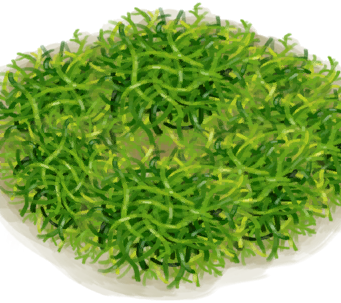
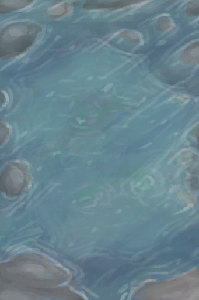
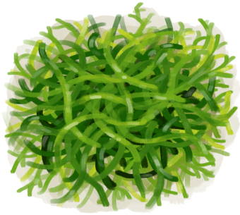

# 人鱼巢  
> 由海藻制成的巢。有助于保持湿润并对抗内陆恐惧症。  
  
<table class="table table-bordered" data-toggle="table" ><tbody><tr ><td  style="width:80%;text-align:left;vertical-align:top;"  >** 区域唯一 **  ** 不可删除 **  ** 效果: ** [

[舒适度](Comfort.md)](Comfort.md)+100</td><td  style="width:20%;text-align:left;vertical-align:top;"  >

</td></tr></tbody></tbody></table>  
  
## 获取来源  
<table class="table table-bordered" data-toggle="table" ><thead><tr ><th  style="text-align:left;vertical-align:top;"  >来源</th><th  style="text-align:left;vertical-align:top;"  >操作</th></tr></thead><tr ><td  style="text-align:left;vertical-align:top;"  >[

[人鱼巢(蓝图)](Bp_MermaidNest.md)](Bp_MermaidNest.md)</td><td  style="text-align:left;vertical-align:top;"  >蓝图制造</td></tr></tbody></table>  
  
## 动作  
<table class="table table-bordered" data-toggle="table" ><thead><tr ><th  style="text-align:left;vertical-align:top;"  >动作</th><th  style="text-align:left;vertical-align:top;"  >耗时</th><th  style="text-align:left;vertical-align:top;"  >条件</th><th  style="text-align:left;vertical-align:top;"  data-sortable="true"  >变化</th><th  style="text-align:left;vertical-align:top;"  >状态</th></tr></thead><tr ><td  style="text-align:left;vertical-align:top;"  >小憩 </td><td  style="text-align:left;vertical-align:top;"  >16TP</td><td  style="text-align:left;vertical-align:top;"  >[波次](WaveCounter.md): 0-0  **不能处于以下状态**： [睡眠中断](SleepInterrupt.md): 1-1 [

[水分](Hydration.md)](Hydration.md): 0-30 [

[过热](Hyperthermia.md)](Hyperthermia.md): 51-200 [

[失温](Hypothermia.md)](Hypothermia.md): 26-100 [

[血压](Blood.md)](Blood.md): 0-30 [

[恶心](Nausea.md)](Nausea.md): 20-24 [

[体重](Weight.md)](Weight.md): 0-74 [波次](WaveCounter.md): 12-24</td><td  style="text-align:left;vertical-align:top;"  ></td><td  style="text-align:left;vertical-align:top;"  >[睡眠中断](SleepInterrupt.md)-1 [睡眠钟](SleepClock.md)+15 [

[压力](Stress.md)](Stress.md)-1 (每15分钟) [

[世界观](Structure.md)](Structure.md)+1 (每15分钟) [

[情绪](Morale.md)](Morale.md)+1.25 (每15分钟) [

[恶心](Nausea.md)](Nausea.md)-1.5 (每15分钟) [

[清醒度](Wakefulness.md)](Wakefulness.md)+6 (每15分钟) [

[背痛](BackPain.md)](BackPain.md)+4.5 (每15分钟) [

[蚊虫叮咬](BugBites.md)](BugBites.md)-1 (每15分钟)</td></tr><tr ><td  style="text-align:left;vertical-align:top;"  >睡觉 [“休息动作(组)”](SleepAction.md)</td><td  style="text-align:left;vertical-align:top;"  >32TP</td><td  style="text-align:left;vertical-align:top;"  >[波次](WaveCounter.md): 0-0  **不能处于以下状态**： [睡眠中断](SleepInterrupt.md): 1-1 [

[水分](Hydration.md)](Hydration.md): 0-30 [

[过热](Hyperthermia.md)](Hyperthermia.md): 51-200 [

[失温](Hypothermia.md)](Hypothermia.md): 26-100 [

[血压](Blood.md)](Blood.md): 0-30 [

[恶心](Nausea.md)](Nausea.md): 20-24 [

[体重](Weight.md)](Weight.md): 0-74 [波次](WaveCounter.md): 12-24</td><td  style="text-align:left;vertical-align:top;"  ></td><td  style="text-align:left;vertical-align:top;"  >[睡眠中断](SleepInterrupt.md)-1 [睡眠钟](SleepClock.md)+31 [

[压力](Stress.md)](Stress.md)-1 (每15分钟) [

[世界观](Structure.md)](Structure.md)+2 (每15分钟) [

[情绪](Morale.md)](Morale.md)+1.25 (每15分钟) [

[恶心](Nausea.md)](Nausea.md)-1.5 (每15分钟) [

[清醒度](Wakefulness.md)](Wakefulness.md)+6 (每15分钟) [

[背痛](BackPain.md)](BackPain.md)+4.5 (每15分钟) [

[蚊虫叮咬](BugBites.md)](BugBites.md)-1 (每15分钟)</td></tr></tbody></table>  
  
## 可拖入  
<table class="table table-bordered" data-toggle="table" ><thead><tr ><th  style="text-align:left;vertical-align:top;"  >使用</th><th  style="text-align:left;vertical-align:top;"  >动作</th><th  style="text-align:left;vertical-align:top;"  >耗时</th><th  style="text-align:left;vertical-align:top;"  >条件</th><th  style="text-align:left;vertical-align:top;"  >变化</th><th  style="text-align:left;vertical-align:top;"  data-sortable="true"  >玩家状态</th></tr></thead><tr ><td  style="text-align:left;vertical-align:top;"  >[“水(任意)”](tag_WaterAny.md)</td><td  style="text-align:left;vertical-align:top;"  >浇水 </td><td  style="text-align:left;vertical-align:top;"  >1TP</td><td  style="text-align:left;vertical-align:top;"  >[

[光亮](Light.md)](Light.md): 10-100</td><td  style="text-align:left;vertical-align:top;"  >** 自身: ** 

  +24(100%)  ** 使用物: ** →消失 含水量  -300</td><td  style="text-align:left;vertical-align:top;"  ></td></tr><tr ><td  style="text-align:left;vertical-align:top;"  >[

[潮汐池(岩滩)](TidePool.md)](TidePool.md) [

[被淹没的潮汐池(岩滩)](TidePoolFlooded.md)](TidePoolFlooded.md)</td><td  style="text-align:left;vertical-align:top;"  >浇水 </td><td  style="text-align:left;vertical-align:top;"  >1TP</td><td  style="text-align:left;vertical-align:top;"  >[

[光亮](Light.md)](Light.md): 10-100</td><td  style="text-align:left;vertical-align:top;"  >** 自身: ** 

  +24(100%)</td><td  style="text-align:left;vertical-align:top;"  ></td></tr><tr ><td  style="text-align:left;vertical-align:top;"  >[

[海藻](Seaweed.md)](Seaweed.md)</td><td  style="text-align:left;vertical-align:top;"  >修理巢 </td><td  style="text-align:left;vertical-align:top;"  >1TP</td><td  style="text-align:left;vertical-align:top;"  >[

[光亮](Light.md)](Light.md): 10-100</td><td  style="text-align:left;vertical-align:top;"  >** 自身: ** 耐久  +288(50%)  ** 使用物: ** →消失</td><td  style="text-align:left;vertical-align:top;"  ></td></tr></tbody></table>  
  
## 属性   
<table class="table table-bordered" data-toggle="table" ><thead><tr ><th  style="text-align:left;vertical-align:top;"  >属性</th><th  style="text-align:left;vertical-align:top;"  >值</th><th  style="text-align:left;vertical-align:top;"  >耗时</th><th  style="text-align:left;vertical-align:top;"  >变化</th></tr></thead><tr ><td  style="text-align:left;vertical-align:top;"  >耐久</td><td  style="text-align:left;vertical-align:top;"  >初始：576 最大：576</td><td  style="text-align:left;vertical-align:top;"  >每15分钟-1 最多需要：576TP</td><td  style="text-align:left;vertical-align:top;"  >** 到达0时： **  ** 自身 ** →消失</td></tr><tr ><td  style="text-align:left;vertical-align:top;"  >

</td><td  style="text-align:left;vertical-align:top;"  >初始：12 最大：24</td><td  style="text-align:left;vertical-align:top;"  >每15分钟-1 最多需要：24TP</td><td  style="text-align:left;vertical-align:top;"  ></td></tr></tbody></table>  
  
## 被动效果  
<table class="table table-bordered" data-toggle="table" ><thead><tr ><th  style="text-align:left;vertical-align:top;"  >名称</th><th  style="text-align:left;vertical-align:top;"  >条件</th><th  style="text-align:left;vertical-align:top;"  data-sortable="true"  >变化(每15分钟)</th><th  style="text-align:left;vertical-align:top;"  >玩家状态</th></tr></thead><tr ><td  style="text-align:left;vertical-align:top;"  >Wet Nest</td><td  style="text-align:left;vertical-align:top;"  >** 需要属性：** 

: 1～0(4.17%～0%)</td><td  style="text-align:left;vertical-align:top;"  ></td><td  style="text-align:left;vertical-align:top;"  >[

[内陆恐惧症](LandSickness.md)](LandSickness.md)-0.5 [

[皮肤潮湿度](SkinHumidity.md)](SkinHumidity.md)+0.5</td></tr></tbody></table>  
  

