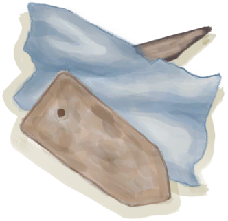
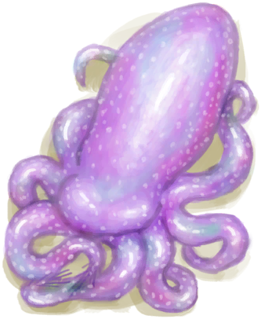

# 金属废料  
> 可以用来制作一些工具。  
   
>   
  
<table class="table table-bordered" data-toggle="table" ><tbody><tr ><td  style="width:80%;text-align:left;vertical-align:top;"  >**重量：**250  **标签：**	[“美丽的/好看的”](tag_Pretty.md), [“沉重的”](tag_Heavy.md)</td><td  style="width:20%;text-align:left;vertical-align:top;"  >

</td></tr></tbody></tbody></table>  
  
## 获取来源  
<table class="table table-bordered" data-toggle="table" ><thead><tr ><th  style="text-align:left;vertical-align:top;"  >来源</th><th  style="text-align:left;vertical-align:top;"  >操作</th></tr></thead><tr ><td  style="text-align:left;vertical-align:top;"  >[

[座椅](Seat.md)](Seat.md)</td><td  style="text-align:left;vertical-align:top;"  >拆解 ** 拖入：**[“斧”](tag_Axe.md)</td></tr><tr ><td  style="text-align:left;vertical-align:top;"  >[

[座椅](SeatPlaced.md)](SeatPlaced.md)</td><td  style="text-align:left;vertical-align:top;"  >拆卸 ** 拖入：**[“斧”](tag_Axe.md) , [“斧”](tag_Axe.md)</td></tr><tr ><td  style="text-align:left;vertical-align:top;"  >[

[胜负参半(事件)](Event_DroneFightMixedSuccess.md)](Event_DroneFightMixedSuccess.md)</td><td  style="text-align:left;vertical-align:top;"  >继续</td></tr><tr ><td  style="text-align:left;vertical-align:top;"  >[

[成功！(事件)](Event_DroneFightSuccess.md)](Event_DroneFightSuccess.md)</td><td  style="text-align:left;vertical-align:top;"  >继续</td></tr><tr ><td  style="text-align:left;vertical-align:top;"  >[

[海怪尸体](SeahoundCarcass.md)](SeahoundCarcass.md)</td><td  style="text-align:left;vertical-align:top;"  >切割 ** 拖入：**[黑曜石刀](KnifeObsidian.md)</td></tr><tr ><td  style="text-align:left;vertical-align:top;"  >[

[海怪尸体](SeahoundCarcass.md)](SeahoundCarcass.md)</td><td  style="text-align:left;vertical-align:top;"  >切割 ** 拖入：**[“切割工具”](tag_Cutter.md)</td></tr><tr ><td  style="text-align:left;vertical-align:top;"  >[

[废金属斧](AxeScrap.md)](AxeScrap.md)</td><td  style="text-align:left;vertical-align:top;"  >拆解</td></tr><tr ><td  style="text-align:left;vertical-align:top;"  >[

[废金属斧](AxeScrap.md)](AxeScrap.md)</td><td  style="text-align:left;vertical-align:top;"  >转化</td></tr><tr ><td  style="text-align:left;vertical-align:top;"  >[

[废金属铲](ShovelScrap.md)](ShovelScrap.md)</td><td  style="text-align:left;vertical-align:top;"  >拆解</td></tr><tr ><td  style="text-align:left;vertical-align:top;"  >[

[废金属铲](ShovelScrap.md)](ShovelScrap.md)</td><td  style="text-align:left;vertical-align:top;"  >转化</td></tr><tr ><td  style="text-align:left;vertical-align:top;"  >[

[沉船(鸟岩岛)](Shipwreck.md)](Shipwreck.md)</td><td  style="text-align:left;vertical-align:top;"  >探索沉船</td></tr></tbody></table>  
  
## 可用于蓝图  

[

[废金属斧(蓝图)](Bp_ScrapAxe.md)](Bp_ScrapAxe.md)

[

[废金属刀(蓝图)](Bp_ScrapKnife.md)](Bp_ScrapKnife.md)

[

[废金属铲(蓝图)](Bp_ScrapShovel.md)](Bp_ScrapShovel.md)

[

[废金属长矛(蓝图)](Bp_ScrapSpear.md)](Bp_ScrapSpear.md)

  
  
  

