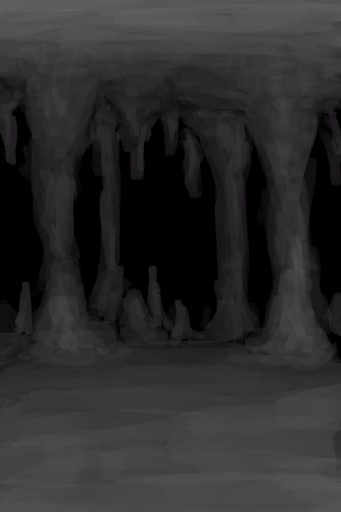

[返回首页](index.md)   |  [查看所有区域](area.md)
# 洞穴中层  
> 洞穴系统的第二层。  
  
  属性  |   图片   
 ----  |  ----:   
 **标签：**	[“室内”](tag_EnvIndoors.md), [“洞穴系统”](tag_EnvCaveSystem.md)  |     
  
## 探索  
进度  |  目的地  
----  |  ----  
33%  |  [铜矿脉(狭窄隧道)](CopperVein.md)  
66%  |  [竖井(洞穴中层)](ShaftMidChamberToLowChamber.md)  
100%  |  [狭窄通道(洞穴中层)](DarkChamberCaveEntranceClosed.md)  
## 动作  
动作  |  时间  |  条件  |  变化  |  状态  
----  |  ----  |  ----  |  ----  |  ----  
探索  |  15分  |  [光亮](Light.md):5-100  |  [石头](Stone.md)(+1) [晶洞](Geode.md)(+1) [燧石](Flint.md)(+1) [燧石板](FlintSlab.md)(+1)  |  [污垢](Filth.md)+2  
## 可拖入  
使用  |  动作  |  时间  |  条件  |  变化  |  状态  
----  |  ----  |  ----  |  ----  |  ----  |  ----  
[扫帚](Broom.md)  |  打扫  |  30分  |  [光亮](Light.md):5-100  |  自身: 耐久  -250  使用物: 可用次数  -1    |  [压力](Stress.md)-10 [情绪](Morale.md)+5  
## 变化  
操作  |  值  |  时间  |  变化  
----  |  ----  |  ----  |  ----  
污秽  |  初始：1000 最大：1000  |  每15分钟+3 最多需要：3天11小时19.999999999999716分  |    
