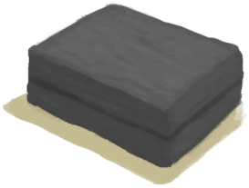

# 装饰品模具  
> 应该把它放进熔炉或者高级窑炉。  
  
<table class="table table-bordered" data-toggle="table"  data-show-header="false"><thead style="display:none"><tr ><th  style="width:50%;text-align:left;vertical-align:top;"  >title</th><th  style="width:50%;text-align:left;vertical-align:top;"  ></th></tr></thead><tr ><td  style="width:50%;text-align:left;vertical-align:top;"  >**重量：**250  **标签：**	[“粘土”](tag_Clay.md), [“沉重的”](tag_Heavy.md)</td><td  style="width:50%;text-align:left;vertical-align:top;"  >

<a href="MoldCopperDecoration.md" style="color:black">装饰品模具</a>

</td></tr></tbody></table>  
  
## 获取来源  

蓝图制造

[装饰品模具(蓝图)](Bp_MoldDecoration.md)

  
  
## 动作  

<table><tr><td rowspan="2" style="width:200px;text-align:center;font-size:1.3em;font-weight:bold">

回收

</td><td></td></tr><tr><td><b>自身：</b>→消失</td></tr><tr><td colspan="2">[

[粘土](Clay.md)](Clay.md)(+2), [

[铜](Copper.md)](Copper.md)(+2)</td></tr></table>
  
  
  
## 可用于转化  
<table class="table table-bordered" data-toggle="table"  ><thead style=""><tr ><th  style="text-align:left;vertical-align:top;"  >转化为</th><th  style="text-align:left;vertical-align:top;"  >容器</th></tr></thead><tr ><td  style="text-align:left;vertical-align:top;"  >[

[铜制装饰品](CopperDecoration_Mold.md)](CopperDecoration_Mold.md)</td><td  style="text-align:left;vertical-align:top;"  >[

[熔炉](Forge.md)](Forge.md)</td></tr><tr ><td  style="text-align:left;vertical-align:top;"  >[

[铜制装饰品](CopperDecoration_Mold.md)](CopperDecoration_Mold.md)</td><td  style="text-align:left;vertical-align:top;"  >[

[高级窑炉](KilnAdvanced.md)](KilnAdvanced.md)</td></tr></tbody></table>  
  

