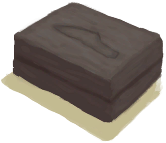

# 刀模具  
> 下一步是把它放进熔炉或者高级窑炉。  
  
<table class="table table-bordered" data-toggle="table"  data-show-header="false"><thead style="display:none"><tr ><th  style="width:50%;text-align:left;vertical-align:top;"  >title</th><th  style="width:50%;text-align:left;vertical-align:top;"  ></th></tr></thead><tr ><td  style="width:50%;text-align:left;vertical-align:top;"  >**重量：**250  **标签：**	[“粘土”](tag_Clay.md), [“沉重的”](tag_Heavy.md)</td><td  style="width:50%;text-align:left;vertical-align:top;"  >

<a href="MoldKnife.md" style="color:black">刀模具</a>

模具可以用泥和抗裂剂制作，用来铸造许多不同用途的工具。模具需要放置在熔炉中煅烧。  目前有斧子，小刀，铲子和矛的模具。</td></tr></tbody></table>  
  
## 获取来源  

蓝图制造

[刀模具(蓝图)](Bp_MoldKnife.md)

  
  
## 可用于转化  
<table class="table table-bordered" data-toggle="table"  ><thead style=""><tr ><th  style="text-align:left;vertical-align:top;"  >转化为</th><th  style="text-align:left;vertical-align:top;"  >容器</th></tr></thead><tr ><td  style="text-align:left;vertical-align:top;"  >[

[铜刀](KnifeCopper.md)](KnifeCopper.md)</td><td  style="text-align:left;vertical-align:top;"  >[

[熔炉](Forge.md)](Forge.md)</td></tr><tr ><td  style="text-align:left;vertical-align:top;"  >[

[铜刀](KnifeCopper.md)](KnifeCopper.md)</td><td  style="text-align:left;vertical-align:top;"  >[

[高级窑炉](KilnAdvanced.md)](KilnAdvanced.md)</td></tr></tbody></table>  
  

