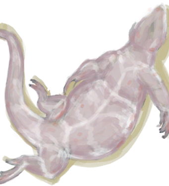
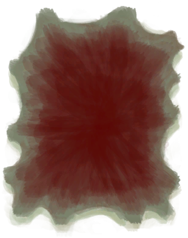

# 巨蜥尸体  
> 一头死去的巨蜥，应该趁还没腐烂先剥下它的皮。  
   
> 这种危险的爬行动物栖息在岛屿的东部。  虽然巨蜥庞大的身躯可以为你提供大量的肉和皮，但充满细菌的利齿也使巨蜥们不容小觑。  如果你不幸被咬伤，请时刻保证伤口的<b>清洁和保护</b>，并考虑服用一些药物来增强你的<b>免疫系统</b>。如果你不采取任何措施，伤口中的细菌将导致严重疾病。  
  
<table class="table table-bordered"><tbody><tr ><td  style="width:80%;text-align:left;vertical-align:top;" >** 不可删除 **  **重量：**2000  **标签：**	[“大的”](tag_Large.md)  ** 效果: ** [

[舒适度](Comfort.md)](Comfort.md)-250</td><td  style="width:20%;text-align:left;vertical-align:top;" >

</td></tr></tbody></tbody></table>  
  
## 获取来源  
<table class="table table-bordered"><thead><tr ><th  style="text-align:left;vertical-align:top;" >来源</th><th  style="text-align:left;vertical-align:top;" >操作</th></tr></thead><tr ><td  style="text-align:left;vertical-align:top;" >[

[原木陷阱](LogTrap.md)](LogTrap.md)</td><td  style="text-align:left;vertical-align:top;" >捕捉猎物</td></tr><tr ><td  style="text-align:left;vertical-align:top;" >[

[陷坑](TrappingPit.md)](TrappingPit.md)</td><td  style="text-align:left;vertical-align:top;" >捕捉猎物</td></tr><tr ><td  style="text-align:left;vertical-align:top;" >[

[我拿下它了，但我受伤了。(事件)](Event_MonitorFightMixedSuccess.md)](Event_MonitorFightMixedSuccess.md)</td><td  style="text-align:left;vertical-align:top;" >继续</td></tr><tr ><td  style="text-align:left;vertical-align:top;" >[

[巨蜥倒下了！(事件)](Event_MonitorFightSuccess.md)](Event_MonitorFightSuccess.md)</td><td  style="text-align:left;vertical-align:top;" >继续</td></tr></tbody></table>  
  
## 可拖入  
<table class="table table-bordered"><thead><tr ><th  style="text-align:left;vertical-align:top;" >使用</th><th  style="text-align:left;vertical-align:top;" >动作</th><th  style="text-align:left;vertical-align:top;" >耗时</th><th  style="text-align:left;vertical-align:top;" >条件</th><th  style="text-align:left;vertical-align:top;" >变化</th><th  style="text-align:left;vertical-align:top;" >玩家状态</th></tr></thead><tr ><td  style="text-align:left;vertical-align:top;" >[

[黑曜石刀](KnifeObsidian.md)](KnifeObsidian.md)</td><td  style="text-align:left;vertical-align:top;" >剥皮 [手部动作(组)](HandAction.md) [制造动作(组)](CraftAction.md)</td><td  style="text-align:left;vertical-align:top;" >45分</td><td  style="text-align:left;vertical-align:top;" >[

[光亮](Light.md)](Light.md): 10-100</td><td  style="text-align:left;vertical-align:top;" >** 自身: ** → [

[剥皮的巨蜥](MonitorSkinned.md)](MonitorSkinned.md)  ** 使用物: ** 可用次数  -1  ** 获得: **   [

[蜥蜴生皮](SkinFreshReptile.md)](SkinFreshReptile.md)(+2) 基础权重：1</td><td  style="text-align:left;vertical-align:top;" >[

[污垢](Filth.md)](Filth.md)+15</td></tr><tr ><td  style="text-align:left;vertical-align:top;" >[“切割工具”](tag_Cutter.md)</td><td  style="text-align:left;vertical-align:top;" >剥皮 [手部动作(组)](HandAction.md) [制造动作(组)](CraftAction.md)</td><td  style="text-align:left;vertical-align:top;" >1小时</td><td  style="text-align:left;vertical-align:top;" >[

[光亮](Light.md)](Light.md): 10-100</td><td  style="text-align:left;vertical-align:top;" >** 自身: ** → [

[剥皮的巨蜥](MonitorSkinned.md)](MonitorSkinned.md)  ** 使用物: ** 可用次数  -1  ** 获得: **   [

[蜥蜴生皮](SkinFreshReptile.md)](SkinFreshReptile.md)(+2) 基础权重：1</td><td  style="text-align:left;vertical-align:top;" >[

[污垢](Filth.md)](Filth.md)+15</td></tr></tbody></table>  
  
## 属性   
<table class="table table-bordered"><thead><tr ><th  style="text-align:left;vertical-align:top;" >属性</th><th  style="text-align:left;vertical-align:top;" >值</th><th  style="text-align:left;vertical-align:top;" >耗时</th><th  style="text-align:left;vertical-align:top;" >变化</th></tr></thead><tr ><td  style="text-align:left;vertical-align:top;" >耐久</td><td  style="text-align:left;vertical-align:top;" >初始：192</td><td  style="text-align:left;vertical-align:top;" >每15分钟-1 最多需要：2天</td><td  style="text-align:left;vertical-align:top;" >** 到达0时： **   [

[骨头](Bones.md)](Bones.md)(+4)  ** 自身 ** →消失</td></tr></tbody></table>  
  

