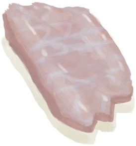

# 巨蜥肉干  
> 咸咸的，很美味！  
   
>   
  
  巨蜥肉干  |   图片   
 ----  |  ----:   
 **重量：**100  **标签：**	[“可烹饪的”](tag_Cookable.md), [“喂/添加”](tag_Feed.md), [“喂”](tag_Meat.md), [“人类食物”](tag_HumanFood.md)  |     
  
## 动作  
动作  |  耗时  |  条件  |  变化  |  状态  
----  |  ----  |  ----  |  ----  |  ----  
食用 [食用肉类动作](CarnivorousAction.md) [进食动作](EatingAction.md)  |  15分  |    |  消失  |  [饱食](Satiation.md)+30 [胃](Stomach.md)+25 [水分](Hydration.md)+4 [情绪](Morale.md)+7 [爬行类厌倦度](SaturationReptile.md)+45 [污垢](Filth.md)+5  
## 可拖至  
[猪食槽](BoarFeeder.md), [猪食槽(空)](BoarFeederEmpty.md), [堆肥箱](CompostBin.md), [灰山鹑喂食器](PartridgeFeeder.md), [灰山鹑喂食器(空)](PartridgeFeederEmpty.md), [中陷阱的猕猴](CageTrapMacaque.md), [母猪](BoarEnclosureFemale.md), [母猪](BoarEnclosureFemale.md), [公猪](BoarEnclosureMale.md), [公猪](BoarEnclosureMale.md), [小猪](BoarEnclosurePiglet.md), [小猪](BoarEnclosurePiglet.md), [母猪](BoarTiedFemale.md), [母猪](BoarTiedFemale.md), [公猪](BoarTiedMale.md), [公猪](BoarTiedMale.md), [小猪](BoarTiedPiglet.md), [小猪](BoarTiedPiglet.md), [忠犬朋友](DogFriend.md), [祖父](Grandfather.md), [祖父(健康)](GrandfatherHealthy.md), [猕猴朋友](MacaqueFriend.md), [受伤的猕猴](MacaqueWounded.md), [小灰山鹑](PartridgeChick.md), [雌灰山鹑](PartridgeFemaleEnclosure.md), [雌灰山鹑](PartridgeFemaleLive.md), [雄灰山鹑](PartridgeMaleEnclosure.md), [雄灰山鹑](PartridgeMaleLive.md)  
## 属性   
属性  |  值  |  耗时  |  变化  
----  |  ----  |  ----  |  ----  
耐久  |  初始：1344  |  每15分钟-1 最多需要：14天  |  ** 到达0时： ** → [腐烂物](RottenRemains.md)  
