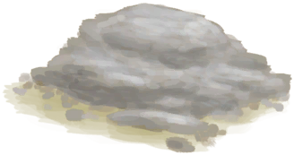

# 干燥的砂浆  
> 可以重新放进窑炉中制作生石灰。  
  
<table class="table table-bordered" data-toggle="table"  data-show-header="false"><thead style="display:none"><tr ><th  style="width:50%;text-align:left;vertical-align:top;"  >title</th><th  style="width:50%;text-align:left;vertical-align:top;"  ></th></tr></thead><tr ><td  style="width:50%;text-align:left;vertical-align:top;"  >**重量：**150  **标签：**	[“沉重的”](tag_Heavy.md)</td><td  style="width:50%;text-align:left;vertical-align:top;"  >

<a href="MortarDry.md" style="color:black">干燥的砂浆</a>

</td></tr></tbody></table>  
  
## 获取来源  

转化

[砂浆](Mortar.md)

  
  
## 可用于转化  
<table class="table table-bordered" data-toggle="table"  ><thead style=""><tr ><th  style="text-align:left;vertical-align:top;"  >转化为</th><th  style="text-align:left;vertical-align:top;"  >容器</th></tr></thead><tr ><td  style="text-align:left;vertical-align:top;"  >[

[煅烧后的砂浆](MortarBurnt.md)](MortarBurnt.md)</td><td  style="text-align:left;vertical-align:top;"  >[

[窑炉](Kiln.md)](Kiln.md)</td></tr><tr ><td  style="text-align:left;vertical-align:top;"  >[

[煅烧后的砂浆](MortarBurnt.md)](MortarBurnt.md)</td><td  style="text-align:left;vertical-align:top;"  >[

[高级窑炉](KilnAdvanced.md)](KilnAdvanced.md)</td></tr></tbody></table>  
  

