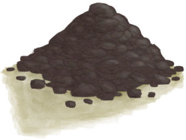
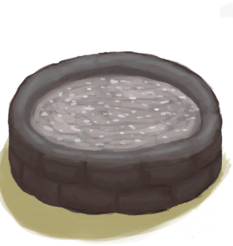

# 泥砖  
> 可以用它制作东西，比如烧陶器的窑炉。  
  
<table class="table table-bordered" data-toggle="table"  data-show-header="false"><thead style="display:none"><tr ><th  style="width:50%;text-align:left;vertical-align:top;"  >title</th><th  style="width:50%;text-align:left;vertical-align:top;"  ></th></tr></thead><tr ><td  style="width:50%;text-align:left;vertical-align:top;"  >**重量：**150  **标签：**	[“沉重的”](tag_Heavy.md)</td><td  style="width:50%;text-align:left;vertical-align:top;"  >

<a href="MudBrick.md" style="color:black">泥砖</a>

</td></tr></tbody></table>  
  
## 获取来源  

** 使用**[“抗裂剂”](tag_Temper.md)制作泥砖

[泥堆](MudPile.md)

  
  
## 可拖入  

<table style="margin-bottom:0px;"><tr><td style="width:40%;text-align:left; background-color:#FEFEFE"><b>拖入：</b>[“锤”](tag_Hammer.md)</td><td style="width:40%;font-size:1em;font-weight:bold;background-color:#FEFEFE">破坏 (15分) [“手部动作(组)”](HandAction.md)</td></tr><tr style="background-color:#FFFFFF"><td style=""><b>使用物：</b></td><td style=""><b>自身：</b>→ [

[干土堆](DirtPile.md)](DirtPile.md)</td></tr></table>
  
  
## 可用于蓝图  

<a href="Bp_Enclosure.md" style="color:black">畜栏</a>

<a href="Bp_Forge.md" style="color:black">熔炉</a>

<a href="Bp_Kiln.md" style="color:black">窑炉</a>

<a href="Bp_KilnAdvanced.md" style="color:black">高级窑炉</a>

<a href="Bp_MudHut.md" style="color:black">泥屋</a>

<a href="Bp_SaltBed.md" style="color:black">盐田</a>

<a href="Bp_Shower.md" style="color:black">淋浴器</a>

<a href="Bp_Stove.md" style="color:black">火炉</a>

<a href="Bp_WaterFilter.md" style="color:black">滤水器</a>

<a href="Bp_WaterReservoir.md" style="color:black">蓄水池</a>

<a href="Bp_WateringTrough.md" style="color:black">水槽</a>

  
  
  

