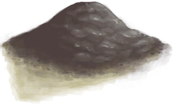

# 泥滩  
> 可以从这儿获取泥巴  
  
<table class="table table-bordered table7504" data-toggle="table"  data-show-header="false"><thead style="display:none"><tr ><th  style="width:50%;"  >title</th><th  style="width:50%;"  ></th></tr></thead><tr ><td  style="width:50%;"  >**可用次数：**3</td><td  style="width:50%;"  >

<a href="MudDeposit.md" style="color:black">泥滩</a>

</td></tr></tbody></table>  
  
## 获取来源  

探索

[红树林](Mangroves.md)

  
  
## 动作  

<table><tr><td rowspan="2" style="width:200px;text-align:center;font-size:1.3em;font-weight:bold">

挖泥巴

15分

</td><td>[“手部动作(组)”](HandAction.md)</td></tr><tr><td><b>自身：</b>使用次数  <b>-1(-33.33%)</b></td></tr><tr><td colspan="2"><b>需求：</b>[

[光亮](Light.md)](Light.md): <b>10-100</b></td></tr><tr><td colspan="2"><b>状态变化：</b>[

[污垢](Filth.md)](Filth.md)<b>+10</b></td></tr><tr><td colspan="2">[

[泥堆](MudPile.md)](MudPile.md)(<b>+3</b>)</td></tr></table>
  
  
  
## 可拖入  

<table style="margin-bottom:0px;"><tr><td style="width:40%;text-align:left; background-color:#FEFEFE"><b>拖入：</b>[“铲子”](tag_Shovel.md)</td><td style="width:40%;font-size:1em;font-weight:bold;background-color:#FEFEFE">挖泥巴 (15分) [“手部动作(组)”](HandAction.md)</td></tr><tr style="background-color:#FFFFFF"><td style=""><b>使用物：</b>可用次数  <b>-1</b></td><td style=""><b>自身：</b>使用次数  <b>-1(-33.33%)</b></td></tr><tr><td colspan="2">[

[泥堆](MudPile.md)](MudPile.md)(<b>+6</b>)</td></tr></table>
  
  
## 属性   

<table style="margin-bottom:0px;"><tr><td style="width:30%;text-align:left; background-color:#FEFEFE;font-size:1.3em;font-weight:bold;">使用次数</td><td style="font-size:1em;background-color:#FEFEFE">初始：3 , 最大：3 -</td></tr><tr style="background-color:#FFFFFF"><td colspan=2>** 到达0时： ** 自身: →消失</td></tr></table>
  

