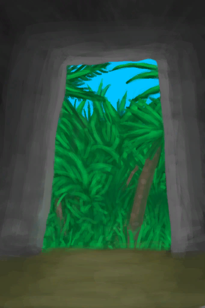

# 泥屋  
> 进入泥屋  
   
> 用<b>泥砖、原木、细线和棕榈叶</b>建造的房子。它能使人免受<b>风暴、雨水和日晒</b>的影响。  泥屋可以进行多次升级来改进，包括存储扩展、门、粉刷墙面等。 屋顶一旦受损或有倒塌的危险，就应该修理。  
  
<table class="table table-bordered" data-toggle="table" ><tbody><tr ><td  style="width:80%;text-align:left;vertical-align:top;"  >** 可重命名 **</td><td  style="width:20%;text-align:left;vertical-align:top;"  >

</td></tr></tbody></tbody></table>  
  
## 获取来源  
<table class="table table-bordered" data-toggle="table" ><thead><tr ><th  style="text-align:left;vertical-align:top;"  >来源</th><th  style="text-align:left;vertical-align:top;"  >操作</th></tr></thead><tr ><td  style="text-align:left;vertical-align:top;"  >[

[泥屋(蓝图)](Bp_MudHut.md)](Bp_MudHut.md)</td><td  style="text-align:left;vertical-align:top;"  >蓝图制造</td></tr></tbody></table>  
  
## 动作  
<table class="table table-bordered" data-toggle="table" ><thead><tr ><th  style="text-align:left;vertical-align:top;"  >动作</th><th  style="text-align:left;vertical-align:top;"  data-sortable="true"  >耗时</th><th  style="text-align:left;vertical-align:top;"  data-sortable="true"  >条件</th><th  style="text-align:left;vertical-align:top;"  >变化</th><th  style="text-align:left;vertical-align:top;"  data-sortable="true"  >状态</th></tr></thead><tr ><td  style="text-align:left;vertical-align:top;"  >进入 </td><td  style="text-align:left;vertical-align:top;"  >-</td><td  style="text-align:left;vertical-align:top;"  ></td><td  style="text-align:left;vertical-align:top;"  >** 获得： ** ** [Exit]  **   [

[泥屋(环境)](Env_MudHut.md)](Env_MudHut.md)(+1)   [

[离开(泥屋)](MudHutExit.md)](MudHutExit.md)(+1)   [

[泥屋](MudHut.md)](MudHut.md)(+1) 基础权重：1</td><td  style="text-align:left;vertical-align:top;"  ></td></tr></tbody></table>  
  

