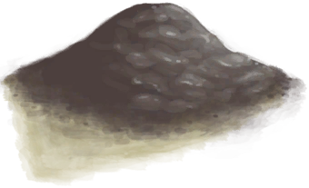
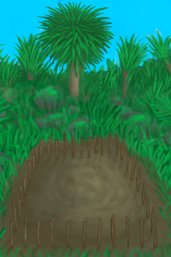
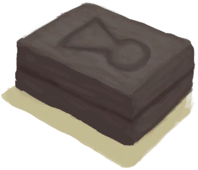
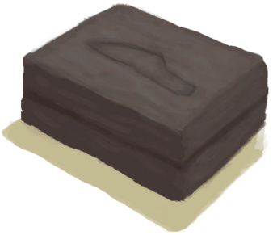
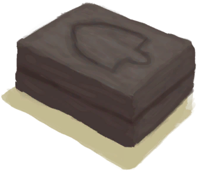
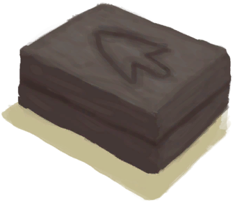
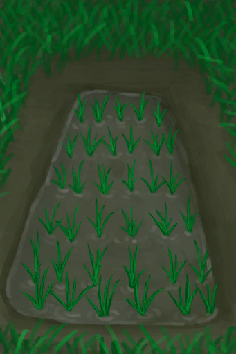

# 泥堆  
> 可以将它和抗裂剂混合来制作砖块。沙子、贝壳碎片或灰烬都可以。  
  
<table class="table table-bordered" data-toggle="table"  data-show-header="false"><thead style="display:none"><tr ><th  style="width:50%;text-align:left;vertical-align:top;"  >title</th><th  style="width:50%;text-align:left;vertical-align:top;"  ></th></tr></thead><tr ><td  style="width:50%;text-align:left;vertical-align:top;"  >**重量：**150  **标签：**	[“储水容器”](tag_WaterContainer.md), [“沉重的”](tag_Heavy.md)</td><td  style="width:50%;text-align:left;vertical-align:top;"  >

<a href="MudPile.md" style="color:black">泥堆</a>

</td></tr></tbody></table>  
  
## 获取来源  

制作泥巴

[干土堆](DirtPile.md)

** 使用**[“水(任意)”](tag_WaterAny.md)制作泥巴

[干土堆](DirtPile.md)

蓝图制造

[水井(蓝图)](Bp_Well.md)

挖泥巴

[泥滩](MudDeposit.md)

** 使用**[“铲子”](tag_Shovel.md)挖泥巴

[泥滩](MudDeposit.md)

挖泥巴

[干涸的小水塘(湿地)](Puddle.md)

** 使用**[“铲子”](tag_Shovel.md)挖泥巴

[干涸的小水塘(湿地)](Puddle.md)

  
  
## 动作  

<table><tr><td rowspan="2" style="width:200px;text-align:center;font-size:1.3em;font-weight:bold">

制作粘土

30分

</td><td>[“手部动作(组)”](HandAction.md)</td></tr><tr><td><b>自身：</b>→ [

[粘土](Clay.md)](Clay.md)</td></tr><tr><td colspan="2"><b>需求：</b>[

[光亮](Light.md)](Light.md): <b>1-100</b></td></tr><tr><td colspan="2"><b>状态变化：</b>[

[污垢](Filth.md)](Filth.md)<b>+15</b></td></tr></table>
  

<table><tr><td rowspan="2" style="width:200px;text-align:center;font-size:1.3em;font-weight:bold">

涂到身上

15分

</td><td>[“手部动作(组)”](HandAction.md)</td></tr><tr><td></td></tr><tr><td colspan="2"><b>状态变化：</b>[

[污垢](Filth.md)](Filth.md)<b>+500</b>, [

[泥巴防护](MudProtection.md)](MudProtection.md)<b>+50</b></td></tr></table>
  
  
  
## 可拖入  

<table style="margin-bottom:0px;"><tr><td style="width:40%;text-align:left; background-color:#FEFEFE"><b>拖入：</b>[“抗裂剂”](tag_Temper.md)</td><td style="width:40%;font-size:1em;font-weight:bold;background-color:#FEFEFE">制作泥砖 (15分) [“手部动作(组)”](HandAction.md)</td></tr><tr style="background-color:#FFFFFF"><td style=""><b>使用物：</b>→消失</td><td style=""><b>自身：</b>→ [

[泥砖](MudBrick.md)](MudBrick.md)</td></tr><tr><td colspan="2"><b>状态变化：</b>[

[污垢](Filth.md)](Filth.md)<b>+15</b></td></tr><tr><td colspan="2"><b>需求：</b>[

[光亮](Light.md)](Light.md): <b>1-100</b></td></tr></table>
  

<table style="margin-bottom:0px;"><tr><td style="width:40%;text-align:left; background-color:#FEFEFE"><b>拖入：</b>[“锤”](tag_Hammer.md)</td><td style="width:40%;font-size:1em;font-weight:bold;background-color:#FEFEFE">制作粘土 (30分) [“手部动作(组)”](HandAction.md)</td></tr><tr style="background-color:#FFFFFF"><td style=""><b>使用物：</b></td><td style=""><b>自身：</b>→ [

[粘土](Clay.md)](Clay.md)</td></tr><tr><td colspan="2"><b>状态变化：</b>[

[污垢](Filth.md)](Filth.md)<b>+10</b></td></tr><tr><td colspan="2"><b>需求：</b>[

[光亮](Light.md)](Light.md): <b>1-100</b></td></tr></table>
  
  
## 可拖至  

[蜂箱](BeeSkep.md)

[繁殖中的蜂群](BeeSkepSwarming.md)

[中陷阱的猕猴](CageTrapMacaque.md)

[母猪](BoarEnclosureFemale.md)

[公猪](BoarEnclosureMale.md)

[小猪](BoarEnclosurePiglet.md)

[母猪](BoarTiedFemale.md)

[公猪](BoarTiedMale.md)

[小猪](BoarTiedPiglet.md)

[忠犬朋友](DogFriend.md)

[母山羊](GoatEnclosureFemale.md)

[小羊](GoatEnclosureKid.md)

[哺乳期山羊](GoatEnclosureLactating.md)

[公山羊](GoatEnclosureMale.md)

[母山羊](GoatTiedFemale.md)

[哺乳期山羊](GoatTiedFemaleLactating.md)

[小羊](GoatTiedKid.md)

[公山羊](GoatTiedMale.md)

[祖父](Grandfather.md)

[祖父(健康)](GrandfatherHealthy.md)

[猕猴朋友](MacaqueFriend.md)

[受伤的猕猴](MacaqueWounded.md)

[西米饼](SagoFlatbread.md)

[应急水包](WaterRation.md)

[干涸的小水塘(湿地)](Puddle.md)

[蓄水池](WaterReservoir.md)

[蓄水池(满)](WaterReservoirFull.md)

[蓄水池（灌溉中）](WaterReservoirIrrigating.md)

  
  
## 可用于蓝图  

<a href="Bp_BeeSkepEmpty.md" style="color:black">空蜂箱</a>

<a href="Bp_CropPlot.md" style="color:black">农田</a>

<a href="Bp_MoldAxe.md" style="color:black">斧头模具</a>

<a href="Bp_MoldKnife.md" style="color:black">刀模具</a>

<a href="Bp_MoldShovel.md" style="color:black">铲头模具</a>

<a href="Bp_MoldSpear.md" style="color:black">矛头模具</a>

<a href="Bp_RicePaddy.md" style="color:black">水稻田</a>

  
  
  
## 可用于转化  
<table class="table table-bordered" data-toggle="table"  ><thead style=""><tr ><th  style="text-align:left;vertical-align:top;"  >转化为</th><th  style="text-align:left;vertical-align:top;"  >容器</th></tr></thead><tr ><td  style="text-align:left;vertical-align:top;"  >[

[干土堆](DirtPile.md)](DirtPile.md)</td><td  style="text-align:left;vertical-align:top;"  >[

[营火](Campfire.md)](Campfire.md)</td></tr><tr ><td  style="text-align:left;vertical-align:top;"  >[

[干土堆](DirtPile.md)](DirtPile.md)</td><td  style="text-align:left;vertical-align:top;"  >[

[粘土火盆](ClayFirePit.md)](ClayFirePit.md)</td></tr><tr ><td  style="text-align:left;vertical-align:top;"  >[

[干土堆](DirtPile.md)](DirtPile.md)</td><td  style="text-align:left;vertical-align:top;"  >[

[火堆](Fire.md)](Fire.md)</td></tr><tr ><td  style="text-align:left;vertical-align:top;"  >[

[干土堆](DirtPile.md)](DirtPile.md)</td><td  style="text-align:left;vertical-align:top;"  >[

[瓦斯炉(开)](GasCookerOn.md)](GasCookerOn.md)</td></tr></tbody></table>  
  
## 属性   

<table style="margin-bottom:0px;"><tr><td style="width:30%;text-align:left; background-color:#FEFEFE;font-size:1.3em;font-weight:bold;">耐久</td><td style="font-size:1em;background-color:#FEFEFE">初始：180 , 最大：180 每15分钟-1 , 最多需要：1天21小时</td></tr><tr style="background-color:#FFFFFF"><td colspan=2>** 到达0时： ** 自身: → [

[干土堆](DirtPile.md)](DirtPile.md)</td></tr></table>
  
## 被动效果  
<table class="table table-bordered" data-toggle="table"  ><thead style=""><tr ><th  style="text-align:left;vertical-align:top;"  >名称</th><th  style="text-align:left;vertical-align:top;"  >条件</th><th  style="text-align:left;vertical-align:top;"  >变化(每15分钟)</th><th  style="text-align:left;vertical-align:top;"  data-sortable="true"  >玩家状态</th></tr></thead><tr ><td  style="text-align:left;vertical-align:top;"  >Rain</td><td  style="text-align:left;vertical-align:top;"  >** 需要状态：** [

[降水值](RainValue.md)](RainValue.md): <b>1-5</b></td><td  style="text-align:left;vertical-align:top;"  >耐久 +10(5.55%)</td><td  style="text-align:left;vertical-align:top;"  ></td></tr></tbody></table>  
  

