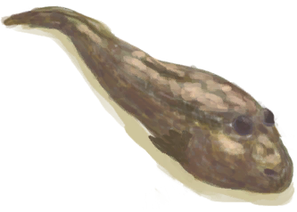

# 烤弹涂鱼  
> 如果肉多点就好了。  
   
>   
  
  烤弹涂鱼  |   图片   
 ----  |  ----:   
 **重量：**75  **标签：**	[“可烹饪的”](tag_Cookable.md), [“饲料”](tag_Feed.md), [“肉”](tag_Meat.md), [“人类食物”](tag_HumanFood.md), [“鱼肉”](tag_Fish.md)  |     
  
## 获取来源  
来源  |  操作  
----  |  ----  
[弹涂鱼](Mudskipper.md) , [营火](Campfire.md)  |  弹涂鱼  
[弹涂鱼](Mudskipper.md) , [粘土火盆](ClayFirePit.md)  |  弹涂鱼  
[弹涂鱼](Mudskipper.md) , [火堆](Fire.md)  |  弹涂鱼  
[弹涂鱼](Mudskipper.md) , [瓦斯炉(开)](GasCookerOn.md)  |  弹涂鱼  
[弹涂鱼](Mudskipper.md) , [火炉](Stove.md)  |  弹涂鱼  
## 动作  
动作  |  耗时  |  条件  |  变化  |  状态  
----  |  ----  |  ----  |  ----  |  ----  
食用 [食用肉类动作](CarnivorousAction.md) [进食动作](EatingAction.md)  |  15分  |    |  ** 自身：** 消失  |  [饱食](Satiation.md)+10 [胃](Stomach.md)+6 [水分](Hydration.md)+2 [情绪](Morale.md)+2 [鱼类<nobr>厌倦度</nobr>](SaturationFish.md)+35 [污垢](Filth.md)+4  
## 可拖至  
[猪食槽](BoarFeeder.md) | [猪食槽(空)](BoarFeederEmpty.md) | [堆肥箱](CompostBin.md) | [灰山鹑喂食器](PartridgeFeeder.md) | [灰山鹑喂食器(空)](PartridgeFeederEmpty.md) | [中陷阱的猕猴](CageTrapMacaque.md) | [母猪](BoarEnclosureFemale.md) | [母猪](BoarEnclosureFemale.md) | [公猪](BoarEnclosureMale.md) | [公猪](BoarEnclosureMale.md) | [小猪](BoarEnclosurePiglet.md) | [小猪](BoarEnclosurePiglet.md) | [母猪](BoarTiedFemale.md) | [母猪](BoarTiedFemale.md) | [公猪](BoarTiedMale.md) | [公猪](BoarTiedMale.md) | [小猪](BoarTiedPiglet.md) | [小猪](BoarTiedPiglet.md) | [忠犬朋友](DogFriend.md) | [祖父](Grandfather.md) | [祖父(健康)](GrandfatherHealthy.md) | [猕猴朋友](MacaqueFriend.md) | [受伤的猕猴](MacaqueWounded.md) | [小灰山鹑](PartridgeChick.md) | [雌灰山鹑](PartridgeFemaleEnclosure.md) | [雌灰山鹑](PartridgeFemaleLive.md) | [雄灰山鹑](PartridgeMaleEnclosure.md) | [雄灰山鹑](PartridgeMaleLive.md)  
## 可用于转化  
转化为  |  容器  
----  |  ----  
[烧焦物](CharredRemains.md)  |  [营火](Campfire.md)  
[烧焦物](CharredRemains.md)  |  [粘土火盆](ClayFirePit.md)  
[烧焦物](CharredRemains.md)  |  [火堆](Fire.md)  
[烧焦物](CharredRemains.md)  |  [瓦斯炉(开)](GasCookerOn.md)  
[烧焦物](CharredRemains.md)  |  [火炉](Stove.md)  
## 属性   
属性  |  值  |  耗时  |  变化  
----  |  ----  |  ----  |  ----  
耐久  |  初始：192  |  每15分钟-1 最多需要：2天  |  ** 到达0时： **  → [腐烂物(猕猴窝)](RottenRemains.md)  

