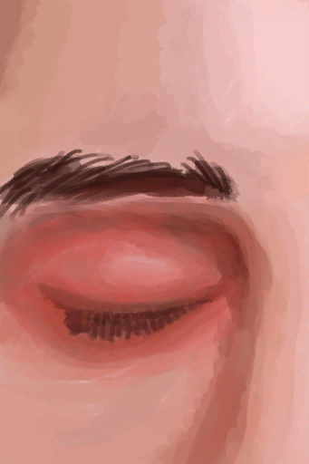

# 视力  
> 数值偏低会使你更难发现有用的物品、更难规避危险。  
  

<b>基础值: </b> 0 
  

<b>变化范围: </b> 0 ~ 3 
  

<b>基础变化率: </b> 无 
  
## 阶段  

<table><tr style="height:2em;"><td style="background-color:#F0F0F0;text-align:center;width:180px;font-size:1.4em;font-weight:bold;vertical-align:middle;">
1

33%
</td><td colspan=2 style="font-size:1.1em;vertical-align:middle;background-color:#F9F9F9;">
<b>

近视</b>

&nbsp;&nbsp;我眼神不好。
</td></tr><tr><td colspan=2></td></tr><tr style="height:2em;"><td style="background-color:#F0F0F0;text-align:center;width:180px;font-size:1.4em;font-weight:bold;vertical-align:middle;">
2 ～ 3

66% ～ 100%
</td><td colspan=2 style="font-size:1.1em;vertical-align:middle;background-color:#F9F9F9;">
<b>

严重近视</b>

&nbsp;&nbsp;我看不太清……
</td></tr><tr><td colspan=2></td></tr></table>
  
## 相关卡牌  
[眼部损伤](EyeDamage.md)  |  [蛇毒](VenomKrait.md)  
## 可被以下操作改变  
<table class="table table-bordered table8898" data-toggle="table"  ><thead style=""><tr ><th  style=""  >来源</th><th  style=""  >操作</th><th  style=""  data-sortable="true"  >值</th></tr></thead><tr ><td  style=""  >[

[眼镜蛇毒液](W_CobraSpit.md)](W_CobraSpit.md)</td><td  style=""  >条件被动</td><td  style=""  >3</td></tr><tr ><td  style=""  >[

[眼镜蛇毒液](W_CobraSpit.md)](W_CobraSpit.md)</td><td  style=""  >条件被动</td><td  style=""  >2</td></tr><tr ><td  style=""  >[

[眼镜蛇毒液](W_CobraSpit.md)](W_CobraSpit.md)</td><td  style=""  >条件被动</td><td  style=""  >1</td></tr><tr ><td  style=""  >[

[眼镜](Glasses.md)](Glasses.md)</td><td  style=""  >被动效果</td><td  style=""  >-2</td></tr></tbody></table>  
  
## 被以下操作需求  
<table class="table table-bordered table6352" data-toggle="table"  ><thead style=""><tr ><th  style=""  >来源</th><th  style=""  >操作</th><th  style=""  >值</th></tr></thead><tr ><td  style=""  >[酸湖(火山)](AcidLake.md)</td><td  style=""  >影响</td><td  style=""  >1 ~ 3</td></tr><tr ><td  style=""  >[环礁](Atoll.md)</td><td  style=""  >影响</td><td  style=""  >1 ~ 3</td></tr><tr ><td  style=""  >[海湾](Bay.md)</td><td  style=""  >影响</td><td  style=""  >1 ~ 3</td></tr><tr ><td  style=""  >[沙滩](Beach.md)</td><td  style=""  >影响</td><td  style=""  >1 ~ 3</td></tr><tr ><td  style=""  >[鸟岩岛](BirdRock.md)</td><td  style=""  >影响</td><td  style=""  >1 ~ 3</td></tr><tr ><td  style=""  >[隐秘港湾(沙滩)](Cove.md)</td><td  style=""  >影响</td><td  style=""  >1 ~ 3</td></tr><tr ><td  style=""  >[丛林深处](DeepJungle.md)</td><td  style=""  >影响</td><td  style=""  >1 ~ 3</td></tr><tr ><td  style=""  >[荒芜沙滩](DesolateBeach.md)</td><td  style=""  >影响</td><td  style=""  >1 ~ 3</td></tr><tr ><td  style=""  >[东部草原](GrasslandsE.md)</td><td  style=""  >影响</td><td  style=""  >1 ~ 3</td></tr><tr ><td  style=""  >[西部草原](GrasslandsW.md)</td><td  style=""  >影响</td><td  style=""  >1 ~ 3</td></tr><tr ><td  style=""  >[东部高地](HighlandsEastern.md)</td><td  style=""  >影响</td><td  style=""  >1 ~ 3</td></tr><tr ><td  style=""  >[西部高地](HighlandsWestern.md)</td><td  style=""  >影响</td><td  style=""  >1 ~ 3</td></tr><tr ><td  style=""  >[丛林](Jungle.md)</td><td  style=""  >影响</td><td  style=""  >1 ~ 3</td></tr><tr ><td  style=""  >[丛林高地](JungleHighlands.md)</td><td  style=""  >影响</td><td  style=""  >1 ~ 3</td></tr><tr ><td  style=""  >[红树林](Mangroves.md)</td><td  style=""  >影响</td><td  style=""  >1 ~ 3</td></tr><tr ><td  style=""  >[丛林边缘](Outskirts.md)</td><td  style=""  >影响</td><td  style=""  >1 ~ 3</td></tr><tr ><td  style=""  >[岩滩](Rocks.md)</td><td  style=""  >影响</td><td  style=""  >1 ~ 3</td></tr><tr ><td  style=""  >[神秘谷](SecretValley.md)</td><td  style=""  >影响</td><td  style=""  >1 ~ 3</td></tr><tr ><td  style=""  >[火山](Volcano.md)</td><td  style=""  >影响</td><td  style=""  >1 ~ 3</td></tr><tr ><td  style=""  >[湿地丛林(湿地)](Wetlands.md)</td><td  style=""  >影响</td><td  style=""  >1 ~ 3</td></tr><tr ><td  style=""  >[我发现了一头野猪！(事件)](Event_BoarFight.md)</td><td  style=""  >影响</td><td  style=""  >0 ~ 3</td></tr><tr ><td  style=""  >[喷毒眼镜蛇！(事件)](Event_CobraFight.md)</td><td  style=""  >影响</td><td  style=""  >0 ~ 3</td></tr><tr ><td  style=""  >[攻击无人机！(事件)](Event_DroneFight.md)</td><td  style=""  >影响</td><td  style=""  >0 ~ 3</td></tr><tr ><td  style=""  >[宿敌来了！(事件)](Event_EnemyFight.md)</td><td  style=""  >影响</td><td  style=""  >0 ~ 3</td></tr><tr ><td  style=""  >[一头山羊！(事件)](Event_GoatFight.md)</td><td  style=""  >影响</td><td  style=""  >0 ~ 3</td></tr><tr ><td  style=""  >[猎手来了(事件)](Event_HunterFight.md)</td><td  style=""  >影响</td><td  style=""  >0 ~ 3</td></tr><tr ><td  style=""  >[猕猴们攻击了你！(事件)](Event_MacaqueDenFight.md)</td><td  style=""  >影响</td><td  style=""  >0 ~ 3</td></tr><tr ><td  style=""  >[一只猕猴！(事件)](Event_MacaqueFight.md)</td><td  style=""  >影响</td><td  style=""  >0 ~ 3</td></tr><tr ><td  style=""  >[一只猕猴！(事件)](Event_MacaqueFightRaid.md)</td><td  style=""  >影响</td><td  style=""  >0 ~ 3</td></tr><tr ><td  style=""  >[一只猕猴！(事件)](Event_MacaqueUndeadFight.md)</td><td  style=""  >影响</td><td  style=""  >0 ~ 3</td></tr><tr ><td  style=""  >[一头巨蜥！(事件)(洞穴)](Event_MonitorFight.md)</td><td  style=""  >影响</td><td  style=""  >0 ~ 3</td></tr><tr ><td  style=""  >[一只灰山鹑！(事件)](Event_PartridgeFight.md)</td><td  style=""  >影响</td><td  style=""  >0 ~ 3</td></tr><tr ><td  style=""  >[一只海鸥！(事件)](Event_SeagullFight.md)</td><td  style=""  >影响</td><td  style=""  >0 ~ 3</td></tr><tr ><td  style=""  >[一只海鸥！(事件)](Event_SeagullRaid.md)</td><td  style=""  >影响</td><td  style=""  >0 ~ 3</td></tr><tr ><td  style=""  >[一只海鸥！(事件)](Event_SeagullRaidCrop.md)</td><td  style=""  >影响</td><td  style=""  >0 ~ 3</td></tr><tr ><td  style=""  >[一头海怪！(事件)](Event_SeahoundFight.md)</td><td  style=""  >影响</td><td  style=""  >0 ~ 3</td></tr><tr ><td  style=""  >[蝙蝠群(蝙蝠洞)](BatColony.md)</td><td  style=""  >影响</td><td  style=""  >0 ~ 3</td></tr></tbody></table>  
  

